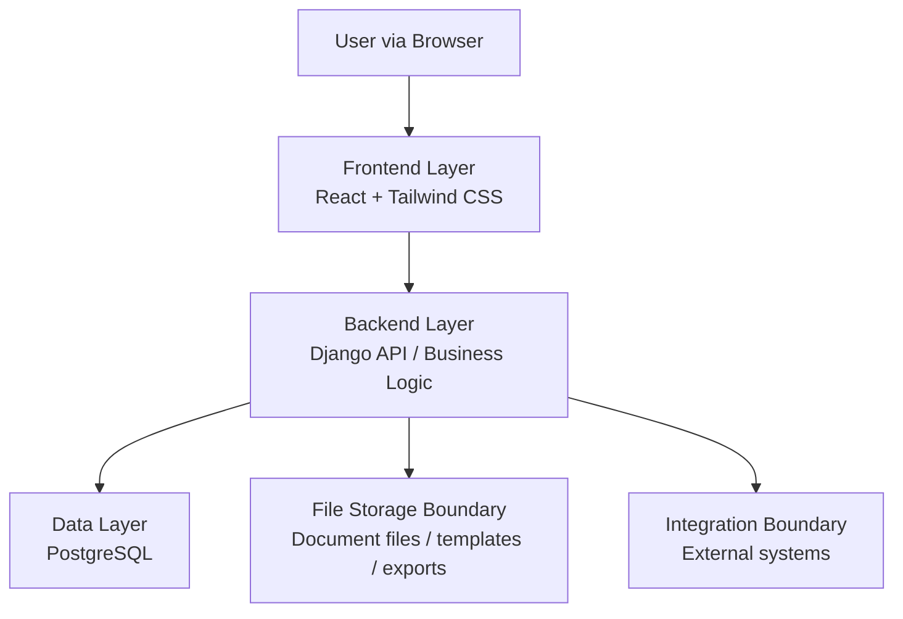

# Architecture

หน้านี้เป็นพื้นที่หลักสำหรับรายละเอียดเชิงเทคนิคของ Legal ERP Platform เช่น
technology stack, application layer, backend component, tenant boundary,
security และ integration boundary ก่อนแตกต่อไปยัง Database, API, UI และ module
specification

Architecture ปัจจุบันยึดแนวคิด web-based, matter-centered และ multi-tenant โดย
ให้ frontend, backend และ database แยกหน้าที่ชัดเจน แต่ยังเชื่อมกันผ่าน domain
model เดียวกัน

## Architecture Goals

- ทำให้ข้อมูล client, matter, document, task, calendar, quotation, billing และ
  finance foundation เชื่อมกันจาก source of truth เดียว
- รองรับการใช้งานแบบ multi-tenant โดยแยกข้อมูลของแต่ละ tenant ออกจากกัน
- ควบคุมสิทธิ์ผ่าน role, permission และ audit log
- รองรับการต่อยอด module ใหม่โดยไม่ทำให้ core matter workflow ซับซ้อนเกินไป
- เปิดทางให้เชื่อมต่อ external integration ในอนาคต โดยยังไม่ผูกกับ provider
  เฉพาะใน baseline แรก

## System Context

ผู้ใช้หลักของระบบทำงานผ่าน browser โดยเข้าสู่ Legal ERP Platform เพื่อจัดการงาน
ประจำวันของสำนักงานกฎหมายหรือทีมกฎหมาย ระบบควรทำหน้าที่เป็นศูนย์กลางข้อมูล
ระหว่างทีมกฎหมาย ทีมปฏิบัติการ ผู้ดูแลระบบ และทีมการเงิน

- **Legal Users**: ใช้งาน matter, task, document, calendar และ quotation
- **Finance Users**: ติดตาม billing, payment collection และ financial data
- **Administrators**: จัดการ tenant, user, role, permission, master data และ
  configuration
- **External Systems**: ระบบภายนอกที่อาจเชื่อมต่อในอนาคต เช่น payment gateway,
  accounting system, e-Filing, court system หรือ document signing service

## Application Layers

- **Frontend Layer**: React และ Tailwind CSS สำหรับสร้าง web interface ที่ผู้ใช้
  ทำงานผ่าน browser
- **Backend Layer**: Django สำหรับจัดการ business logic, permission, validation,
  workflow, API และการเข้าถึงข้อมูล
- **Data Layer**: PostgreSQL สำหรับจัดเก็บข้อมูลหลักของระบบ เช่น tenant, user,
  client, matter, document metadata, task, calendar event, quotation, invoice
  และ payment record
- **File Storage Boundary**: พื้นที่จัดเก็บไฟล์เอกสารแนบ template และ exported
  document ควรถูกแยกจาก relational data โดยเก็บ metadata และ permission
  reference ไว้ใน PostgreSQL
- **Integration Boundary**: จุดเชื่อมต่อกับระบบภายนอกควรถูกแยกเป็น boundary
  ชัดเจน เพื่อให้เปลี่ยน provider หรือเลื่อน integration ไป phase ถัดไปได้

## Core Backend Components

- **Tenant Management**: จัดการ tenant และข้อมูล configuration ที่ใช้แยกบริบท
  การทำงานของแต่ละองค์กร
- **Identity and Access Control**: จัดการ user, role, permission, session และ
  policy สำหรับกำหนดว่าใครเห็นหรือแก้ไขข้อมูลใดได้บ้าง
- **Matter Workspace**: เป็น component กลางที่เชื่อม client, document, task,
  calendar, quotation, billing และ finance-related record เข้ากับ matter
- **Document Service**: ดูแล document template, generated document, uploaded
  file, version, approval และ audit trail ที่เกี่ยวข้องกับเอกสาร
- **Quotation and Billing Service**: จัดการ service fee definition, quotation,
  approval, revision, invoice, payment term และ collection status
- **Task and Scheduling Service**: จัดการ task assignment, deadline, calendar
  activity และ reminder ที่ผูกกับ matter หรือผู้รับผิดชอบ
- **Finance Foundation Service**: วางข้อมูลพื้นฐานสำหรับ receivable, payable,
  invoice, payment, tax-related setup และ financial reporting
- **Audit and Reporting Service**: บันทึกการเปลี่ยนแปลงสำคัญและเตรียมข้อมูล
  สำหรับ dashboard หรือ report

## Matter-Centered Model

`Matter` เป็น record กลางของระบบ ผู้ใช้ควรสามารถเริ่มจาก matter
แล้วเข้าถึงข้อมูล ที่เกี่ยวข้องได้ครบถ้วน เช่น client, contact history,
document, task, calendar event, quotation, invoice, payment และ profitability
data

ความสัมพันธ์หลักที่ควรใช้เป็นฐานสำหรับ database และ API มีดังนี้:

- หนึ่ง `Tenant` มีหลาย `User`, `Client`, `Matter` และ master data
- หนึ่ง `Client` มีได้หลาย `Matter`
- หนึ่ง `Matter` เชื่อมกับ document, task, calendar event, quotation, invoice
  และ payment record ได้หลายรายการ
- หนึ่ง `User` อาจมี role แตกต่างกันตาม tenant หรือ responsibility ภายใน matter
- ทุก record สำคัญควรมี tenant boundary และ audit metadata ที่ชัดเจน

## Multi-Tenant Boundary

ทุกข้อมูลหลักต้องระบุ tenant context เพื่อป้องกันการเข้าถึงข้อมูลข้ามองค์กร
โดยไม่ตั้งใจ การออกแบบ API, query และ permission check ต้องถือว่า tenant
boundary เป็นเงื่อนไขพื้นฐานเสมอ

แนวทาง baseline:

- ทุก request ต้องรู้ว่าอยู่ใน tenant ใด
- Query ของข้อมูลธุรกิจต้อง filter ตาม tenant
- Permission ต้องตรวจทั้ง role ระดับระบบและสิทธิ์ที่เกี่ยวข้องกับ matter
- Audit log ต้องบันทึก user, tenant, action, target record และเวลาเกิดเหตุการณ์

## Security and Audit

ระบบควรวาง security model จาก role-based access control เป็นพื้นฐาน แล้วขยายด้วย
permission เฉพาะ module หรือ matter เมื่อ requirement ชัดเจนขึ้น

- จำกัดการเข้าถึงข้อมูลตาม role และ tenant
- แยก permission สำหรับ view, create, update, approve, export และ delete
- บันทึก audit log สำหรับการเปลี่ยนแปลงข้อมูลสำคัญ
- ป้องกันการเข้าถึง document และ exported file โดยไม่ผ่าน permission check
- เตรียมแนวทาง backup และ recovery สำหรับข้อมูล PostgreSQL และ file storage

## Integration Strategy

baseline ปัจจุบันควรออกแบบ integration เป็น boundary ไว้ก่อน แต่ยังไม่ถือว่า
ต้องเชื่อมต่อ production service ทั้งหมดตั้งแต่ phase แรก

ระบบที่อาจต้องรองรับในอนาคต:

- e-signature หรือ document signing service
- payment gateway หรือ bank integration
- external accounting หรือ ERP system
- court, e-Filing หรือ government service
- email, calendar หรือ notification provider

## Open Architecture Decisions

- จะใช้ API style แบบใดเป็นมาตรฐานระหว่าง frontend และ backend
- file storage สำหรับ document จะใช้ local storage ใน development และ cloud
  object storage ใน production หรือไม่
- background job สำหรับ document generation, export, notification และ reporting
  จะใช้เครื่องมือใด
- tenant isolation จะใช้รูปแบบ shared database พร้อม tenant key หรือแยก schema
  ตาม tenant ในอนาคต
- authentication จะใช้ username/password ภายในระบบก่อน หรือรองรับ SSO ตั้งแต่
  phase แรก
