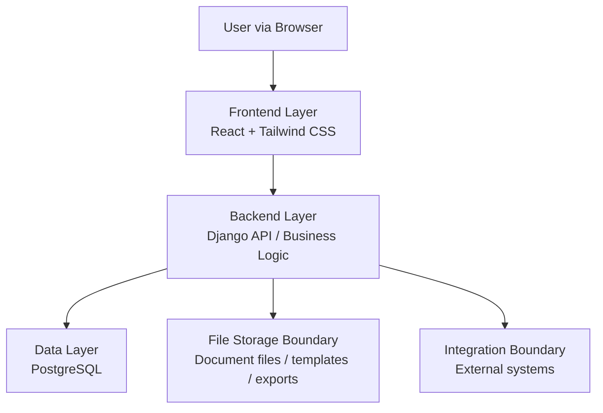

# Architecture

หน้านี้อธิบายโครงสร้างทางเทคนิคของ Legal ERP Platform ด้วยภาษาที่อ่านตามได้:
ใช้เทคโนโลยีอะไร หน้าจอคุยกับระบบหลังบ้านอย่างไร ข้อมูลถูกเก็บตรงไหน
ข้อมูลของแต่ละองค์กรแยกกันอย่างไร และจุดเชื่อมระบบภายนอกอยู่ตรงไหน

Architecture ปัจจุบันยึดแนวคิด web-based, matter-centered และ multi-tenant
โดยให้ `Matter` (แฟ้มงานกฎหมาย) เป็นศูนย์กลาง และแยกหน้าที่ระหว่าง frontend,
backend และ database ให้ชัดเจน แต่ยังทำงานบนภาษากลางชุดเดียวกัน

## Architecture Goals

- ทำให้ข้อมูลลูกความ แฟ้มงานกฎหมาย เอกสาร งานย่อย นัดหมาย ใบเสนอราคา การวางบิล
  และข้อมูลตั้งต้นด้านการเงินเชื่อมกันจากข้อมูลหลักชุดเดียว
- รองรับหลาย tenant โดยข้อมูลของแต่ละองค์กรต้องไม่ปนกัน
- กำหนดว่าใครดูหรือแก้ไขข้อมูลใดได้ ผ่าน role, permission และ audit log
- ต่อเติม module ใหม่ได้ โดยไม่ทำให้ขั้นตอนหลักของแฟ้มงานกฎหมายซับซ้อนเกินไป
- เตรียมจุดเชื่อมระบบภายนอกไว้ล่วงหน้า โดยยังไม่ผูกกับผู้ให้บริการรายใดรายหนึ่ง
  ในรอบเริ่มต้น

## System Context

ผู้ใช้หลักของระบบทำงานผ่าน browser โดยเข้าสู่ Legal ERP Platform เพื่อจัดการงาน
ประจำวันของสำนักงานกฎหมายหรือทีมกฎหมาย ระบบควรทำหน้าที่เป็นศูนย์กลางข้อมูล
ระหว่างทีมกฎหมาย ทีมปฏิบัติการ ผู้ดูแลระบบ และทีมการเงิน

- **Legal Users**: ทีมกฎหมายที่ใช้งานแฟ้มงานกฎหมาย งานย่อย เอกสาร นัดหมาย
  และใบเสนอราคา
- **Finance Users**: ทีมการเงินที่ติดตามการวางบิล การรับชำระเงิน
  และข้อมูลการเงินที่เกี่ยวข้อง
- **Administrators**: ผู้ดูแลระบบที่จัดการองค์กรผู้ใช้งาน ผู้ใช้งาน บทบาท สิทธิ์
  ข้อมูลตั้งต้น และค่าตั้งต้นของระบบ
- **External Systems**: ระบบภายนอกที่อาจเชื่อมต่อในอนาคต เช่น payment gateway
  accounting system, e-Filing, court system หรือ document signing service

## Application Layers

- **Frontend Layer**: React และ Tailwind CSS สำหรับสร้างหน้าจอที่ผู้ใช้ทำงานผ่าน
  browser
- **Backend Layer**: Django สำหรับรับคำสั่งจากหน้าจอ ตรวจสิทธิ์
  ตรวจความถูกต้องของข้อมูล จัดการขั้นตอนการทำงาน และส่งข้อมูลกลับไปยังหน้าจอ
- **Data Layer**: PostgreSQL สำหรับจัดเก็บข้อมูลหลักของระบบ เช่น องค์กรผู้ใช้งาน
  ผู้ใช้งาน ลูกความ แฟ้มงานกฎหมาย เอกสาร งานย่อย นัดหมาย ใบเสนอราคา ใบแจ้งหนี้
  และการรับชำระเงิน
- **File Storage Boundary**: พื้นที่จัดเก็บไฟล์เอกสาร แม่แบบ และไฟล์ที่ส่งออก
  โดยเก็บข้อมูลกำกับไฟล์และสิทธิ์การเข้าถึงไว้ใน PostgreSQL
- **Integration Boundary**: จุดเชื่อมกับระบบอื่นควรถูกแยกชัดเจน เพื่อให้เปลี่ยน
  ผู้ให้บริการหรือเลื่อนไป phase ถัดไปได้

## Core Backend Components

- **Tenant Management**: จัดการข้อมูลองค์กรและค่าตั้งต้นที่ทำให้ข้อมูลของแต่ละ
  องค์กรแยกจากกัน
- **Identity and Access Control**: จัดการผู้ใช้งาน บทบาท สิทธิ์ และกติกาว่าใคร
  เห็นหรือแก้ไขข้อมูลใดได้บ้าง
- **Matter Workspace**: ส่วนกลางที่เชื่อมลูกความ เอกสาร งานย่อย นัดหมาย
  ใบเสนอราคา การวางบิล และข้อมูลการเงินเข้ากับแฟ้มงานกฎหมาย
- **Document Service**: ดูแลแม่แบบเอกสาร เอกสารที่ระบบสร้าง ไฟล์ที่อัปโหลด
  เวอร์ชัน การอนุมัติ และประวัติการเปลี่ยนแปลงของเอกสาร
- **Quotation and Billing Service**: จัดการรูปแบบค่าบริการ ใบเสนอราคา การอนุมัติ
  การแก้ไข ใบแจ้งหนี้ เงื่อนไขชำระ และสถานะการรับเงิน
- **Task and Scheduling Service**: จัดการการมอบหมายงาน กำหนดส่งงาน นัดหมาย
  และการแจ้งเตือนที่ผูกกับแฟ้มงานกฎหมายหรือผู้รับผิดชอบ
- **Finance Foundation Service**: จัดเตรียมข้อมูลสำหรับรายการรับเงิน
  รายการจ่ายเงิน ใบแจ้งหนี้ การรับชำระเงิน ข้อมูลภาษี และรายงานการเงินเบื้องต้น
- **Audit and Reporting Service**: บันทึกการเปลี่ยนแปลงสำคัญ และเตรียมข้อมูล
  สำหรับ dashboard หรือ report

## Matter-Centered Model

`Matter` เป็นข้อมูลหลักของงานหนึ่งเรื่อง ผู้ใช้ควรเริ่มจากแฟ้มงานกฎหมาย
แล้วเข้าถึงข้อมูลที่เกี่ยวข้องได้ครบถ้วน เช่น ลูกความ ประวัติการติดต่อ เอกสาร
งานย่อย นัดหมาย ใบเสนอราคา ใบแจ้งหนี้ การรับชำระเงิน และข้อมูลผลการทำงาน

ความสัมพันธ์หลักที่ควรใช้เป็นฐานสำหรับ database และ API มีดังนี้:

- หนึ่งองค์กรผู้ใช้งานมีผู้ใช้งาน ลูกความ แฟ้มงานกฎหมาย และข้อมูลตั้งต้นได้หลาย
  รายการ
- หนึ่งลูกความมีได้หลายแฟ้มงานกฎหมาย
- หนึ่งแฟ้มงานกฎหมายเชื่อมกับเอกสาร งานย่อย นัดหมาย ใบเสนอราคา ใบแจ้งหนี้
  และการรับชำระเงินได้หลายรายการ
- หนึ่งผู้ใช้งานอาจมีบทบาทต่างกันตามองค์กรหรือหน้าที่ในแฟ้มงานกฎหมาย
- ทุกข้อมูลสำคัญควรบอกได้ว่าเป็นขององค์กรใด และมีประวัติการเปลี่ยนแปลงที่ชัดเจน

## Multi-Tenant Boundary

ทุกข้อมูลหลักต้องระบุว่าเป็นของ tenant ใด เพื่อป้องกันไม่ให้ผู้ใช้ขององค์กรหนึ่ง
เห็นหรือแก้ไขข้อมูลของอีกองค์กรหนึ่งโดยไม่ตั้งใจ การออกแบบ API, query และ
permission check ต้องถือว่าการแยกข้อมูลองค์กรเป็นเงื่อนไขพื้นฐานเสมอ

แนวทางรอบเริ่มต้น:

- ทุก request ต้องรู้ว่าอยู่ในองค์กรใด
- การดึงข้อมูลธุรกิจต้องกรองตามองค์กรผู้ใช้งานเสมอ
- การตรวจสิทธิ์ต้องดูทั้งบทบาทระดับระบบและสิทธิ์ที่เกี่ยวข้องกับแฟ้มงานกฎหมาย
- audit log ต้องบันทึกว่าใครทำอะไร กับข้อมูลใด ในองค์กรใด และทำเมื่อไร

## Security and Audit

ระบบควรวางแนวทางความปลอดภัยจากการกำหนดสิทธิ์ตามบทบาทเป็นพื้นฐาน
แล้วค่อยขยายด้วยสิทธิ์เฉพาะ module หรือสิทธิ์เฉพาะ `Matter` เมื่อขอบเขตการใช้งาน
ชัดเจนขึ้น

- จำกัดการเข้าถึงข้อมูลตามบทบาทและองค์กรผู้ใช้งาน
- แยกสิทธิ์สำหรับการดู เพิ่ม แก้ไข อนุมัติ ส่งออก และลบข้อมูล
- บันทึกประวัติการเปลี่ยนแปลงสำหรับข้อมูลสำคัญ
- ป้องกันการเข้าถึงเอกสารและไฟล์ที่ส่งออกโดยไม่ผ่านการตรวจสิทธิ์
- เตรียมแนวทาง backup และ recovery สำหรับข้อมูล PostgreSQL และไฟล์เอกสาร

## Integration Strategy

รอบเริ่มต้นควรออกแบบจุดเชื่อมระบบภายนอกไว้ก่อน แต่ยังไม่ถือว่าต้องเชื่อมต่อระบบ
production ทั้งหมดตั้งแต่ phase แรก

ระบบที่อาจต้องรองรับในอนาคต:

- e-signature หรือ document signing service
- payment gateway หรือ bank integration
- external accounting หรือ ERP system
- court, e-Filing หรือ government service
- email, calendar หรือ notification provider

## Open Architecture Decisions

- รูปแบบ API ระหว่างหน้าจอและระบบหลังบ้านจะใช้ REST, GraphQL หรือรูปแบบอื่น
- พื้นที่เก็บไฟล์เอกสารจะใช้ local storage และ cloud object storage ใน
  production หรือไม่
- งานเบื้องหลังที่ระบบทำโดยไม่ต้องรอหน้าจอ เช่น สร้างเอกสาร ส่งออกไฟล์
  ส่งการแจ้งเตือน และเตรียมรายงาน จะใช้เครื่องมือใด
- การแยกข้อมูลองค์กรจะใช้ฐานข้อมูลร่วมพร้อม tenant key หรือแยก schema
  ตามองค์กรในอนาคต
- การเข้าสู่ระบบจะเริ่มจาก username/password ภายในระบบก่อน หรือรองรับ SSO
  ตั้งแต่ phase แรก
