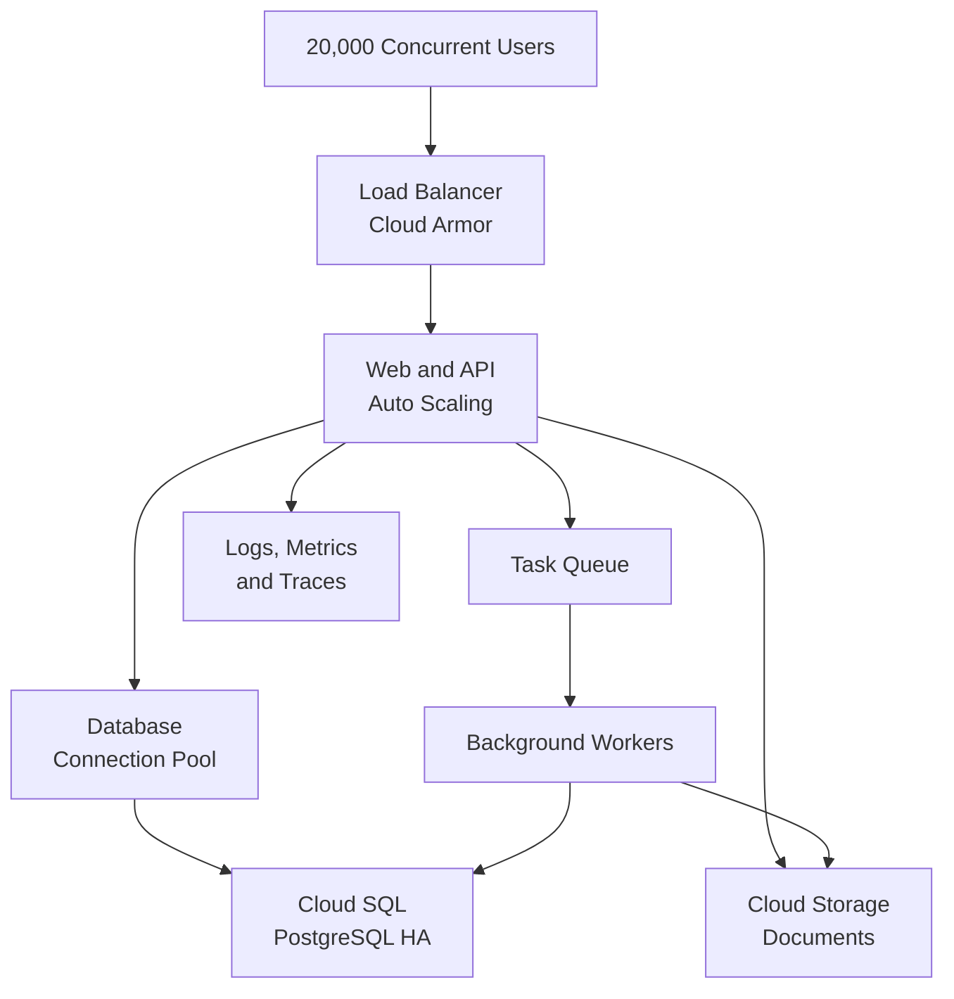

# Scalability & Capacity

หน้านี้กำหนดลำดับเตรียม Legal Practice ERP Platform ให้รองรับผู้ใช้งานพร้อมกัน 20,000 บัญชี
โดยใช้ผลการทดสอบเป็นตัวกำหนดขนาดระบบ
ไม่กำหนดขนาดเครื่องจากจำนวนบัญชีเพียงอย่างเดียว

ผู้ใช้งานพร้อมกัน 20,000 บัญชีไม่ได้หมายความว่าต้องมี database connection 20,000
connections ระบบต้องรับ request ผ่าน application instances และใช้ connection
pool ที่จำกัดจำนวน connection เข้าฐานข้อมูล

## Target Architecture

งานที่ใช้เวลานาน เช่น Report, Payroll, Import, Export, Email
และการประมวลผลเอกสาร ต้องส่งไปทำเบื้องหลัง เพื่อไม่ให้ request
ของผู้ใช้ค้างและไม่แย่ง database connection จากงานหน้าจอ

## Capacity Information

ก่อนกำหนดขนาดระบบ ทีมต้องวัดข้อมูลต่อไปนี้จาก workflow จริง:

| ข้อมูลที่ต้องวัด                          | ใช้ตัดสินใจ                        |
| :---------------------------------------- | :--------------------------------- |
| Active users ในช่วง 1 และ 5 นาที          | จำนวน request ที่เกิดขึ้นจริง      |
| Requests per second                       | จำนวน application instances        |
| Read, write และ endpoint ที่ใช้บ่อย       | Index, cache และ database capacity |
| จำนวนรายการต่อ Workspace                  | ผลกระทบจาก Workspace ขนาดใหญ่      |
| ขนาดและจำนวนไฟล์                          | Storage, network และ upload limit  |
| Report, Payroll, Import และ Export        | Queue และ worker capacity          |
| Response time, error rate และ timeout     | เกณฑ์ผ่านของระบบ                   |
| Database connections, CPU, memory และ I/O | Connection pool และขนาดฐานข้อมูล   |

การทดสอบต้องมีอย่างน้อยสามรูปแบบ:

- **Normal Load:** รูปแบบการใช้งานประจำวัน
- **Peak Load:** ผู้ใช้ 20,000 บัญชีทำงานตาม workflow ที่กำหนดพร้อมกัน
- **Burst Load:** ผู้ใช้จำนวนมากส่ง request ในช่วงเวลาสั้น เช่น Login
  หรือเปิดหน้าแรกพร้อมกัน

## Delivery Sequence

### 1. Build the Capacity Model

**Owner:** Product, Developer, QA และ DevOps

1. เลือก workflow สำคัญ เช่น Login, Matter Search, Document Upload, Billing,
   Payroll และ Report
2. กำหนดจำนวนผู้ใช้และความถี่ของแต่ละ workflow
3. เตรียมข้อมูลทดสอบให้มีจำนวน Workspace, User, Matter และ Document
   ใกล้เคียงจริง
4. แยกงานหน้าเว็บ งาน API งานฐานข้อมูล และงานเบื้องหลังออกจากกัน

**ผ่านเมื่อ:** มี load profile ที่ QA ทำซ้ำได้และระบุ Normal, Peak และ Burst
ชัดเจน

### 2. Approve Service Targets

**Owner:** Product Owner, System Owner และ DevOps

กำหนด Availability, Response Time, Error Rate, RPO และ RTO ก่อนเลือกขนาดระบบ
พร้อมระบุ endpoint ที่ยอมให้ใช้เวลานานกว่างานทั่วไป เช่น Report และ Export

**ผ่านเมื่อ:** ทุกค่ามีผู้รับผิดชอบ วิธีวัด และเกณฑ์ผ่านที่ได้รับอนุมัติ

### 3. Prepare the Application

**Owner:** Developer

1. ใช้ Django Authentication และตรวจ Workspace, Plan, Permission และ record
   scope
2. จำกัดทุก business query ด้วย `workspace_id` และใช้ Row-Level Security
3. ใช้ pagination และห้ามดึงข้อมูลจำนวนมากโดยไม่มีขอบเขต
4. เพิ่ม index จาก query ที่ใช้งานจริงและตรวจ query plan
5. แยกงานหนักไปยัง task queue และทำให้ retry แล้วไม่สร้างข้อมูลซ้ำ
6. กำหนด timeout, file limit และ structured logging โดยไม่บันทึกข้อมูลลับ
7. ตั้ง connection pool ต่อ application instance และปิด connection ที่ไม่ใช้งาน

**ผ่านเมื่อ:** Functional, Permission และ Cross-Workspace tests ผ่านก่อนเริ่ม
Load Test

### 4. Prepare the Platform

**Owner:** DevOps

1. แยก Development, Staging และ Production เป็นคนละ environment
2. สร้าง infrastructure และ configuration ที่ทำซ้ำได้
3. ตั้ง CI/CD, migration step, health check, traffic control และ rollback
4. เปิด Load Balancer, TLS, Cloud Armor, Secret Manager และ least-privilege
   access
5. ตั้ง minimum, maximum instances และ concurrency ของ application จากผลทดสอบ
6. ใช้ Cloud SQL แบบ High Availability พร้อม connection pooling, backup และ PITR
7. สร้าง dashboard และ alert สำหรับ request, error, latency, instance, queue และ
   database

**ผ่านเมื่อ:** Staging มีโครงสร้างเทียบเท่า Production และ rollback/restore
ผ่านการทดสอบ

### 5. Run Performance Tests

**Owner:** QA, Developer และ DevOps

ทดสอบตามลำดับเพื่อให้ระบุสาเหตุของคอขวดได้:

1. ทดสอบ endpoint สำคัญทีละรายการ
2. ทดสอบหลาย workflow พร้อมกันตาม Normal Load
3. เพิ่มถึง Peak Load ที่ผู้ใช้พร้อมกัน 20,000 บัญชี
4. ทดสอบ Burst Load และ Soak Test ต่อเนื่อง
5. ทดสอบ queue backlog, retry, instance failure และ database failover
6. ตรวจ Workspace isolation ระหว่าง Load Test ทุกครั้ง

**ผ่านเมื่อ:** Service targets ผ่าน, ไม่มีข้อมูลข้าม Workspace, queue
กลับสู่ภาวะปกติ และระบบไม่ใช้ database connections เกินงบที่กำหนด

### 6. Roll Out in Stages

**Owner:** Product Owner, QA, Developer และ DevOps

| ระยะ       | จำนวนผู้ใช้งานพร้อมกันสูงสุด | จุดตรวจหลัก                            |
| :--------- | ---------------------------: | :------------------------------------- |
| Internal   |                          100 | Workflow, log และ alert                |
| Pilot      |                          500 | Query, permission และ error            |
| Phase 1    |                        2,000 | Autoscaling และ database connections   |
| Phase 2    |                        5,000 | Queue, report และ storage              |
| Phase 3    |                       10,000 | Peak response time และค่าใช้จ่าย       |
| Production |                       20,000 | Service targets และ incident readiness |

แต่ละระยะต้องผ่านเกณฑ์เดิมต่อเนื่องตามเวลาที่กำหนด มีผู้อนุมัติ และมี rollback
plan ก่อนเพิ่มจำนวนผู้ใช้

### 7. Operate and Improve

**Owner:** Operations และ DevOps ร่วมกับ Developer

- ตรวจ request rate, response time, error, queue backlog และ database health
- ทบทวน capacity ก่อน campaign, migration หรือการเปิด module ใหม่
- ทำ restore test และ incident exercise ตามรอบ
- วิเคราะห์ slow query และ endpoint ที่ใช้ทรัพยากรสูงจากข้อมูลจริง
- บันทึก capacity result ของแต่ละ release เพื่อเปรียบเทียบ regression

## Scaling Decisions

ไม่เพิ่มบริการเพียงเพราะคาดว่าอาจจำเป็น ให้ใช้เงื่อนไขต่อไปนี้:

| การตัดสินใจ           | เพิ่มเมื่อ                                                                          |
| :-------------------- | :---------------------------------------------------------------------------------- |
| Cache                 | พบ read ซ้ำจำนวนมากและลดได้โดยไม่ทำให้ข้อมูลสิทธิ์หรือข้อมูลธุรกิจคลาดเคลื่อน       |
| Read Replica          | งานอ่านหรือรายงานกระทบ transaction หลัก และผลทดสอบยืนยันประโยชน์                    |
| Table Partitioning    | ตารางขนาดใหญ่มี query/retention ตามเวลาและผล query plan รองรับ                      |
| External Search       | PostgreSQL search ไม่ผ่านเป้าหมายจากข้อมูลใกล้เคียงจริง                             |
| GKE หรือ Runtime อื่น | Cloud Run ไม่รองรับข้อกำหนดที่พิสูจน์แล้ว ไม่เปลี่ยนเพราะจำนวนผู้ใช้เพียงอย่างเดียว |

## Release Gate

ห้ามเปิดใช้งานกับผู้ใช้ 20,000 บัญชีจนกว่าจะยืนยันครบว่า:

- Capacity Model และ Service Targets ได้รับอนุมัติ
- Load, Burst, Soak, Security และ Cross-Workspace tests ผ่าน
- Database connection budget และ autoscaling limit ทำงานตามที่กำหนด
- Backup, restore, rollback, alert และ incident runbook ผ่านการทดสอบ
- Dashboard แสดงสถานะ application, queue, database และ storage ได้
- ทีมรับผิดชอบ production และช่องทาง escalation พร้อมใช้งาน

## Related Documents

- [Architecture](/docs/architecture)
- [Technology Stack](/docs/architecture/technology-stack)
- [Development Workflow](/docs/development/workflow)
- [Development Rules](/docs/development/rules)
- [Database](/docs/database)
