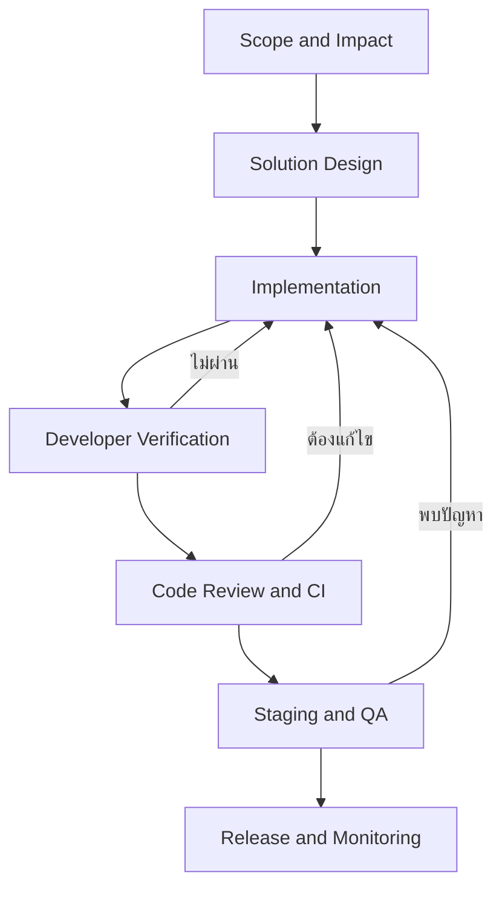

# Development Workflow

หน้านี้กำหนดลำดับการพัฒนา Legal ERP ตั้งแต่รับงานจนเปิดใช้งานจริง เพื่อให้
Developer, Reviewer, QA และ DevOps ส่งต่องานด้วยข้อมูลและเกณฑ์เดียวกัน

งานต้องผ่านทีละขั้น ห้ามข้าม Security, Cross-Workspace Test, Code Review หรือ
Staging Verification แม้งานจะมีขนาดเล็ก

## Workflow Overview

## 1. Scope and Impact

**Input:** Requirement, issue หรือ change request ที่ระบุผลลัพธ์ที่ต้องการ

**Developer:**

1. อ่าน Requirement และ Project Docs ที่เกี่ยวข้อง
2. ระบุ Workspace, Plan, Role, Permission และข้อมูลที่ได้รับผลกระทบ
3. ตรวจ module, API, database, background job, integration และ report
   ที่เกี่ยวข้อง
4. ระบุ acceptance criteria, edge cases และสิ่งที่อยู่นอกขอบเขต
5. แจ้งเมื่อ Requirement ขัดกับกฎระบบหรือข้อมูลไม่พอสำหรับพัฒนา

**Exit Gate:** ทีมเข้าใจขอบเขตตรงกันและ QA สามารถเตรียม Test Scenario ได้

## 2. Solution Design

**Input:** Scope และ acceptance criteria ที่ชัดเจน

**Developer:**

1. ตรวจรูปแบบที่มีอยู่ใน codebase ก่อนเพิ่มวิธีใหม่
2. ออกแบบ data flow ตั้งแต่หน้าจอถึงฐานข้อมูลและงานเบื้องหลัง
3. กำหนด Authentication, Workspace isolation, Plan และ Permission checks
4. ออกแบบ migration, API contract, validation, error และ audit event
5. ประเมิน performance, database connection, file, retry และ rollback
6. ขออนุมัติก่อนเปลี่ยน architecture, authentication หรือ external provider

**Exit Gate:** มีแนวทางที่พัฒนาและทดสอบได้โดยไม่ขัดกับ Architecture, Development
Rules และ Database Rules

## 3. Implementation

พัฒนาตาม dependency ต่อไปนี้ โดยข้ามส่วนที่ไม่เกี่ยวข้องกับงานได้:

### 3.1 Database

- เพิ่มหรือแก้ schema, constraint, index และ migration
- ตารางข้อมูลบริษัทต้องมี `workspace_id` และ Row-Level Security
- Migration ต้องรองรับข้อมูลเดิมและมี rollback หรือ recovery plan
- Query สำคัญต้องตรวจ query plan ด้วยข้อมูลใกล้เคียงจริง

### 3.2 Backend

- ใช้ผู้ใช้และ Workspace ที่ตรวจสอบแล้วฝั่ง server
- ตรวจ Plan, Permission, record scope และสถานะรายการตามลำดับ
- ใช้ transaction กับงานที่ต้องสำเร็จหรือย้อนกลับพร้อมกัน
- บันทึก audit event สำหรับการเปลี่ยนแปลงสำคัญ
- ใช้ pagination, timeout และ idempotency ตามลักษณะงาน

### 3.3 Frontend

- แสดงเฉพาะคำสั่งที่แผนและสิทธิ์อนุญาต แต่ยังต้องให้ Backend ตรวจซ้ำ
- รองรับ loading, empty, validation, error และ success states
- ป้องกันการส่งคำสั่งซ้ำและไม่แสดงข้อมูลจาก Workspace ก่อนหน้า
- ตรวจ layout, ตารางและข้อความบน desktop และ mobile

### 3.4 Background Job and Integration

- ส่งงานหนักออกจาก HTTP request
- ส่ง Workspace context และ record reference ที่ตรวจสอบได้
- กำหนด retry, timeout, idempotency และ failure handling
- ตรวจ webhook signature และเก็บ credential ใน secret storage
- ห้าม log sensitive payload โดยไม่จำเป็น

**Exit Gate:** โค้ดทำงานตาม design, migration ใช้งานได้ และไม่มีส่วนที่ข้าม
Authentication, Workspace หรือ Permission checks

## 4. Developer Verification

**Input:** Implementation ที่พร้อมตรวจบนเครื่อง Developer

**Developer:**

1. รัน formatter, static checks และ automated tests ที่เกี่ยวข้อง
2. ทดสอบ happy path, validation, permission denied และ retry
3. ทดสอบ Workspace A ไม่สามารถเข้าถึงข้อมูล Workspace B
4. ทดสอบ migration ไปข้างหน้าและตรวจข้อมูลเดิม
5. ตรวจ query count, slow query, log, audit event และ background job
6. ทดสอบหน้าจอ desktop/mobile และตรวจ console error
7. สรุปไฟล์ที่เปลี่ยน ผลทดสอบ ความเสี่ยง และข้อจำกัดที่ยังเหลือ

**Exit Gate:** Acceptance criteria ผ่านใน Developer environment และมีหลักฐาน
เพียงพอสำหรับ Reviewer

## 5. Code Review and CI

**Input:** Code change, test result และคำอธิบายผลกระทบ

**Reviewer และ CI:**

1. ตรวจความถูกต้อง, security, Workspace isolation และ backward compatibility
2. ตรวจ migration, transaction, error handling และ audit coverage
3. ตรวจ test ว่าครอบคลุมทั้งกรณีอนุญาตและปฏิเสธ
4. รัน automated checks จาก clean environment
5. ให้ Developer แก้ finding และ rerun checks ก่อนอนุมัติ

**Exit Gate:** Review ได้รับอนุมัติและ CI ผ่านทั้งหมด

## 6. Staging and QA

**Input:** Build ที่ผ่าน Code Review และ CI

**QA ร่วมกับ Developer และ DevOps:**

1. Deploy ไป Staging ด้วยขั้นตอนเดียวกับ Production
2. รัน migration และ smoke test หลัง deploy
3. QA ทดสอบ acceptance criteria, regression, role และ cross-Workspace access
4. ทดสอบ integration, background job, report และ file flow ที่เกี่ยวข้อง
5. งานที่กระทบ capacity ต้องผ่าน load หรือ performance test ตามระดับความเสี่ยง
6. บันทึก defect แล้วส่งกลับขั้น Implementation ห้ามแก้เฉพาะใน Staging

**Exit Gate:** QA ยอมรับผล, ไม่มี critical defect และมี release/rollback plan

## 7. Release and Monitoring

**Input:** Version ที่ QA อนุมัติพร้อม release และ rollback plan

**DevOps ร่วมกับ Developer:**

1. ตรวจ backup, migration order, secret, configuration และผู้รับผิดชอบ
2. Deploy ด้วย CI/CD และควบคุมจำนวนผู้ใช้หรือ traffic ตามความเสี่ยง
3. รัน migration และ production smoke test
4. ตรวจ error, latency, database, queue, storage และ business event
5. Rollback หรือปิด feature เมื่อเกินเกณฑ์ที่กำหนด
6. บันทึก release result, incident และงานแก้ไขหลังเปิดใช้

**Exit Gate:** ระบบทำงานตาม service target, monitoring ปกติ และมีผู้รับผิดชอบ
รับช่วงดูแลหลัง release

## Stop and Report

Developer ต้องหยุดและแจ้งก่อนดำเนินการต่อเมื่อ:

- Requirement หรือ acceptance criteria ไม่ชัดเจนจนเสี่ยงทำงานผิด
- ไม่สามารถระบุ Workspace หรือ Permission ที่ถูกต้องได้
- ต้องสร้าง custom authentication หรือ bypass security control
- Migration อาจทำข้อมูลสูญหายหรือไม่สามารถย้อนกลับได้
- ไม่สามารถทดสอบผลกระทบต่อข้อมูลข้าม Workspace
- Production configuration แตกต่างจากสิ่งที่ผ่าน Staging โดยไม่มี approval

## Completion Evidence

งานหนึ่งรายการถือว่าเสร็จเมื่อมีข้อมูลครบ:

- Requirement และ acceptance criteria
- Design decision ที่มีผลกับระบบ
- Code, migration และ configuration changes
- Automated, security, cross-Workspace และ QA test results
- Code Review และ CI result
- Release, rollback และ monitoring result
- Known limitations และ follow-up owner

## Related Documents

- [Architecture](/docs/architecture)
- [Technology Stack](/docs/architecture/technology-stack)
- [Scalability & Capacity](/docs/architecture/scalability-capacity)
- [Development Rules](/docs/development/rules)
- [Database](/docs/database)
- [API](/docs/api)
- [Platform Monitoring, Backup & Recovery](/docs/sops/platform-operations)
