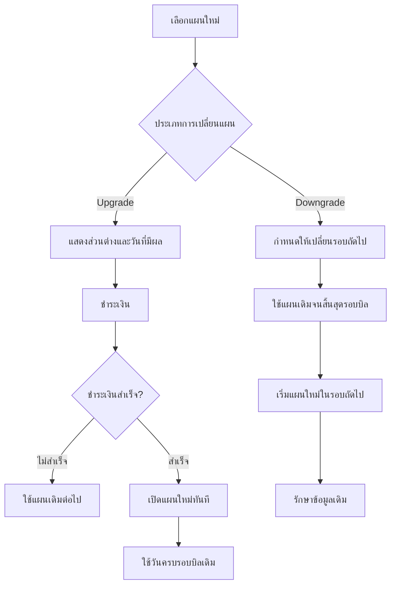

# Plan Rules

หน้านี้สรุปกติกาการสืบทอดและการเปลี่ยนแผนของ Workspace

## Plan Inheritance

  

  

- แผนที่สูงกว่ารวมความสามารถของแผนก่อนหน้า
- Not Included จะเปิดได้เมื่อแผนถัดไประบุเป็น Included
- View Only ดูข้อมูลได้ แต่ไม่สามารถสร้าง แก้ไข ลบ หรืออนุมัติ
- Baseline เป็นความสามารถพื้นฐานของทุกแผน
- TBD ยังไม่เปิดใช้งานจนกว่าจะได้รับการอนุมัติ

## Plan Change Flow

  

  

## Upgrade

- มีผลทันทีหลังชำระเงินสำเร็จ
- คิดเฉพาะส่วนต่างตามเวลาที่เหลือในรอบบิล
- วันครบรอบบิลเดิมไม่เปลี่ยน
- หากชำระไม่สำเร็จ ให้ใช้แผนเดิมต่อไป
- เปิดเฉพาะความสามารถที่แผนใหม่รองรับ
- ไม่เปลี่ยน Access Profile หรือสิทธิ์รายบุคคลโดยอัตโนมัติ
- แจ้ง Workspace Admin เมื่อการเปลี่ยนแผนมีผล

## Downgrade

- มีผลเมื่อเริ่มรอบบิลถัดไป
- ใช้แผนเดิมได้จนสิ้นสุดรอบที่ชำระแล้ว
- ไม่คืนเงินสำหรับระยะเวลาที่เหลือในรอบบิลปัจจุบัน
- ไม่ลบข้อมูล เอกสาร ประวัติรายการ หรือ Audit Log โดยอัตโนมัติ
- เมื่อแผนใหม่มีผล ให้หยุดการสร้างหรือแก้ไขข้อมูลในฟีเจอร์ที่ไม่รองรับ
- ตรวจสอบงานค้างและการเชื่อมต่อก่อนเปลี่ยนแผน
- กำหนดวิธีดูหรือส่งออกข้อมูลเดิม และระยะผ่อนผันก่อนนำไปใช้จริง

## Before Confirmation

ก่อนยืนยันการเปลี่ยนแผน ระบบต้องแสดง:

- ยอดที่ต้องชำระทันที
- วันที่แผนใหม่มีผล
- ราคาที่จะเรียกเก็บในรอบถัดไป
- วันครบรอบบิล

## Existing Data

- รักษาข้อมูลเดิมและความสัมพันธ์ของข้อมูล
- เก็บประวัติและ Audit Log ให้อ่านย้อนหลังได้
- ปฏิบัติตามระยะเวลาจัดเก็บข้อมูลและ Legal Hold
- เมื่อกลับมาใช้แผนเดิม ระบบควรใช้ข้อมูลเดิมต่อได้

## Related Documents

- [Plans Overview](/docs/plans)
- [Pricing](/docs/plans/pricing)
- [Feature Comparison](/docs/plans/feature-comparison)
- [Signup & Access](/docs/plans/subscription-access)
- [Workspace Onboarding & Package](/docs/sops/tenant-onboarding)
- [Retention & Disposal](/docs/sops/retention-disposal)
