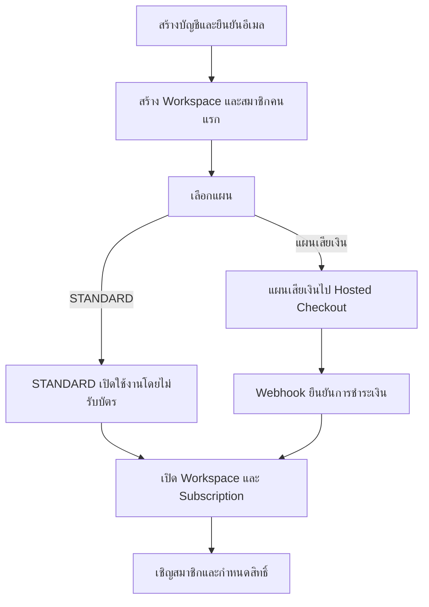

# Signup, Subscription & Access

หน้านี้สรุปการสมัครใช้งาน การชำระเงิน การเข้าสู่ระบบ และการกำหนดสิทธิ์

## แนวคิดหลัก

| เรื่อง         | ระบบใช้ทำอะไร                                      |
| -------------- | -------------------------------------------------- |
| User           | บัญชีสำหรับเข้าสู่ระบบและระบุตัวผู้ใช้งาน          |
| Workspace      | พื้นที่ข้อมูลของผู้สมัครหรือสำนักงานหนึ่งแห่ง      |
| Subscription   | แผนที่ Workspace สมัครและ Module ที่เปิดใช้งาน     |
| Membership     | ความสัมพันธ์ระหว่าง User กับ Workspace             |
| Access Profile | ชุดสิทธิ์เริ่มต้นที่ Admin ปรับให้สมาชิกแต่ละคนได้ |

ระบบยืนยันว่าเป็นผู้ใช้คนใด Subscription ตรวจว่า Workspace ใช้ Module ใดได้ และ
Membership ตรวจว่าผู้ใช้นั้นทำอะไรใน Workspace ได้

## Signup Flow

ทุกการสมัครใช้ flow เดียวกัน ผู้สมัครเป็น Owner และสมาชิกคนแรกของ Workspace

- หากใช้งานคนเดียว Workspace จะมีสมาชิกหนึ่งคน
- หากเป็นสำนักงาน Owner สามารถเชิญพนักงานเพิ่มได้
- Workspace ที่เริ่มจากสมาชิกหนึ่งคนเพิ่มสมาชิกภายหลังได้โดยไม่ต้องย้ายข้อมูล

## Payment Rules

- STANDARD ไม่ต้องใช้บัตรเครดิต
- แผนเสียเงินรับข้อมูลบัตรผ่าน Hosted Checkout เท่านั้น
- Legal Practice ERP Platform ไม่เก็บหมายเลขบัตรหรือรหัส CVC
- หน้า Payment Success ไม่ใช่หลักฐานเปิดใช้งาน
- ระบบเปิดหรือต่ออายุ Subscription เมื่อได้รับ webhook ที่ตรวจสอบแล้ว
- Webhook เดิมที่ถูกส่งซ้ำต้องไม่สร้าง Subscription หรือรายการชำระเงินซ้ำ

## Member Access

ระบบมี Starter Access Profiles ได้แก่ Admin, Lawyer, Assistant, Finance, HR และ
Manager ชุดเหล่านี้เป็นค่าเริ่มต้น ไม่ใช่ Role ที่บังคับทุกบริษัท

Admin สามารถกำหนดให้สมาชิกแต่ละคน:

- เข้า Module ใดได้
- ดูอย่างเดียวหรือสร้างและแก้ไขได้
- อนุมัติ ลบ หรือ Export ได้หรือไม่
- เข้าถึงข้อมูลของตนเอง งานที่ได้รับมอบหมาย ทีม หรือทั้ง Workspace

Admin ไม่สามารถเปิด Module ที่ Subscription ไม่มี หรือให้สิทธิ์ข้าม Workspace

## Related Documents

- [Plans & Pricing](/docs/plans)
- [Pricing](/docs/plans/pricing)
- [Plan Rules](/docs/plans/plan-rules)
- [Users & Access](/docs/roles)
