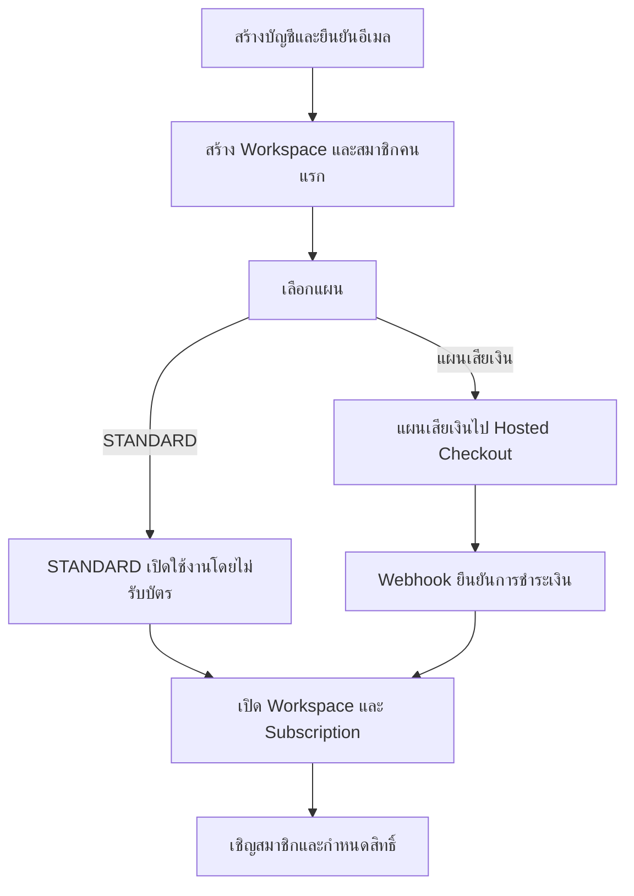

# Signup, Subscription & Access

หน้านี้สรุปการสมัครใช้งาน การชำระเงิน การเข้าสู่ระบบ และการกำหนดสิทธิ์ สำหรับ
Developer และ QA

## แนวคิดหลัก

| เรื่อง         | ระบบใช้ทำอะไร                                      |
| -------------- | -------------------------------------------------- |
| User           | บัญชีสำหรับเข้าสู่ระบบและระบุตัวผู้ใช้งาน          |
| Workspace      | พื้นที่ข้อมูลของผู้สมัครหรือสำนักงานหนึ่งแห่ง      |
| Subscription   | แผนที่ Workspace สมัครและ Module ที่เปิดใช้งาน     |
| Membership     | ความสัมพันธ์ระหว่าง User กับ Workspace             |
| Access Profile | ชุดสิทธิ์เริ่มต้นที่ Admin ปรับให้สมาชิกแต่ละคนได้ |

ระบบยืนยันว่าเป็นผู้ใช้คนใด Subscription ตรวจว่า Workspace ใช้ Module ใดได้ และ
Membership ตรวจว่าผู้ใช้นั้นทำอะไรใน Workspace ได้

## Signup Flow

ทุกการสมัครใช้ flow เดียวกัน ผู้สมัครเป็น Owner และสมาชิกคนแรกของ Workspace

- หากใช้งานคนเดียว Workspace จะมีสมาชิกหนึ่งคน
- หากเป็นสำนักงาน Owner สามารถเชิญพนักงานเพิ่มได้
- Workspace ที่เริ่มจากสมาชิกหนึ่งคนเพิ่มสมาชิกภายหลังได้โดยไม่ต้องย้ายข้อมูล

## Payment Rules

- STANDARD ไม่ต้องใช้บัตรเครดิต
- แผนเสียเงินรับข้อมูลบัตรผ่าน Hosted Checkout เท่านั้น
- Legal ERP ไม่เก็บหมายเลขบัตรหรือรหัส CVC
- หน้า Payment Success ไม่ใช่หลักฐานเปิดใช้งาน
- ระบบเปิดหรือต่ออายุ Subscription เมื่อได้รับ webhook ที่ตรวจสอบแล้ว
- Webhook เดิมที่ถูกส่งซ้ำต้องไม่สร้าง Subscription หรือรายการชำระเงินซ้ำ

## Member Access

ระบบมี Starter Access Profiles ได้แก่ Admin, Lawyer, Assistant, Finance, HR และ
Manager ชุดเหล่านี้เป็นค่าเริ่มต้น ไม่ใช่ Role ที่บังคับทุกบริษัท

Admin สามารถกำหนดให้สมาชิกแต่ละคน:

- เข้า Module ใดได้
- ดูอย่างเดียวหรือสร้างและแก้ไขได้
- อนุมัติ ลบ หรือ Export ได้หรือไม่
- เข้าถึงข้อมูลของตนเอง งานที่ได้รับมอบหมาย ทีม หรือทั้ง Workspace

Admin ไม่สามารถเปิด Module ที่ Subscription ไม่มี หรือให้สิทธิ์ข้าม Workspace

## Access Check

ทุก request ที่มีข้อมูลธุรกิจต้องผ่านเงื่อนไขตามลำดับ:

1. User เข้าสู่ระบบและบัญชียัง Active
2. Workspace และ Subscription ยัง Active
3. User มี Membership ที่ Active ใน Workspace
4. Subscription เปิด Module ที่ร้องขอ
5. Access Profile และสิทธิ์รายบุคคลอนุญาต Action
6. Record อยู่ภายใน Workspace และขอบเขตที่ได้รับอนุญาต

หากเงื่อนไขใดไม่ผ่าน ระบบต้องปฏิเสธและไม่เปิดเผยข้อมูลของ Workspace อื่น

## Developer Checklist

- ใช้ระบบยืนยันตัวตนส่วนกลางสำหรับ Login, Logout, Password, Session และ Account
  Recovery
- ห้ามเก็บรหัสผ่านแบบอ่านได้หรือสร้างกลไกตรวจรหัสผ่านขึ้นเอง
- ผูกข้อมูลธุรกิจทุกรายการกับ Workspace
- ผูกสิทธิ์กับ Membership ไม่ผูกกับ User โดยตรง
- สร้าง Starter Access Profiles ด้วย migration หรือคำสั่งติดตั้งระบบ
- ตรวจลายเซ็นและป้องกันการประมวลผล webhook ซ้ำ
- บันทึกการเปลี่ยนแผน สมาชิก และสิทธิ์ใน Audit Log

## QA Checklist

- ทนายเดี่ยวสมัคร STANDARD และเริ่มใช้งานโดยไม่กรอกบัตร
- สำนักงานสมัครแผนเสียเงินและเปิดใช้หลัง webhook สำเร็จเท่านั้น
- การชำระเงินไม่สำเร็จต้องไม่เปิด Subscription
- Owner เชิญผู้ใช้ใหม่หรือผู้ใช้เดิมเข้า Workspace ได้
- Admin ปรับ Module และสิทธิ์รายบุคคลได้
- สมาชิกใช้ Module ที่แผนไม่เปิดไม่ได้ แม้ Admin เลือกสิทธิ์ให้
- ผู้ใช้เข้าถึงข้อมูล Workspace อื่นไม่ได้
- ระบบห้ามลบหรือปิด Owner คนสุดท้าย

## Related Documents

- [Plans & Pricing](/docs/plans)
- [Pricing](/docs/plans/pricing)
- [Plan Rules](/docs/plans/plan-rules)
- [Users & Access](/docs/roles)
- [Workspace Onboarding](/docs/sops/tenant-onboarding)
- [Access Management](/docs/sops/access-management)
