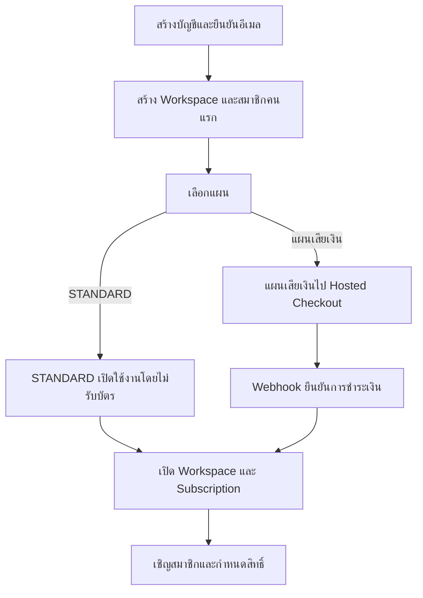

# Signup, Subscription & Access

หน้านี้สรุปการสมัครใช้งาน การชำระเงิน การเข้าสู่ระบบ และการกำหนดสิทธิ์

## Core Concepts

เอกสารนี้ใช้คำห้าคำต่อไปนี้ตลอดทั้งหน้า แต่ละคำควบคุมคนละเรื่องและใช้แทนกันไม่ได้

| คำ             | ความหมาย                                                       | ควบคุม                |
| -------------- | -------------------------------------------------------------- | --------------------- |
| User           | บัญชีผู้ใช้งานหนึ่งบัญชี ผูกกับอีเมลที่ยืนยันแล้ว              | การพิสูจน์ตัวตน       |
| Workspace      | พื้นที่ข้อมูลของสำนักงานหนึ่งแห่ง แยกจาก Workspace อื่นเด็ดขาด | ขอบเขตข้อมูล          |
| Subscription   | แผนที่ Workspace ใช้อยู่ กำหนดว่าโมดูลใดเปิดใช้ได้             | สิทธิ์ระดับ Workspace |
| Membership     | การที่ User หนึ่งบัญชีเป็นสมาชิกของ Workspace หนึ่งแห่ง        | ความเป็นสมาชิก        |
| Access Profile | ชุดสิทธิ์ที่กำหนดให้สมาชิกแต่ละคนภายใน Workspace               | สิทธิ์ระดับผู้ใช้     |

User หนึ่งบัญชีมี Membership ได้หลายรายการ จึงเข้าถึงได้หลาย Workspace
โดยสิทธิ์ในแต่ละ Workspace แยกจากกัน

### Setup Example

ลำดับการตั้งค่าเริ่มต้นของสำนักงานที่รับงานคดีแรงงานหนึ่งแห่ง

| ลำดับ | เหตุการณ์                                                                  | คำที่เกี่ยวข้อง |
| ----: | -------------------------------------------------------------------------- | --------------- |
|     1 | ผู้สมัครสร้างบัญชีและยืนยันอีเมล                                           | User            |
|     2 | ระบบสร้างพื้นที่เก็บแฟ้มงานกฎหมาย ลูกความ และเอกสารของสำนักงาน             | Workspace       |
|     3 | สำนักงานเลือกแผน PRO ทำให้ Time Tracking และ Conflict Checking เปิดใช้ได้   | Subscription    |
|     4 | ผู้สมัครเชิญทนายในทีมเข้า Workspace                                        | Membership      |
|     5 | ผู้ดูแลกำหนดให้ทนายในทีมสร้างและแก้ไขแฟ้มงานได้ แต่ไม่ให้อนุมัติใบเสนอราคา | Access Profile  |

### Access Evaluation Order

ระบบตรวจสิทธิ์สามชั้นตามลำดับทุกครั้งที่มีการทำรายการ

1. **Authentication** ตรวจว่าเป็น User ที่ยืนยันตัวตนแล้ว
2. **Entitlement** ตรวจว่า Subscription ของ Workspace เปิดโมดูลนั้น
3. **Authorization** ตรวจว่า Access Profile ของสมาชิกอนุญาตให้ทำรายการนั้น

หากไม่ผ่านชั้นใดชั้นหนึ่ง ระบบปฏิเสธรายการนั้น การเปลี่ยนแผนจึงไม่เปลี่ยนสิทธิ์
ของสมาชิก และการเพิ่มสิทธิ์ให้สมาชิกไม่เปิดโมดูลที่แผนไม่รองรับ

## Signup Flow

```mermaid
flowchart TD
  CreateUser["สร้างบัญชีและยืนยันอีเมล"]
  CreateWorkspace["สร้าง Workspace และสมาชิกคนแรก"]
  SelectPlan["เลือกแผน"]
  Free["STANDARD เปิดใช้งานโดยไม่รับบัตร"]
  Checkout["แผนเสียเงินไป Hosted Checkout"]
  Webhook["Webhook ยืนยันการชำระเงิน"]
  Active["เปิด Workspace และ Subscription"]
  Invite["เชิญสมาชิกและกำหนดสิทธิ์"]

  CreateUser --> CreateWorkspace --> SelectPlan
  SelectPlan -->|"STANDARD"| Free --> Active
  SelectPlan -->|"แผนเสียเงิน"| Checkout --> Webhook --> Active
  Active --> Invite
```

ทุกการสมัครใช้ flow เดียวกัน ผู้สมัครเป็น Owner และสมาชิกคนแรกของ Workspace

- หากใช้งานคนเดียว Workspace จะมีสมาชิกหนึ่งคน
- หากเป็นสำนักงาน Owner สามารถเชิญพนักงานเพิ่มได้
- Workspace ที่เริ่มจากสมาชิกหนึ่งคนเพิ่มสมาชิกภายหลังได้โดยไม่ต้องย้ายข้อมูล

## Payment Rules

- STANDARD ไม่ต้องใช้บัตรเครดิต
- แผนเสียเงินรับข้อมูลบัตรผ่าน Hosted Checkout เท่านั้น
- Legal Practice ERP Platform ไม่เก็บหมายเลขบัตรหรือรหัส CVC
- หน้า Payment Success ไม่ใช่หลักฐานเปิดใช้งาน
- ระบบเปิดหรือต่ออายุ Subscription เมื่อได้รับ webhook ที่ตรวจสอบแล้ว
- Webhook เดิมที่ถูกส่งซ้ำต้องไม่สร้าง Subscription หรือรายการชำระเงินซ้ำ

## Member Access

ระบบมี Starter Access Profiles ได้แก่ Admin, Lawyer, Assistant, Finance, HR และ
Manager ชุดเหล่านี้เป็นค่าเริ่มต้น ไม่ใช่ Role ที่บังคับทุกบริษัท
และใช้ได้ทุกแผนเพราะการกำหนดสิทธิ์ตามบทบาทเป็นความสามารถพื้นฐานของระบบ

**การปรับสิทธิ์รายบุคคลเพิ่มเติมจาก Access Profile เปิดใช้ตั้งแต่แผน PRO ขึ้นไป**
โดย Admin กำหนดให้สมาชิกแต่ละคนได้ว่า

- เข้า Module ใดได้
- ดูอย่างเดียวหรือสร้างและแก้ไขได้
- อนุมัติ ลบ หรือ Export ได้หรือไม่
- เข้าถึงข้อมูลของตนเอง งานที่ได้รับมอบหมาย ทีม หรือทั้ง Workspace

Workspace ที่ใช้แผน STANDARD หรือ ESSENTIALS กำหนดสิทธิ์ผ่าน Access Profile
ได้อย่างเดียว หากต้องปรับสิทธิ์ต่างจาก Access Profile ต้องเปลี่ยนเป็นแผน PRO
ขึ้นไป

Admin ไม่สามารถเปิด Module ที่ Subscription ไม่มี หรือให้สิทธิ์ข้าม Workspace

## Related Documents

- [Plans & Pricing](/docs/plans)
- [Pricing](/docs/plans/pricing)
- [Plan Rules](/docs/plans/plan-rules)
- [Users & Access](/docs/roles)
