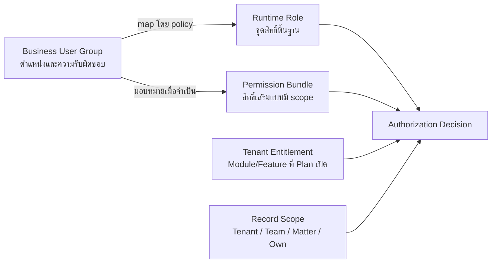

# Roles

หน้านี้กำหนดแบบจำลองผู้ใช้งานของ Legal ERP Platform โดยแยกตำแหน่งและหน้าที่,
Runtime Role, Permission Bundle และ Plan Entitlement ออกจากกัน เพื่อไม่ให้
ตำแหน่งงานหรือแผนราคากลายเป็นสิทธิ์เข้าถึงข้อมูลโดยอัตโนมัติ

## Role Model

ระบบจะอนุญาตให้ใช้งานเมื่อแผนขององค์กรเปิดฟีเจอร์ ผู้ใช้มีสิทธิ์ดำเนินการ
และข้อมูลอยู่ในขอบเขตที่ผู้ใช้เข้าถึงได้

Plan ที่เปิด Feature ไม่ได้ให้สิทธิ์ผู้ใช้โดยอัตโนมัติ และผู้ใช้ที่มี Permission
ไม่สามารถใช้ Feature ที่ Tenant ไม่มี entitlement

## Canonical Concepts

| Concept | Meaning | Example |
| --- | --- | --- |
| Business User Group | ตำแหน่งหรือความรับผิดชอบทางธุรกิจ | Partner, Senior Lawyer, Accounting |
| Runtime Role | กลุ่ม permission พื้นฐานที่ระบบบังคับใช้ | Admin, Lawyer, Assistant, Finance, HR, Manager |
| Permission Bundle | สิทธิ์เสริมที่ผูก action/scope/expiry | Document Approver, Manager A2, Sensitive Export |
| Plan Entitlement | Module/Feature ที่ Tenant เปิดตาม Plan/version | PRO เปิด Time Tracking |
| Record Scope | ขอบเขตข้อมูลที่ permission ใช้ได้ | Tenant, team, assigned Matter, own record |
| Acting Role | role/bundle ที่ผู้ใช้เลือกใช้กับธุรกรรมหนึ่ง | Lawyer ทำงานและ Manager อนุมัติ |

## Runtime Role Baseline

Legal ERP ใช้ runtime role หลัก 6 กลุ่ม โดยหนึ่งบัญชีอาจได้รับมากกว่าหนึ่ง role
เมื่อหน้าที่จำเป็นและผ่าน separation-of-duties review

| Role | ครอบคลุมกลุ่มผู้ใช้งาน | จุดประสงค์หลัก |
| --- | --- | --- |
| Admin | Tenant Admin / ผู้ดูแลระบบขององค์กร | ตั้งค่า Tenant, user, role, permission, master data, security และ audit |
| Lawyer | ทนายและพนักงานกฎหมาย | ทำงานกับ Client, Matter, Document, Task และ Calendar ตาม assignment |
| Assistant | Legal assistant, case coordinator และทีมสนับสนุน | เตรียมข้อมูล เอกสาร งาน นัดหมาย และติดตาม workflow โดยไม่อนุมัติขั้นสุดท้าย |
| Finance | ฝ่ายการเงินและบัญชี | ดูแล quotation, billing, payment, finance records และ reconciliation |
| HR | ฝ่ายทรัพยากรบุคคล | ดูแล personnel, payroll, leave และข้อมูลบุคลากรที่เป็นความลับ |
| Manager | ผู้บริหาร หุ้นส่วน หรือผู้กำกับงาน | ดูภาพรวม มอบหมาย ทบทวน และอนุมัติตาม authority/scope |

## Business User Groups

ระบบใช้กลุ่มผู้ใช้งานทางธุรกิจ 7 กลุ่มสำหรับเชื่อมตำแหน่งและความรับผิดชอบเข้ากับ
runtime role โดยไม่สร้าง runtime role ใหม่ตามชื่อตำแหน่งทุกชื่อ

| Business User Group | Role Mapping Direction |
| --- | --- |
| Owner | map ไป Manager และ bundle ด้าน oversight ตามขอบเขตที่อนุมัติ |
| Admin | map ไป Admin; ไม่มี business approval authority โดยอัตโนมัติ |
| Partner | map ไป Lawyer และอาจเพิ่ม Manager ตาม responsibility |
| Managing Partner | map ตาม authority ที่อนุมัติ โดยไม่อนุมานสิทธิ์จากชื่อตำแหน่ง |
| Senior Lawyer | map ไป Lawyer; review/approve ต้องเป็น scoped bundle |
| Junior Lawyer | map ไป Lawyer โดยไม่ให้ approval bundle อัตโนมัติ |
| Accounting | map ไป Finance และจำกัดจาก legal/HR content ที่ไม่จำเป็น |

Assistant และ HR ยังคงเป็น runtime roles เพราะกระบวนการทำงานต้องใช้บทบาทเหล่านี้

## Role Design Principles

- ใช้ least privilege และ deny by default
- ทุก permission ต้องมี action, resource และ scope ชัดเจน
- approval authority แยกจาก create/update และ executor เมื่อ control กำหนด
- ตำแหน่งและหน้าที่ไม่เพิ่ม permission จนกว่าจะผ่าน mapping และ approval
- Plan/Package ไม่เปลี่ยน role หรือ approval authority
- Tenant, team, Matter, assigned record และ own-record scope ต้องถูกตรวจทุกครั้ง
- Permission สำคัญต้องมี expiry, recertification และ immutable audit event
- Platform support ไม่ใช้ Tenant Admin role และต้องผ่าน controlled support หรือ
  Emergency Access

## Current Boundaries

- Client Contact ใช้ Portal Membership ภายใต้ SOP-CLI-002 แยกจาก internal role
- Senior Lawyer และ Managing Partner ยังเป็นตำแหน่งที่ต้อง map กับ role/bundle ไม่ใช่
  primary runtime role
- Sales ยังไม่แยกเป็น runtime role งาน quotation ใช้ Lawyer/Finance/Manager
  ตามหน้าที่และ authority
- Admin หมายถึง Tenant Admin ส่วน platform operator ใช้ service/support access
- Manager ไม่ได้เห็นทุก Tenant/team/Matter โดยอัตโนมัติ
- HR แยกจาก Finance เพื่อป้องกันการเปิดเผย payroll และ personnel data

## Related Documents

- [User Roles](/docs/roles/roles)
- [Permissions](/docs/roles/permissions)
- [User, Role & Access Management](/docs/sops/access-management)
- [Role & Permission Alignment](/docs/sops/governance/role-permission-alignment)
