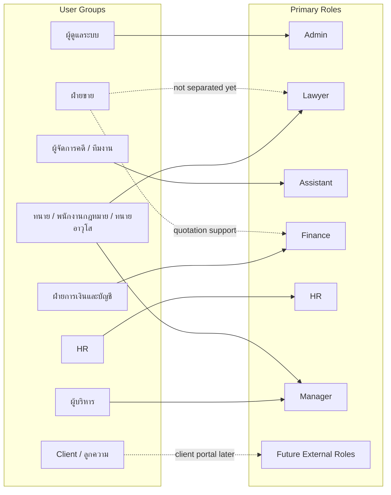

# Roles

หน้านี้สรุปแนวทางแบ่งกลุ่มผู้ใช้งานหลักของ Legal ERP Platform สำหรับรอบเริ่มต้น
โดยระบบต้องรองรับผู้ใช้งานหลายระดับ หลายฝ่าย และต้องควบคุมการเข้าถึงด้วย RBAC,
audit trail และมาตรฐานด้านความปลอดภัย

เป้าหมายของหน้านี้คือกำหนด role baseline ที่อ่านเข้าใจง่ายก่อนลงรายละเอียด
permission ในหน้าถัดไป

## Role Design Principles

แนวทางแบ่ง role ใช้หลักต่อไปนี้:

- ระบบต้องรองรับผู้ใช้งานหลายกลุ่ม เช่น ลูกความ, ทนาย/พนักงานกฎหมาย,
  ทนายอาวุโส/หุ้นส่วน, ผู้จัดการคดี, ฝ่ายขาย, ฝ่ายการเงินและบัญชี, HR, ผู้บริหาร
  และผู้ดูแลระบบ
- ผู้ใช้งานแต่ละกลุ่มต้องเห็นข้อมูลและฟังก์ชันตามบทบาทของตนเอง
- ระบบต้องควบคุมสิทธิ์ด้วย RBAC และต้องมี audit trail สำหรับการตรวจสอบย้อนหลัง
- เอกสารทางกฎหมายต้องมีขั้นตอน review/approval โดยทนายอาวุโสหรือผู้มีอำนาจ
- ข้อมูลการเงินต้องจำกัดสิทธิ์เฉพาะผู้เกี่ยวข้อง เช่น finance, manager
  หรือผู้บริหาร
- dashboard และรายงานต้องช่วยให้ manager เห็นภาระงาน รายได้ ต้นทุน
  และประสิทธิภาพของทีมแบบภาพรวม

## Role Baseline

เพื่อให้เอกสารเริ่มต้นไม่ซับซ้อนเกินไป รอบนี้กำหนดกลุ่มผู้ใช้งานหลัก 6 กลุ่ม:

| Role      | ครอบคลุมกลุ่มผู้ใช้งาน                               | จุดประสงค์หลัก                                                          |
| --------- | ---------------------------------------------------- | ----------------------------------------------------------------------- |
| Admin     | ผู้ดูแลระบบ, SaaS Admin, System Admin, Tenant Admin  | ตั้งค่าระบบ ผู้ใช้งาน role, permission, master data, security และ audit |
| Lawyer    | ทนาย, พนักงานกฎหมาย, ทนายอาวุโสบางกรณี               | ทำงานกฎหมายหลักกับ Matter (แฟ้มงานกฎหมาย), เอกสาร, task และนัดหมาย      |
| Assistant | ผู้จัดการคดี, ทีมงาน, legal operation, staff support | ช่วยเตรียมข้อมูล ติดตามงาน นัดหมาย เอกสาร และประสานงานในแฟ้มงานกฎหมาย   |
| Finance   | ฝ่ายการเงินและบัญชี                                  | ดูแล quotation, invoice, payment, billing และข้อมูลการเงินที่เกี่ยวข้อง |
| HR        | ฝ่ายบุคคล (HR)                                       | ดูแลเงินเดือน (Payroll), ภาษี, ประกันสังคม, การลา และข้อมูลบุคลากร      |
| Manager   | ผู้บริหาร, partner, senior lawyer, practice manager  | ดูภาพรวม อนุมัติ ตรวจสอบ performance และตัดสินใจจาก dashboard/report    |

## Current Boundary

- Client หรือ external customer ยังไม่ถูกนับเป็น primary internal role ในรอบนี้
  เพราะต้องแยกเป็น client portal หรือ external access model ภายหลัง
- Sales ยังไม่แยกเป็น role หลักในรอบเริ่มต้น งาน quotation ที่เกี่ยวข้องกับขาย
  จะอยู่ระหว่าง Lawyer, Finance และ Manager ก่อน
- HR แยกเป็น role หลักของตัวเอง (ไม่รวมกับ Finance) เพื่อรักษาความลับของข้อมูล
  เงินเดือนพนักงาน แยกจากข้อมูล billing ของลูกค้าที่ Finance ดูแล
- Senior Lawyer ยังไม่แยกเป็น role หลัก แต่บาง permission เช่น review/approve
  document อาจถูกกำหนดเป็นสิทธิ์เพิ่มเติมของ Lawyer หรือ Manager

## Next Step

จาก role baseline นี้ หน้า [User Roles](/docs/roles/roles)
ลงรายละเอียดหน้าที่ของแต่ละ role ส่วนหน้า [Permissions](/docs/roles/permissions)
ใช้เป็น matrix เริ่มต้นว่าแต่ละ role ดู เพิ่ม แก้ไข อนุมัติ ส่งออก
หรือลบข้อมูลใดได้บ้าง
