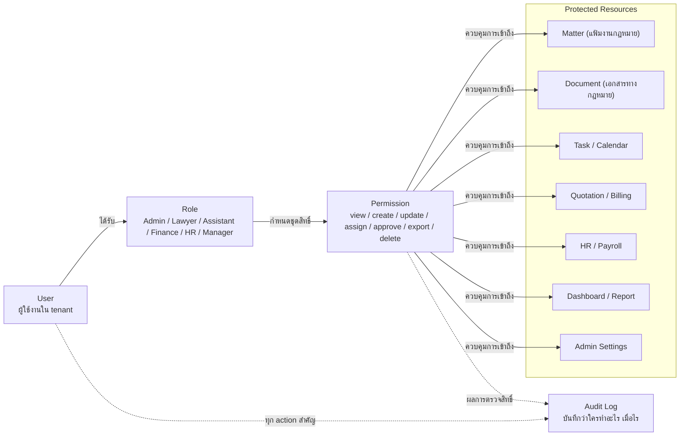

# Permissions

หน้านี้กำหนดแนวคิด permission และ permission matrix เริ่มต้นของ Legal ERP
Platform เพื่อใช้เป็นฐานก่อนลงรายละเอียดในแต่ละ module

ระบบต้องใช้ RBAC เพื่อให้ผู้ใช้งานแต่ละกลุ่มเห็นข้อมูลและฟังก์ชันตามบทบาทของ
ตนเอง พร้อม audit trail สำหรับตรวจสอบย้อนหลัง

## RBAC Concept

## Permission Actions

permission ควรเริ่มจาก action พื้นฐานที่อ่านง่ายและใช้ซ้ำได้ทุก module:

- view: ดูข้อมูลหรือรายการ
- create: สร้างข้อมูลใหม่
- update: แก้ไขข้อมูล
- assign: มอบหมายงานหรือเปลี่ยนผู้รับผิดชอบ
- approve: อนุมัติรายการสำคัญ เช่น document, quotation หรือ expense
- export: ส่งออกเอกสาร รายงาน หรือข้อมูล
- delete: ลบหรือยกเลิกข้อมูล
- manage: ตั้งค่าระบบ ผู้ใช้งาน role, permission หรือ master data

## Starting Rule

- ให้สิทธิ์น้อยที่สุดเท่าที่ role ต้องใช้ทำงานจริง
- ข้อมูลของแต่ละ tenant ต้องแยกกันเสมอ
- ข้อมูลสำคัญ เช่น document, billing, payment และ admin settings ต้องมี audit
  log
- permission ที่เกี่ยวกับ approval ควรแยกจาก permission สำหรับ create/update
- การลบข้อมูลสำคัญควรถูกจำกัด และอาจใช้ soft delete หรือขั้นตอนอนุมัติ

## Matrix Notation

ตารางด้านล่างใช้คำสั้น ๆ เพื่อให้อ่านง่าย:

| Notation | Meaning                                                               |
| -------- | --------------------------------------------------------------------- |
| Config   | ตั้งค่าระบบหรือข้อมูลตั้งต้น ไม่ได้หมายถึงเห็นข้อมูลปฏิบัติการทั้งหมด |
| Full     | ดู สร้าง แก้ไข ส่งออก และจัดการรายการในพื้นที่งานนั้น                 |
| Work     | ทำได้เฉพาะแฟ้มงานที่รับผิดชอบ อยู่ในทีม หรือได้รับมอบหมาย             |
| Support  | ช่วยเตรียมและอัปเดตข้อมูล แต่ไม่อนุมัติขั้นสุดท้าย                    |
| Read     | ดูข้อมูลหรือรายงานอย่างเดียว                                          |
| Assign   | มอบหมายงาน เปลี่ยนผู้รับผิดชอบ หรือจัดลำดับงาน                        |
| Approve  | ตรวจสอบหรืออนุมัติรายการสำคัญ                                         |
| Export   | ส่งออกข้อมูล เอกสาร หรือรายงาน                                        |
| No       | ไม่มีสิทธิ์ตามปกติ                                                    |

## Permission Matrix

ทุกสิทธิ์ในตารางนี้อยู่ภายใน tenant เดียวกันเท่านั้น และสิทธิ์ของ Lawyer กับ
Assistant ต้องถูกจำกัดด้วยแฟ้มงานกฎหมาย ทีม หรือรายการที่ได้รับมอบหมายเสมอ
ในตารางนี้ Client หมายถึงลูกความหรือผู้รับบริการ, Matter หมายถึงแฟ้มงานกฎหมาย
และ Document หมายถึงเอกสารทางกฎหมาย

| Area                    |       Admin       |      Lawyer      |      Assistant      |        Finance         |         HR          |       Manager       |
| :---------------------- | :---------------: | :--------------: | :-----------------: | :--------------------: | :-----------------: | :-----------------: |
| Tenant, User, Role      |   Config / Full   |        No        |         No          |           No           |         No          |   Read team users   |
| Master Data             |   Config / Full   |       Read       |        Read         |  Config finance data   |   Config HR data    |        Read         |
| Client                  |   Support only    |       Work       |       Support       | Read billing contacts  |         No          |    Read overview    |
| Matter                  |   Support only    |   Work / Full    |       Support       |  Read billing status   |         No          |   Read / Approve    |
| Document & Template     | Config templates  |       Work       |       Support       | Read finance documents |         No          |  Approve / Export   |
| Task & Calendar         | Config categories |       Work       |   Work / Support    |   Work finance tasks   | Work leave calendar |    Read / Assign    |
| Quotation & Service Fee |      Config       |    Work draft    |       Support       |          Full          |         No          |  Approve / Export   |
| Billing & Payment       |      Config       | Read own matters | Read assigned items |          Full          |         No          |  Approve / Export   |
| Finance Foundation      |      Config       |        No        |         No          |          Full          |         No          |   Read / Approve    |
| HR & Payroll            |  Config settings  |        No        |         No          |           No           |        Full         |   Read / Approve    |
| Reports & Dashboard     | Read system/audit |  Read own/team   | Read assigned work  |  Read finance reports  |   Read HR reports   |    Full overview    |
| Audit Log & Security    |       Full        |        No        |         No          |   Read finance audit   |    Read HR audit    | Read management log |

## Approval Matrix

รายการที่มีผลต่อเอกสารทางกฎหมาย การเงิน หรือสิทธิ์ผู้ใช้งานควรแยกคนเตรียมข้อมูล
ออกจากคนอนุมัติ เพื่อลดความผิดพลาดและตรวจสอบย้อนหลังได้ง่าย

| Item                     | Prepare / Edit                 | Approve / Confirm                              | Audit Note                                           |
| ------------------------ | ------------------------------ | ---------------------------------------------- | ---------------------------------------------------- |
| Document final approval  | Lawyer, Assistant              | Manager หรือ senior Lawyer                     | บันทึกผู้แก้ไข ผู้ตรวจ และเวลาที่อนุมัติ             |
| Quotation approval       | Lawyer, Finance                | Manager                                        | บันทึกส่วนลด เงื่อนไขพิเศษ และเวอร์ชัน quotation     |
| Billing adjustment       | Finance                        | Manager                                        | บันทึกเหตุผลการแก้ invoice, payment หรือยอดค้าง      |
| Payment refund/write-off | Finance                        | Manager                                        | บันทึกจำนวนเงิน เหตุผล และผู้อนุมัติ                 |
| Leave request            | พนักงาน (self-service) หรือ HR | Manager หรือ alternate HR                      | policy/balance/overlap และ requester/approver แยกกัน |
| Payroll run              | HR                             | Manager A1; privileged/org-wide เพิ่ม Admin A2 | maker/A1/A2/System post แยกกันและ Posted immutable   |
| Delete / restore data    | เจ้าของข้อมูลหรือผู้รับผิดชอบ  | Manager หรือ Admin ตามประเภทข้อมูล             | ใช้ soft delete สำหรับข้อมูลสำคัญ                    |
| Permission change        | Admin                          | Manager; privileged ใช้ Manager A1 + Admin A2  | บันทึก role เดิม role ใหม่ เหตุผล scope และ expiry   |
| Sensitive export         | ผู้มีสิทธิ์ตาม module          | Manager เมื่อเป็นข้อมูลสำคัญ                   | บันทึกไฟล์ เวลา ผู้ส่งออก และขอบเขตข้อมูล            |

## Data Boundary Rules

- Admin มีหน้าที่ตั้งค่าและช่วยแก้ปัญหาระบบ แต่ไม่ควรเห็นหรือแก้เนื้อหางาน
  กฎหมายโดยไม่จำเป็น
- Lawyer และ Assistant เห็นข้อมูลตามแฟ้มงานกฎหมาย ทีม หรือรายการที่ได้รับ
  มอบหมาย
- Finance เห็นข้อมูลที่จำเป็นต่อ quotation, billing, payment และ finance
  foundation แต่ไม่จำเป็นต้องเห็นรายละเอียดเอกสารทางกฎหมายทั้งหมด
- HR เห็นเฉพาะข้อมูลบุคลากร เงินเดือน และการลา ไม่เห็นข้อมูล Matter, document
  ทางกฎหมาย หรือ billing ของลูกค้า และข้อมูลเงินเดือนรายบุคคลไม่ควรให้ Finance
  เข้าถึงโดยตรง
- Manager เห็นภาพรวมและอนุมัติรายการสำคัญตามระดับความรับผิดชอบ ไม่ใช่เห็นทุก
  ข้อมูลของทุกทีมโดยอัตโนมัติ
- การลบ ส่งออก อนุมัติ เปลี่ยนสิทธิ์ และแก้ไขข้อมูลการเงินต้องมี audit log เสมอ
- ถ้ามีแฟ้มงานที่ต้องจำกัดเป็นพิเศษ ควรมีสิทธิ์ระดับแฟ้มงานกฎหมายเพิ่มเติมเหนือ
  role ปกติ

Authority, scope, maker-checker และ toxic permission combination ใช้
[Role & Permission Alignment](/docs/sops/governance/role-permission-alignment)
เป็น control หลักเมื่อข้อความสรุปในหน้านี้ไม่ละเอียดพอ

## Review Rule

ทบทวน matrix นี้พร้อม SOP-SEC-001 และ CTRL-RBAC-001 ทุกไตรมาส รวมถึงเมื่อ role,
approval authority, module scope หรือ privileged permission เปลี่ยน
