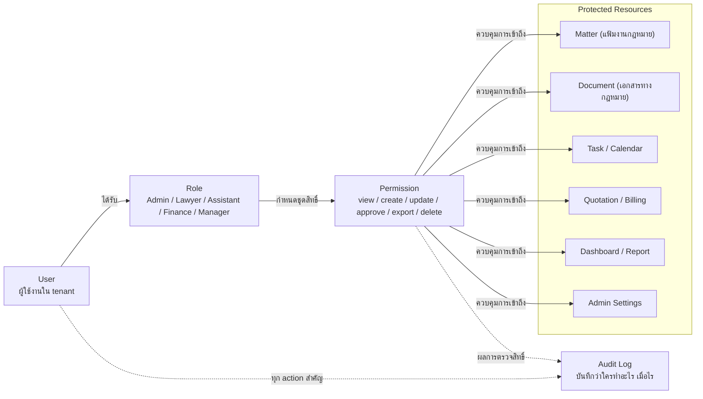

# Permissions

หน้านี้ใช้เป็น baseline สำหรับอธิบายแนวคิด permission ของ Legal ERP Platform
ก่อนทำ permission matrix ราย module ในขั้นถัดไป

requirement ระบุว่าระบบต้องใช้ RBAC เพื่อให้ผู้ใช้งานแต่ละกลุ่มเห็นข้อมูลและ
ฟังก์ชันตามบทบาทของตนเอง พร้อม audit trail สำหรับตรวจสอบย้อนหลัง

## RBAC Concept

## Permission Actions

permission ควรเริ่มจาก action พื้นฐานที่อ่านง่ายและใช้ซ้ำได้ทุก module:

- `view`: ดูข้อมูลหรือรายการ
- `create`: สร้างข้อมูลใหม่
- `update`: แก้ไขข้อมูล
- `approve`: อนุมัติรายการสำคัญ เช่น document, quotation หรือ expense
- `export`: ส่งออกเอกสาร รายงาน หรือข้อมูล
- `delete`: ลบหรือยกเลิกข้อมูล

## Starting Rule

- ให้สิทธิ์น้อยที่สุดเท่าที่ role ต้องใช้ทำงานจริง
- ข้อมูลของแต่ละ tenant ต้องแยกกันเสมอ
- ข้อมูลสำคัญ เช่น document, billing, payment และ admin settings ต้องมี audit
  log
- permission ที่เกี่ยวกับ approval ควรแยกจาก permission สำหรับ create/update
- การลบข้อมูลสำคัญควรถูกจำกัด และอาจใช้ soft delete หรือขั้นตอนอนุมัติ

## Next Step

ขั้นถัดไปคือทำ permission matrix แยกตาม module เช่น Matter, Document, Task,
Quotation, Billing, Finance และ Administration
