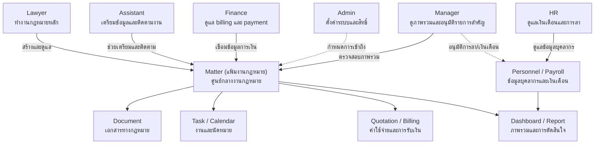

# User Roles

หน้านี้อธิบาย Access Profile พื้นฐานของ Legal ERP ซึ่งเป็นชุดสิทธิ์เริ่มต้น
ไม่ใช่ชื่อตำแหน่งงานหรือแผนราคา

สมาชิกหนึ่งคนมีได้มากกว่าหนึ่ง Access Profile เมื่อมีหน้าที่หลายด้าน เช่น
Partner อาจใช้ทั้ง Lawyer และ Manager
ส่วนสิทธิ์ที่มีความเสี่ยงสูงต้องกำหนดเพิ่มเติม
เป็นรายบุคคลและระบุขอบเขตให้ชัดเจน

Access Profile ทุกกลุ่มมีให้ใช้กับทุกแผน แต่สมาชิกจะเข้าได้เฉพาะโมดูลที่แผนของ
Workspace เปิดไว้

## Admin

Admin คือผู้ดูแลการตั้งค่าและความปลอดภัยของ Workspace ผู้ดูแล Platform ไม่ได้รับ
Access Profile นี้ใน Workspace และต้องใช้ช่องทางช่วยเหลือที่แยกจาก
บัญชีสมาชิกปกติ

หน้าที่หลัก:

- จัดการ Workspace สมาชิก Access Profile และสิทธิ์รายบุคคล
- ตั้งค่า master data เช่น ประเภทแฟ้มงานกฎหมาย ประเภทเอกสาร สถานะงาน
  และข้อมูลตั้งต้นที่ระบบใช้ซ้ำ
- ตั้งค่า security เช่น MFA, password policy, RBAC และ access control
- ดู audit log และตรวจสอบการเข้าถึงข้อมูลสำคัญ
- ตั้งค่าการเชื่อมต่อระบบภายนอกตามที่ระบบรองรับ
- ตั้งค่าข้อมูลที่ใช้กับ e-signature หรือผู้อนุมัติ เมื่อมีการกำหนดขั้นตอนชัดเจน

ขอบเขตที่ควรระวัง:

- Admin ไม่ควรใช้สิทธิ์ดูหรือแก้ไขเนื้อหางานกฎหมายโดยไม่จำเป็น
- การแก้ไข permission ต้องถูกบันทึกใน audit log
- Platform support ต้องใช้ access แบบ time-bound ภายใต้ Emergency Access control
  และห้ามได้รับ business approval authority

## Lawyer

Lawyer คือผู้ทำงานกฎหมายหลัก เช่น ทนาย พนักงานกฎหมาย หรือทนายอาวุโส ที่ทำงานกับ
Matter (แฟ้มงานกฎหมาย), client, document, task และ calendar

หน้าที่หลัก:

- สร้างและดูแลแฟ้มงานกฎหมายที่ตนรับผิดชอบ
- บันทึกข้อมูลลูกความ ข้อมูลคดี/งานกฎหมาย และสถานะงาน
- สร้างเอกสารทางกฎหมายจาก template และแก้ไขร่างเอกสาร
- อัปโหลด จัดหมวดหมู่ แท็ก และเชื่อมเอกสารกับแฟ้มงานกฎหมาย
- สร้าง task นัดหมาย deadline และติดตามงานของตนเอง
- ให้ข้อมูลสำหรับ quotation หรือ service fee ตามขอบเขตบริการทางกฎหมาย
- review หรือ approve เอกสาร เฉพาะกรณีที่ได้รับ permission ระดับ senior

ขอบเขตที่ควรระวัง:

- Lawyer ควรเห็นเฉพาะแฟ้มงานกฎหมายที่เกี่ยวข้องกับตนหรือทีม
- การ approve เอกสารไม่ควรให้ทุก lawyer ทำได้โดยอัตโนมัติ
- การเข้าถึงข้อมูลการเงินควรจำกัดเฉพาะข้อมูลที่เกี่ยวข้องกับงานของตน

## Assistant

Assistant คือผู้ช่วยปฏิบัติการของทีมกฎหมาย เช่น legal assistant, case
coordinator หรือทีมงานที่ช่วยเตรียมข้อมูลและติดตามงาน

หน้าที่หลัก:

- สร้างหรืออัปเดตข้อมูลพื้นฐานของแฟ้มงานกฎหมายตามที่ได้รับมอบหมาย
- เตรียมเอกสาร อัปโหลดไฟล์ จัดหมวดหมู่ และใส่ metadata
- จัดตารางนัดหมาย ติดตาม deadline และส่ง reminder
- สร้าง task ย่อยหรืออัปเดตสถานะงานตามความคืบหน้าจริง
- ประสานงานระหว่าง lawyer, finance และ manager
- ช่วยค้นหาเอกสารหรือข้อมูลที่เกี่ยวข้องกับแฟ้มงานกฎหมาย

ขอบเขตที่ควรระวัง:

- Assistant ไม่ควร approve เอกสารทางกฎหมายขั้นสุดท้าย
- ไม่ควรเข้าถึงข้อมูลการเงินเชิงลึก เว้นแต่ได้รับ permission เฉพาะ
- การลบเอกสารหรือข้อมูลสำคัญควรถูกจำกัดหรือใช้ขั้นตอนอนุมัติ

## Finance

Finance คือผู้ดูแลงาน quotation, billing, invoice, payment และข้อมูลการเงิน
ที่เกี่ยวข้องกับแฟ้มงานกฎหมาย

หน้าที่หลัก:

- สร้าง ตรวจสอบ หรืออัปเดต quotation ตามข้อมูลบริการและค่าธรรมเนียม
- ดูแล invoice, payment, billing status และยอดค้างชำระ
- บันทึกข้อมูลรับเงิน รายการจ่ายเงิน ภาษี และข้อมูลการเงินตั้งต้น
- ติดตามสถานะการชำระเงินและจัดทำรายงานการเงินเบื้องต้น
- ตรวจสอบ financial control เช่น expense approval หรือวงเงินเครดิต เมื่ออยู่ใน
  scope
- ประสานงานกับ lawyer และ manager เพื่อยืนยันข้อมูลค่าบริการ

ขอบเขตที่ควรระวัง:

- Finance ไม่จำเป็นต้องเห็นรายละเอียดเอกสารทางกฎหมายทั้งหมด
- ข้อมูลการเงินควรแยก permission ระหว่าง view, create, approve และ export
- การแก้ไข invoice, payment หรือข้อมูลภาษีต้องมี audit log ชัดเจน

## HR

HR คือผู้ดูแลงานบุคลากรของสำนักงาน เช่น เงินเดือน (Payroll) การลา
และข้อมูลพนักงาน แยกออกจาก Finance เพื่อรักษาความลับของข้อมูลเงินเดือน
ไม่ให้ปนกับข้อมูล billing ของลูกค้า

หน้าที่หลัก:

- คำนวณเงินเดือน ภาษี ประกันสังคม กองทุน OT เบี้ยขยัน และโบนัส
- ออก payslip ออนไลน์ และจัดการรอบเงินเดือน
- ดูแลระบบลาออนไลน์ (Leave Management)
  รวมถึงอนุมัติเบื้องต้นและติดตามวันลาคงเหลือ
- บันทึกและปรับปรุงข้อมูลบุคลากร เช่น ตำแหน่ง แผนก และวันเริ่มงาน
- Export ข้อมูลเงินเดือนและการลาให้ทีมบัญชีตามรอบที่กำหนด
- จัดทำรายงานสรุปด้าน HR ให้ Manager ใช้ประกอบการตัดสินใจ

ขอบเขตที่ควรระวัง:

- HR ไม่ควรเห็นข้อมูล Matter, document ทางกฎหมาย หรือ billing ของลูกค้า
- ข้อมูลเงินเดือนรายบุคคลต้องจำกัดสิทธิ์เฉพาะ HR และ Manager/Admin
  ตามระดับที่กำหนด ไม่ควรให้ Finance เข้าถึงโดยตรง
- การอนุมัติรอบเงินเดือนควรแยกจากคนที่จัดทำ (ผู้จัดทำกับผู้อนุมัติต้องคนละคน)

## Manager

Manager คือผู้บริหาร หุ้นส่วน ทนายอาวุโส หรือ legal practice manager
ที่ต้องเห็นภาพรวมเพื่อควบคุมงาน ตัดสินใจ และอนุมัติรายการสำคัญ

หน้าที่หลัก:

- ดู dashboard ภาพรวมของแฟ้มงานกฎหมาย งานค้าง รายได้ ต้นทุน และ productivity
- ตรวจสอบ workload ของทีมและช่วยจัดลำดับความสำคัญของงาน
- approve รายการสำคัญ เช่น quotation, document, scope change หรือ expense ตาม
  policy ขององค์กร
- ดู report เพื่อประเมิน performance ของทีมและ profitability ของแต่ละแฟ้มงาน
- ติดตามความเสี่ยง เช่น deadline ใกล้ครบ งานล่าช้า หรือยอดค้างชำระสูง
- กำกับมาตรฐานการทำงานและช่วยตัดสินใจเรื่อง resource allocation

ขอบเขตที่ควรระวัง:

- Manager ควรเห็นข้อมูลข้ามทีมตามระดับความรับผิดชอบ ไม่ใช่เห็นทุกอย่างเสมอไป
- การ approve ควรแยกตามประเภทข้อมูล เช่น document, quotation, expense และ
  permission ต้องระบุชัด
- ถ้า Manager เป็นที่ปรึกษาภายนอกหรือ Partner บางราย ต้องจำกัดข้อมูลเฉพาะ
  Workspace ทีม หรือกลุ่มงานที่รับผิดชอบ

## Position Mapping Overview

ตารางนี้เป็นแนวทางเริ่มต้น Workspace Admin ต้องพิจารณาหน้าที่จริงก่อนกำหนดสิทธิ์

| ตำแหน่งหรือหน้าที่ | Access Profile ที่แนะนำ                  | ข้อจำกัดสำคัญ                                     |
| ------------------ | ---------------------------------------- | ------------------------------------------------- |
| Owner              | Manager                                  | ไม่ได้รับ Admin หรือ Finance โดยอัตโนมัติ         |
| Admin              | Admin                                    | ไม่ควรอนุมัติรายการธุรกิจที่ตนเป็นผู้ดำเนินการ    |
| Partner            | Lawyer และอาจเพิ่ม Manager               | ชื่อตำแหน่งอย่างเดียวไม่ให้สิทธิ์อนุมัติทุกประเภท |
| Managing Partner   | Lawyer และ Manager                       | ต้องกำหนดขอบเขตและระดับอนุมัติแยก                 |
| Senior Lawyer      | Lawyer และสิทธิ์ Review/Approve เฉพาะงาน | ห้ามอนุมัติงานของตนเองเมื่อกำหนดให้แยกคน          |
| Junior Lawyer      | Lawyer                                   | ไม่ได้รับสิทธิ์ Review/Approve เป็นค่าเริ่มต้น    |
| Accounting         | Finance                                  | จำกัดข้อมูลกฎหมายและข้อมูลเงินเดือนรายบุคคล       |

กลุ่มผู้ใช้งานเพิ่มเติมที่กระบวนการทำงานต้องใช้:

| กลุ่มผู้ใช้งาน                     | รูปแบบการเข้าถึง          | ข้อจำกัดสำคัญ                                    |
| ---------------------------------- | ------------------------- | ------------------------------------------------ |
| Legal Assistant / Case Coordinator | Assistant                 | prepare/support; ไม่อนุมัติขั้นสุดท้าย           |
| HR Personnel                       | HR                        | personnel/payroll/leave only; แยกจาก Finance     |
| Client Contact                     | Portal Membership         | ใช้ข้อมูลที่ Workspace เผยแพร่ ไม่ใช่สมาชิกภายใน |
| Platform Operator                  | Controlled support access | ไม่ใช้ Admin และต้องจำกัดเวลาและบันทึกการใช้งาน  |

## Approved Baseline Decisions

- Senior Lawyer ใช้ Lawyer และเพิ่มสิทธิ์ Review/Approve เฉพาะขอบเขต
- Client Contact ใช้ Portal Membership ตาม SOP-CLI-002 และ controlled external
  sharing ตาม SOP-DOC-001
- ยังไม่สร้าง Sales Access Profile แยก โดย Lawyer/Finance จัดทำ quotation และ
  Manager อนุมัติ
- Admin หมายถึงผู้ดูแล Workspace ส่วน Platform Support ใช้ช่องทางช่วยเหลือที่แยก
- Manager ถูกจำกัดด้วย Workspace ทีม แฟ้มงาน และขอบเขตความรับผิดชอบ
  ไม่ได้เห็นข้อมูล ทั้งหมดโดยอัตโนมัติ
- Managing Partner ไม่ได้รับ authority เพิ่มจากชื่อตำแหน่งโดยอัตโนมัติ
- Assistant และ HR คงอยู่เพราะกระบวนการทำงานต้องใช้บทบาทเหล่านี้

## Related Documents

- [Roles Overview](/docs/roles)
- [Role Mapping](/docs/roles/role-mapping)
- [Permissions](/docs/roles/permissions)
- [User, Role & Access Management](/docs/sops/access-management)
- [Role & Permission Alignment](/docs/sops/governance/role-permission-alignment)
