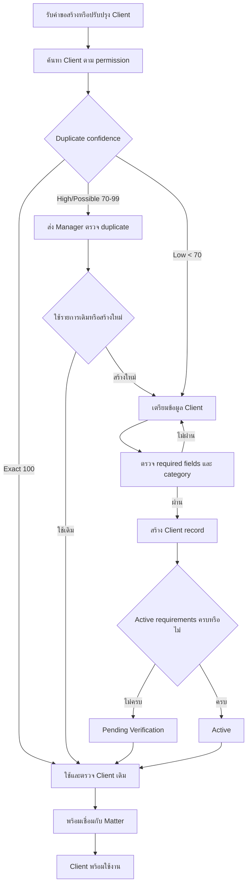

# Client Registration & Maintenance

| Document Control        | Value                           |
| ----------------------- | ------------------------------- |
| SOP ID                  | SOP-CLI-001                     |
| Status                  | Approved                        |
| Version                 | 1.0                             |
| Process Owner           | Manager                         |
| System Owner            | Admin                           |
| Approver                | Manager + Data/Compliance Owner |
| Effective Date          | 14 July 2026                    |
| Last Requirement Review | 14 July 2026                    |

> **Approval notice:** Requirement ยืนยันการค้นหา ลงทะเบียน จัดหมวดหมู่
> ดูรายละเอียด เชื่อม Matter และบันทึก Interaction โดย mandatory fields และ
> Client Status gate ได้รับการยืนยันตาม DEC-CLI-001 และ duplicate matching
> ได้รับการยืนยันตาม DEC-CLI-002 แล้ว ส่วน correction, merge และ Client status
> maintenance authority ได้รับการยืนยันตาม DEC-CLI-003 แล้ว เกณฑ์ VIP/Retainer
> ได้รับการยืนยันตาม DEC-CLI-004 และ Interaction/Note policy ได้รับการยืนยันตาม
> DEC-CLI-005 แล้ว Legal/Compliance ยืนยัน retention baseline และเอกสารมีผลใช้
> ตั้งแต่ 14 July 2026

## Purpose

กำหนดขั้นตอนสร้างและดูแล Client record ให้ระบุตัวลูกความได้ถูกต้อง ลดข้อมูลซ้ำ
เชื่อมโยงกับ Matter ได้ และเก็บประวัติการติดต่อที่ตรวจสอบย้อนหลังได้

## Scope

เริ่มเมื่อได้รับคำขอสร้างหรือปรับปรุง Client และสิ้นสุดเมื่อ Client record
ผ่านการตรวจสอบ จัดหมวดหมู่ และพร้อมเชื่อมกับ Matter

ครอบคลุม Client บุคคลและองค์กร การค้นหา ลงทะเบียน จัดหมวดหมู่ ดูรายละเอียด
บันทึก Interaction/Note เชื่อม Matter จัดการ VIP และ Retainer ส่วน Client
Portal, Feedback และการวิเคราะห์ลูกค้าอยู่นอกขอบเขตฉบับนี้

## Roles

| Role                  | Responsibility in This SOP                                        |
| --------------------- | ----------------------------------------------------------------- |
| Lawyer                | ให้ข้อมูล Client ตรวจความสัมพันธ์ และบันทึก Interaction/Note      |
| Assistant             | ค้นหา เตรียม ลงทะเบียน และตรวจความครบถ้วนของข้อมูล                |
| Manager               | เป็น Process Owner และอนุมัติ correction หรือ status maintenance  |
| Data/Compliance Owner | อนุมัติรายการที่กระทบ identity, privacy, merge หรือ compliance    |
| Finance               | ตรวจ Retainer Plan, commercial document, usage และ financial term |
| Admin                 | ดำเนินการ merge/status change และดูแล master data ตามผลอนุมัติ    |

ผู้ใช้ทุก Role ต้องดำเนินการภายใต้ permission ของ Tenant และ Matter
ที่เกี่ยวข้อง

## Required Information

### Common Fields

- Client ID และ Tenant ID
- Client type: Individual หรือ Organization
- Legal/registered name และ display name
- Client category จาก active master data
- Country of residence/registration
- Primary contact name
- Email หรือ phone อย่างน้อยหนึ่งรายการ
- Preferred communication channel
- Source หรือ requester
- Client status
- Privacy notice delivered at
- Created/updated by และ created/updated at
- Validation result และ schema version

### Individual Client

| Field                     | Rule                                                     |
| ------------------------- | -------------------------------------------------------- |
| Legal first and last name | Required                                                 |
| Nationality               | Required                                                 |
| Contact address           | Required before Active                                   |
| Date of birth             | Required เมื่อ identity verification หรือ policy กำหนด   |
| National ID/Passport      | Required เมื่อ AML, engagement หรือ service policy กำหนด |
| Occupation/Employer       | Conditional ตาม risk/service                             |
| Authorized representative | Conditional เมื่อดำเนินการผ่านตัวแทน                     |

### Organization Client

| Field                           | Rule                                 |
| ------------------------------- | ------------------------------------ |
| Registered legal name           | Required                             |
| Entity type                     | Required                             |
| Country of registration         | Required                             |
| Registration number             | Required สำหรับนิติบุคคลที่จดทะเบียน |
| Registered address              | Required before Active               |
| Primary representative          | Required                             |
| Representative position/contact | Required                             |
| Tax ID                          | Conditional ตาม billing/tax policy   |
| Authorized signatory            | Conditional ก่อน engagement          |
| Parent company/related entities | Conditional สำหรับ conflict check    |
| Beneficial owner                | Conditional ตาม AML/risk policy      |

### Client Status

| Status               | Meaning                                                          |
| -------------------- | ---------------------------------------------------------------- |
| Pending Verification | Common fields ครบ แต่ identity หรือ conditional fields ยังไม่ครบ |
| Active               | Field ที่มีผลผ่าน validation และพร้อมใช้กับ Matter ที่ Active    |
| Inactive             | ห้ามใช้กับ Matter ใหม่ แต่เก็บประวัติตาม Retention Policy        |
| Merged               | รายการต้นทางที่รวมแล้ว ห้ามใช้ใหม่และต้อง redirect ไปผู้รอด      |

### Approved Validation Rules

- Email, phone, country และ identifier ต้องจัดเก็บในรูปแบบมาตรฐาน
- Category และ Entity type ต้องเลือกจาก active master data
- Identifier ที่รูปแบบไม่ถูกต้องต้องไม่ผ่าน validation
- Sensitive fields ต้องเข้ารหัส แสดงแบบ masked และจำกัด permission
- การอ่านหรือแก้ sensitive field ต้องมี audit event
- ห้ามกำหนด Client เป็น Active เมื่อ mandatory และ conditional fields ที่มีผล
  ยังไม่ครบ
- Field ที่ไม่เกี่ยวข้องให้ใช้ Not Required พร้อม reason ห้ามใส่ข้อมูลสมมติ
- การแก้ Legal name, identifier หรือ registration number ต้องสร้าง revision
- เก็บข้อมูลเท่าที่จำเป็นตาม service, risk และ Tenant Policy

## Approved Duplicate Matching Rules

ตรวจ Client ทุกสถานะภายใน Tenant เดียวกันก่อนสร้างและเมื่อแก้ identifier สำคัญ
โดยห้ามเปิดเผยข้อมูล Client ข้าม Tenant

### Data Normalization

- ตัดช่องว่างซ้ำ separator และอักขระตกแต่งตามชนิดข้อมูล
- เปรียบเทียบชื่อแบบไม่สนตัวพิมพ์เล็ก/ใหญ่ โดยเก็บค่าต้นฉบับไว้
- จัด Email, phone, country, National ID, Passport, Registration Number และ Tax
  ID ให้อยู่ในรูปแบบมาตรฐานก่อนเปรียบเทียบ
- เก็บชื่อไทย อังกฤษ ชื่อเดิม และ alias แยกกัน
- Normalization ห้ามเปลี่ยนค่าต้นฉบับใน Client record

### Individual Confidence

| Match                               | Confidence |
| ----------------------------------- | ---------- |
| National ID หรือ Passport ตรงกัน    | 100        |
| Legal name และ Date of birth ตรงกัน | 90         |
| Legal name และ Email/Phone ตรงกัน   | 85         |
| Legal name และ Address ตรงกัน       | 75         |
| Legal name เพียงอย่างเดียว          | 50         |

### Organization Confidence

| Match                                         | Confidence |
| --------------------------------------------- | ---------- |
| Registration Number หรือ Tax ID ตรงกัน        | 100        |
| Registered name และ Country ตรงกัน            | 90         |
| Registered name และ Email domain/Phone ตรงกัน | 85         |
| Registered name และ Address ตรงกัน            | 75         |
| Registered name เพียงอย่างเดียว               | 50         |

### Decision Thresholds

| Result          | Score      | Required Action                               |
| --------------- | ---------- | --------------------------------------------- |
| Exact Match     | 100        | Block การสร้างและใช้ Client เดิม              |
| High Confidence | 90-99      | Block และส่ง Manager ตรวจ                     |
| Possible Match  | 70-89      | ระงับการสร้างจนกว่า Manager จะตัดสิน          |
| Low Confidence  | ต่ำกว่า 70 | สร้างต่อได้และต้องเก็บ duplicate-check result |

Manager review ต้องเก็บ Candidate Client IDs, matching rule/version, confidence,
matched fields แบบ masked, ผล Use Existing/Create New, เหตุผล ผู้ตรวจ
และวันที่เวลา โดยผู้ขอสร้าง Client ห้ามอนุมัติข้อยกเว้นของตนเอง

### Duplicate Control Rules

- ห้าม merge อัตโนมัติจาก duplicate score
- Exact identifier ที่ชนกันแต่ข้อมูลบุคคลไม่ตรง ต้องส่ง Data/Compliance Owner
- Inactive Client ที่ตรงกันต้องใช้หรือ reactivate ตาม authority ห้ามสร้างใหม่
  เพื่อหลบสถานะ
- Merged Client ต้อง redirect ไป surviving Client
- ทุก check และ decision ต้องสร้าง immutable audit event
- Matching rules ต้องมี version และ effective date
- การเปลี่ยน threshold ไม่มีผลย้อนหลังโดยอัตโนมัติ
- Sensitive identifiers ต้อง encrypt และแสดงเฉพาะ masked value ในผลตรวจ

## Approved Client Maintenance Authority

### Authority Matrix

| Action                                | Requester                | Approval                         | Executor              |
| ------------------------------------- | ------------------------ | -------------------------------- | --------------------- |
| แก้ข้อมูลติดต่อทั่วไป                 | Lawyer/Assistant         | ไม่ต้องอนุมัติเมื่อมี permission | Lawyer/Assistant      |
| แก้ Legal name หรือ identifier        | Lawyer/Assistant         | Manager                          | User ที่มี permission |
| แก้ identifier ที่ชนกับ Client อื่น   | Lawyer/Assistant         | Manager A1 + Data/Compliance A2  | Admin                 |
| Merge Client                          | Lawyer/Assistant/Manager | Manager A1 + Data/Compliance A2  | Admin                 |
| Reverse Merge                         | Manager                  | Manager A1 + Data/Compliance A2  | Admin                 |
| Deactivate                            | Lawyer/Assistant         | Manager                          | Admin                 |
| Reactivate                            | Lawyer/Assistant         | Manager                          | Admin                 |
| Reactivate ที่ถูกระงับด้วย compliance | Manager                  | Manager A1 + Data/Compliance A2  | Admin                 |

Requester ห้ามอนุมัติคำขอของตนเอง และ Admin ผู้ดำเนินการห้ามเป็นผู้อนุมัติ
รายการเดียวกัน

### Correction Rules

- การแก้ไขต้องสร้าง revision และห้ามเขียนทับค่าก่อนหน้า
- การแก้ Legal name, National ID, Passport, Registration Number หรือ Tax ID
  ต้องมีเหตุผลและ Evidence Document ID
- เมื่อ identifier ชนกับ Client อื่น ต้องเรียก duplicate check ใหม่และใช้ dual
  approval ตาม Authority Matrix
- การแก้ที่ลดข้อจำกัดของ sensitive field หรือ privacy classification ต้องมี
  Data/Compliance Owner อนุมัติ
- Correction event ต้องเก็บ old/new value, requester, approver, executor
  และวันที่เวลา

### Merge Preconditions

ก่อนอนุมัติ merge ต้องยืนยันว่ารายการเป็นบุคคลหรือนิติบุคคลเดียวกัน มี
duplicate-check result และเหตุผล พร้อมตรวจ dependency ต่อไปนี้

- Matter, Document, Task, Appointment, Interaction และ Note
- Quotation, Invoice, Payment และ Retainer
- Client Portal account
- Legal Hold และ Retention Schedule
- Conflict subjects, related entities และ relationship history

ห้าม merge บุคคลหรือนิติบุคคลคนละราย แม้ชื่อเหมือนกัน

### Merge and Reverse Merge Rules

- เลือก surviving Client จากความครบถ้วนของข้อมูลและ active relationships
- ย้าย linkage ไป surviving Client โดยคงประวัติและ source Client ID
- เปลี่ยน source เป็น Merged พร้อม redirect และห้ามนำไปใช้กับรายการใหม่
- เก็บ identifier และชื่อเดิมเป็น alias ที่ตรวจสอบย้อนกลับได้
- ทำ dependency reconciliation ก่อนและหลัง merge โดยเก็บจำนวนและรายการผิดปกติ
- ห้าม merge อัตโนมัติ และห้ามลบ source Client
- Reverse Merge ต้องใช้ dual approval สร้าง event ใหม่ และคง merge event เดิม

### Deactivation and Reactivation Rules

- Deactivation ต้องระบุ reason และ effective date
- ห้าม deactivate เมื่อมี Active Matter, financial item ค้าง, Retainer ที่
  active หรือ Legal Hold ที่ยังไม่ release
- Inactive Client ต้องคงประวัติ ห้ามใช้กับ Matter ใหม่ และห้ามใช้ deactivation
  เพื่อยกเลิก retention obligation
- Reactivation ต้องตรวจ required fields, duplicate result และ identity ใหม่
  พร้อม reason, requester, approver และวันที่เวลา
- Client ที่ถูก deactivate ด้วย compliance ต้องใช้ Manager A1 และ
  Data/Compliance Owner A2
- Merged Client ห้าม reactivate โดยตรง ต้องผ่าน Reverse Merge
- Matter ใหม่หลัง reactivation ยังต้องผ่าน Conflict/Risk ตาม SOP-MAT-002

### Required Audit Evidence

ทุก correction, merge, reverse merge, deactivation และ reactivation ต้องสร้าง
immutable event ซึ่งมี Client IDs, action, reason, dependency validation,
requester, A1/A2 เมื่อเกี่ยวข้อง, executor, old/new value หรือ migrated links,
Evidence Document IDs และ timestamp

## Approved VIP and Retainer Rules

### Decision Principles

- VIP เป็น Client classification ส่วน Retainer เป็น commercial subscription
  และต้องจัดเก็บเป็นคนละ record
- การเป็น VIP ไม่ทำให้มี Retainer โดยอัตโนมัติ และ Retainer ไม่ทำให้เป็น VIP
  เว้นแต่ Plan ระบุว่า VIP-eligible และผ่าน VIP approval
- VIP หรือ Retainer ห้ามข้าม Conflict/Risk, Matter Acceptance, Commercial
  Readiness, permission, billing control หรือ Legal Hold
- ใช้เกณฑ์และ threshold ที่มี version/effective date ภายใน Tenant เดียวกัน
- ห้ามใช้ข้อมูลอ่อนไหวหรือคุณลักษณะที่กฎหมายคุ้มครองเป็นเกณฑ์ VIP

### Approved VIP Eligibility

Client ต้องเป็น Active และผ่านอย่างน้อยหนึ่งเกณฑ์ต่อไปนี้

| Criterion              | Qualification                                                     |
| ---------------------- | ----------------------------------------------------------------- |
| Collected revenue      | ยอดรับชำระย้อนหลัง 12 เดือนถึง threshold ที่ Tenant อนุมัติ       |
| Active portfolio       | จำนวน Active Matter หรือมูลค่างานถึง threshold ที่ Tenant อนุมัติ |
| Qualifying Retainer    | มี Active Retainer Plan ที่ระบุ VIP-eligible                      |
| Strategic relationship | Manager ระบุเหตุผล business owner, benefit scope และ review date  |

ระบบคำนวณ eligibility จากข้อมูลที่มีอยู่ได้ แต่ทำได้เพียงเสนอ Candidate
ห้ามกำหนด VIP อัตโนมัติ

### Approved VIP Authority and Review

| Action               | Requester        | Approval                        | Executor              |
| -------------------- | ---------------- | ------------------------------- | --------------------- |
| Mark VIP             | Lawyer/Assistant | Manager                         | User ที่มี permission |
| Mark VIP โดย Manager | Manager          | Alternate Manager               | User ที่มี permission |
| Renew VIP            | Lawyer/Assistant | Manager                         | User ที่มี permission |
| Remove VIP           | Lawyer/Assistant | Manager                         | User ที่มี permission |
| เปลี่ยน VIP criteria | Manager          | Manager + Data/Compliance Owner | Admin                 |

- Requester ห้ามอนุมัติคำขอของตนเอง
- VIP record ต้องมี criterion/version, measured value, evidence, requested by,
  approved by, valid from, valid until และ review date
- VIP มีอายุไม่เกิน 12 เดือนและหมดอายุอัตโนมัติหากไม่ต่ออายุ
- เมื่อข้อมูลไม่ถึงเกณฑ์ ระบบต้องแจ้ง Manager เพื่อ review แต่ห้ามลบย้อนหลัง
- การ remove หรือ expire ต้องไม่ลบประวัติ benefit หรือ service event เดิม

### Approved Retainer Plan Requirements

Retainer Plan ต้องมี Plan ID, name, version, status, currency, fee, billing
frequency, effective period, included service/hours, usage measurement, overage,
rollover, tax, suspension, renewal, cancellation และ refund terms

- Finance เป็นผู้จัดทำ Plan และ Manager เป็นผู้อนุมัติก่อน Admin เปิดใช้
- Plan ต้องเป็น Active และอยู่ใน effective period จึงเลือกสร้าง subscription ได้
- Plan version ที่ถูกใช้แล้วต้อง immutable การเปลี่ยนราคา/เงื่อนไขต้องสร้าง
  version ใหม่และไม่มีผลย้อนหลัง
- การ retire Plan ห้ามยกเลิก Active subscription เดิมโดยอัตโนมัติ

### Approved Retainer Subscription Authority

| Action                              | Requester        | Validation/Approval                    | Executor |
| ----------------------------------- | ---------------- | -------------------------------------- | -------- |
| Standard subscription               | Lawyer/Assistant | Finance ตรวจ Plan และเอกสารเชิงพาณิชย์ | Finance  |
| Discount/custom terms/credit waiver | Lawyer/Finance   | Manager                                | Finance  |
| Suspend for overdue payment         | Finance          | Manager                                | Finance  |
| Cancel or early terminate           | Lawyer/Finance   | Manager                                | Finance  |
| Refund/write-off                    | Finance          | Manager                                | Finance  |

Requester ห้ามอนุมัติรายการของตนเอง และ Admin ทำได้เฉพาะ configuration/support
ตาม approved record ห้ามอนุมัติเงื่อนไขเชิงพาณิชย์

### Approved Subscription Lifecycle

| Status           | Entry Rule                                                         |
| ---------------- | ------------------------------------------------------------------ |
| Draft            | เลือก Client และ Plan แล้วแต่ยังตรวจข้อมูลไม่ครบ                   |
| Pending Approval | ข้อมูลครบและรอ Finance validation หรือ Manager approval            |
| Active           | Client Active, Plan Active, เอกสารยอมรับครบ และ effective date ถึง |
| Suspended        | เข้าเงื่อนไข Plan และมีผลอนุมัติตาม Authority Matrix               |
| Expired          | สิ้นสุด term โดยไม่มี renewal ที่อนุมัติ                           |
| Cancelled        | ยกเลิกพร้อม reason, effective date และ settlement result           |

- Subscription ต้องอ้างอิง accepted Quotation หรือ signed Engagement Letter
- ต้องเก็บ start/end date, billing owner, usage owner, financial contact,
  renewal mode และ Matter/service scope
- Usage ต้องบันทึกเป็น ledger ที่อ้างอิง Matter, service/date, quantity, actor
  และ source record
- ระบบต้องเตือนเมื่อใช้สิทธิ์ 75%, 90% และ 100% และใช้ overage rule ของ Plan
- Suspension, expiry หรือ cancellation ห้ามลบ usage, invoice หรือ payment
  history และห้ามหยุดงานทางกฎหมายอัตโนมัติโดยไม่มี responsible Lawyer review
- Renewal ต้องใช้ Plan version ที่ active และตรวจ Client, commercial document,
  outstanding balance และ Conflict/Risk trigger ใหม่เมื่อมีการเปลี่ยน scope

### Approved Audit Evidence

VIP event ต้องเก็บ Client ID, criterion/version, measured value, evidence,
requester, approver, validity และ timestamp ส่วน Retainer event ต้องเก็บ Client
ID, Subscription ID, Plan ID/version, previous/new status, commercial document,
usage/financial validation, requester, validator, approver, executor, reason และ
timestamp โดยทุก event ต้อง immutable

## Approved Interaction and Note Controls

### Record Definitions

- Interaction เป็นข้อเท็จจริงของการติดต่อกับ Client เช่น meeting, call, email,
  message หรือ letter
- Note เป็นความเห็น การวิเคราะห์ หรือข้อมูลภายในที่เกี่ยวข้องกับ Client
- Interaction และ Note ต้องเป็นคนละ record type ห้ามใช้ Note แทน Interaction
  เพื่อหลีกเลี่ยง required fields หรือ retention
- Attachment ต้องเชื่อมด้วย Document ID และรับ confidentiality/retention ที่
  เข้มงวดที่สุดระหว่าง record, Document และ Matter

### Approved Required Fields

| Record      | Required Fields                                                                                                 |
| ----------- | --------------------------------------------------------------------------------------------------------------- |
| Interaction | Client ID, type/channel, direction, participants, summary, occurred at, recorded by, confidentiality, retention |
| Note        | Client ID, title/body, author, created at, confidentiality, retention                                           |

- Matter ID, outcome, follow-up owner/due date และ Document IDs เป็น conditional
  เมื่อเกี่ยวข้อง
- ต้องใช้ occurred at ของเหตุการณ์จริงแยกจาก recorded at ของระบบ
- Participant ที่เป็นบุคคลภายนอกต้องระบุชื่อ/บทบาทเท่าที่จำเป็น
- ห้ามบันทึกรหัสผ่าน secret, full payment credential หรือข้อมูลที่ไม่จำเป็น

### Approved Confidentiality Levels

| Level               | Use                                                     | Baseline Access                                              |
| ------------------- | ------------------------------------------------------- | ------------------------------------------------------------ |
| Client Confidential | การติดต่อหรือ Note ทั่วไป เป็นค่าเริ่มต้น               | Lawyer/Assistant ที่ได้รับมอบหมาย และ Manager ตาม permission |
| Matter Confidential | เนื้อหาที่เกี่ยวกับ Matter โดยตรง                       | Matter team และ Manager ที่เข้าถึง Matter ได้                |
| Restricted          | Personal, financial, commercial หรือข้อมูลอ่อนไหว       | Named users/roles ที่มี need-to-know                         |
| Privileged          | Legal advice, legal strategy หรือ attorney work product | Responsible Lawyer และ legal team ที่ได้รับสิทธิ์โดยชัดแจ้ง  |

- Finance เข้าถึงเฉพาะ Interaction/attachment ที่เกี่ยวกับ billing หรือ Retainer
  และได้รับ permission ห้ามเข้าถึง Note โดย default
- Data/Compliance Owner เข้าถึง Restricted record เมื่อมี compliance purpose
  และต้องมี access event
- Admin เห็นเฉพาะ metadata ที่จำเป็นต่อ support ห้ามอ่าน business content
  เว้นแต่ใช้ approved Emergency Access ตาม DEC-MAT-005
- Search result, notification และ export ต้องไม่เปิดเผย preview
  แก่ผู้ไม่มีสิทธิ์
- ห้ามเผยแพร่ record ไป Client Portal หรือบุคคลภายนอกโดยอัตโนมัติ

### Approved Classification Authority

| Action                                   | Requester                 | Approval                              | Executor              |
| ---------------------------------------- | ------------------------- | ------------------------------------- | --------------------- |
| กำหนดหรือเพิ่มระดับความลับ               | Author/Responsible Lawyer | ไม่ต้องอนุมัติเมื่อมี permission      | User ที่มี permission |
| ลด Matter Confidential เป็น Client level | Responsible Lawyer        | Manager                               | User ที่มี permission |
| ลด Restricted/Privileged                 | Responsible Lawyer        | Manager A1 + Data/Compliance Owner A2 | Admin                 |
| ให้ temporary named access               | Responsible Lawyer        | Manager                               | Admin                 |
| Emergency Access                         | Admin                     | ตาม DEC-MAT-005                       | Admin                 |

Requester ห้ามอนุมัติคำขอของตนเอง Temporary access ต้องมี purpose, scope,
approved by, granted at และ expires at และระบบต้องถอนสิทธิ์เมื่อครบกำหนด

Data/Compliance Owner ใช้ classification metadata, reason และ approval evidence
ประกอบการอนุมัติการลดระดับ Privileged โดยไม่ต้องได้รับสิทธิ์อ่าน privileged
content เว้นแต่มี legal basis และ access approval แยกต่างหาก

### Approved Create, Finalize and Amend Rules

- Interaction เริ่มเป็น Draft และต้อง Finalize เมื่อ required fields ครบ
- Finalized Interaction ห้ามแก้หรือลบ ให้สร้าง Correction Event ที่อ้างอิง
  record เดิม ระบุ old/new value และ reason
- Assistant ขอแก้ Finalized Interaction ต้องให้ Responsible Lawyer อนุมัติ ส่วน
  Responsible Lawyer ขอแก้เองต้องให้ Manager หรือ Alternate Manager อนุมัติ
- Note แก้ได้ตาม requirement แต่ทุกครั้งต้องสร้าง revision พร้อม previous/new
  content, reason, editor และ timestamp ห้ามเขียนทับ revision เดิม
- การเปลี่ยน Note ที่มีผลต่อ legal advice, conflict, risk, commitment หรือ
  financial term ต้องให้ Responsible Lawyer review
- ห้าม hard delete Interaction, Note, Correction Event หรือ revision นอก
  Controlled Disposal ตาม SOP-AUD-001
- Copy, export, print, classification change, permission grant และ view ของ
  Restricted/Privileged record ต้องสร้าง audit event

### Approved Retention Baseline

ใช้ระยะเวลาที่ยาวกว่าระหว่างตารางนี้, Matter retention, Retainer/financial
policy, กฎหมาย, ข้อกำหนดวิชาชีพ, สัญญา และ Client requirement

| Record                                     | Baseline                                                                 |
| ------------------------------------------ | ------------------------------------------------------------------------ |
| Interaction/Note ที่เชื่อม Matter          | เท่ากับระยะเวลาของ Matter ตาม SOP-AUD-001                                |
| Client-only Interaction/Note               | ตลอดเวลาที่ Client Active และ 7 ปีหลัง Inactive/relationship termination |
| Retainer/commercial Interaction/attachment | 10 ปีหลัง subscription terminal date                                     |
| Correction Event และ Note revision         | เท่ากับ record ต้นฉบับ                                                   |
| Access/classification/export event         | 7 ปีนับจาก event                                                         |

- เมื่อ record เชื่อมหลาย Matter ให้ใช้ retention date ที่ช้าที่สุด
- Client status Merged ต้องย้าย linkage แต่ห้ามเริ่ม retention
  ใหม่หรือลดระยะเวลา
- Client status Inactive ไม่ทำให้ disposal เกิดอัตโนมัติ
- Legal Hold มีผลเหนือทุก baseline และต้องระงับ disposal จนกว่า released at
- Disposal ต้องใช้ Manager และ Data/Compliance Owner อนุมัติร่วมก่อน Admin
  ดำเนินการและสร้าง Destruction Certificate ตาม SOP-AUD-001

### Approved Audit Evidence

ทุก Interaction/Note ต้องเก็บ Record ID, Client ID, Matter ID เมื่อเกี่ยวข้อง,
record type, confidentiality, retention policy/version, creator/author,
created/occurred/finalized at และ Document IDs ส่วน revision, correction,
access, export, permission และ disposal ต้องสร้าง immutable event ที่อ้างอิง
Record ID และ actor, acting role, reason, approval และ timestamp

## Workflow

## Procedure

### 1. Search for an Existing Client

**Responsible:** Assistant หรือ Lawyer

1. เปิด Client List ตาม permission
2. ค้นหาทุก Client status ภายใน Tenant ด้วยข้อมูลที่ normalize แล้ว
3. บันทึก matching rule version, candidate IDs, score และ matched fields แบบ
   masked
4. Exact Match ให้ใช้ Client เดิมและ block การสร้าง
5. High/Possible Match ให้หยุดการสร้างและส่ง Manager ตรวจ
6. Low Confidence สร้างต่อได้โดยต้องอ้างอิง duplicate-check result

**Expected result:** ได้ Client เดิมที่ถูกต้องหรือยืนยันว่าต้องสร้าง Client ใหม่

### 2. Prepare and Validate Client Data

**Responsible:** Assistant หรือ Lawyer

1. เลือก Client type เป็นบุคคลหรือองค์กร
2. กรอก Common Fields และ field ตาม Client type
3. เลือก category ที่ active จาก master data
4. ระบุ source/requester และตรวจข้อมูลติดต่อ
5. ระบุ conditional field ที่มีผล หรือเลือก Not Required พร้อมเหตุผล
6. เรียก duplicate validation ก่อนบันทึก

**Expected result:** ข้อมูลผ่าน required-field, category และ duplicate
validation

### 3. Register and Verify the Client

**Responsible:** Assistant หรือ Lawyer

1. สร้าง Client record หลัง Common Fields และ validation ผ่าน
2. เปิด Client detail และตรวจ Client ID, type, category และข้อมูลสำคัญ
3. กำหนด Pending Verification เมื่อ identity/conditional fields ยังไม่ครบ
4. กำหนด Active เมื่อ mandatory และ conditional fields ที่มีผลผ่านครบ
5. บันทึกผู้สร้าง วันที่เวลา และ validation schema version
6. หากข้อมูลไม่ถูกต้อง ให้แก้ด้วย revision ที่มี audit event

**Expected result:** Client record ถูกสร้างและตรวจสอบแล้ว

### 4. Maintain Client Information

**Responsible:** Assistant หรือ Lawyer

1. เปิด Client detail ตาม permission
2. แก้ข้อมูลติดต่อทั่วไปตาม permission หรือส่ง protected correction ตาม
   Authority Matrix
3. สำหรับ Legal name หรือ identifier ให้แนบเหตุผล หลักฐาน และผลอนุมัติ
4. เรียก duplicate check ใหม่เมื่อแก้ identifier สำคัญ
5. เลือก Interaction หรือ Note ตาม Record Definitions
6. กรอก required fields, confidentiality และ retention policy/version
7. เชื่อม Matter ID และ Document IDs เมื่อเกี่ยวข้อง โดยใช้ classification และ
   retention ที่เข้มงวดที่สุด
8. Finalize Interaction เมื่อข้อมูลครบ หรือบันทึก Note revision โดยไม่เขียนทับ
   revision เดิม
9. เมื่อต้องแก้ Finalized Interaction ให้สร้าง Correction Event และรับ approval
   ตาม Approved Create, Finalize and Amend Rules
10. ตรวจ permission, search preview, attachment inheritance และ audit events
    ก่อนเสร็จรายการ

**Expected result:** ข้อมูลปัจจุบันและประวัติการติดต่อสามารถตรวจย้อนหลังได้

### 5. Link the Client to a Matter

**Responsible:** Assistant หรือ Lawyer

1. ตรวจว่า Client record และ Matter มีอยู่และผู้ใช้เข้าถึงได้
2. เลือก Client ที่ตรวจสอบแล้วจาก Client ID
3. Pending Verification เชื่อมได้เฉพาะ Matter Intake Draft
4. Matter ต้องใช้ Client สถานะ Active ก่อน Matter เปลี่ยนเป็น Active
5. สร้าง Client-to-Matter linkage
6. เปิด Client detail และ Matter detail เพื่อตรวจความสัมพันธ์ทั้งสองด้าน

**Expected result:** Client เชื่อมกับ Matter ที่ถูกต้อง

### 6. Merge or Reverse a Client

**Responsible:** Admin (Executor), Manager A1, Data/Compliance Owner A2

1. ตรวจ duplicate result, เหตุผล และหลักฐานว่าเป็นบุคคลหรือนิติบุคคลเดียวกัน
2. ตรวจ dependency ทุกประเภทตาม Merge Preconditions
3. เลือก surviving Client และทำ pre-merge reconciliation
4. รับผลอนุมัติ A1/A2 โดยแยกจาก requester และ executor
5. ให้ Admin ย้าย linkage เก็บ alias และเปลี่ยน source Client เป็น Merged
6. ทำ post-merge reconciliation และตรวจ redirect ไป surviving Client
7. กรณี Reverse Merge ให้สร้างคำขอและ event ใหม่โดยคง merge event เดิม

**Expected result:** Client ถูก merge หรือ reverse อย่างควบคุมได้ ไม่มี
dependency สูญหาย และตรวจย้อนหลังได้

### 7. Deactivate or Reactivate a Client

**Responsible:** Admin (Executor), Manager (Approver)

1. บันทึกคำขอ เหตุผล และ effective date
2. ก่อน deactivate ให้ตรวจ Active Matter, financial item, Retainer และ Legal
   Hold
3. ก่อน reactivate ให้ตรวจ required fields, duplicate result และ identity ใหม่
4. รับ dual approval เมื่อเป็น compliance reactivation
5. ให้ Admin เปลี่ยนสถานะตามผลอนุมัติ
6. ตรวจว่ารายการ Inactive ใช้เปิด Matter ใหม่ไม่ได้ และ Merged ไม่ถูก reactivate
   โดยตรง
7. ตรวจ immutable event และ retention obligation หลังเปลี่ยนสถานะ

**Expected result:** Client status เปลี่ยนโดยมี approval, dependency validation
และหลักฐานครบ

### 8. Mark, Renew or Remove VIP

**Responsible:** Lawyer/Assistant (Requester), Manager (Approver)

1. ตรวจว่า Client เป็น Active
2. เลือก criterion ที่อนุมัติและบันทึก criterion version, measured value และ
   evidence
3. ระบุ benefit scope, valid from, valid until และ review date
4. ส่ง Manager อนุมัติ หรือ Alternate Manager เมื่อ Manager เป็น requester
5. ให้ User ที่มี permission เปลี่ยน VIP classification ตามผลอนุมัติ
6. ทบทวนก่อนครบ 12 เดือนและ renew เมื่อยังผ่านเกณฑ์
7. เมื่อ remove หรือ expire ให้คงประวัติ classification และ benefit event เดิม

**Expected result:** VIP classification มีเกณฑ์ อายุ ผู้อนุมัติ และหลักฐานที่
ตรวจสอบย้อนหลังได้

### 9. Create or Maintain a Retainer Subscription

**Responsible:** Lawyer/Assistant (Requester), Finance (Validator/Executor),
Manager (Exception Approver)

1. ตรวจว่า Client และ Retainer Plan เป็น Active และอยู่ใน effective period
2. เลือก Plan version และระบุ term, service scope, usage owner, billing owner,
   financial contact และ renewal mode
3. เชื่อม accepted Quotation หรือ signed Engagement Letter
4. ให้ Finance ตรวจ fee, billing, outstanding balance และ commercial document
5. ขอ Manager อนุมัติเมื่อมี discount, custom term, credit waiver หรือ exception
6. เปลี่ยน subscription เป็น Active เมื่อ validation/approval และ effective date
   ครบ
7. บันทึก usage ledger และส่งแจ้งเตือนเมื่อใช้สิทธิ์ 75%, 90% และ 100%
8. สำหรับ suspend, cancel, early terminate, refund หรือ write-off
   ให้รับผลอนุมัติ ตาม Authority Matrix และคง financial/usage history
9. ก่อน renewal ให้ตรวจ Plan version, Client, commercial document, outstanding
   balance และ Conflict/Risk trigger เมื่อ scope เปลี่ยน

**Expected result:** Retainer subscription ใช้ Plan ที่อนุมัติ
มีเอกสารเชิงพาณิชย์ usage/financial control และ audit trail ครบ

## Control Points

| Control               | Requirement                                                       | Evidence                                          |
| --------------------- | ----------------------------------------------------------------- | ------------------------------------------------- |
| Duplicate prevention  | ใช้ approved score/threshold ก่อนสร้างหรือแก้ identifier          | Rule version, score, candidates และ decision      |
| Required fields       | Field ตาม active Tenant schema ต้องครบ                            | Schema version และ validation result              |
| Valid category        | ใช้ category ที่ active จาก master data                           | Category ID                                       |
| Client status gate    | Pending เชื่อมได้เฉพาะ Intake Draft; Active ก่อน Matter Active    | Status validation result และ changed at           |
| Sensitive data        | Encrypt, mask, จำกัด permission และ audit การเข้าถึง              | Access/audit event และ encryption metadata        |
| Access control        | List, detail, edit และ linkage ต้องกรองตาม permission             | RBAC decision และ audit event                     |
| Interaction history   | Interaction ต้องมี timestamp และผู้บันทึก                         | Interaction ID, actor และ occurred at             |
| Matter linkage        | Client และ Matter ต้องมีอยู่และเข้าถึงได้                         | Client ID, Matter ID และ linked at                |
| Revision history      | การแก้ข้อมูลสำคัญต้องตรวจย้อนหลังได้                              | Previous/new value, reason และ audit event        |
| Correction authority  | Protected field ต้องมี approval และ revision                      | Request, approval, evidence และ old/new value     |
| Merge reconciliation  | Dependency ต้องครบก่อนและหลัง merge                               | Reconciliation result, aliases และ redirect       |
| Status authority      | Deactivate/reactivate ต้องผ่าน dependency และ approval            | Status request, approvals และ effective date      |
| VIP eligibility       | Client Active, ผ่าน approved criterion และมีอายุไม่เกิน 12 เดือน  | Criterion/version, value, evidence และ approval   |
| Retainer plan         | ใช้ Active Plan version และ commercial document ที่ถูกต้อง        | Plan/version, quotation/engagement และ validation |
| Retainer usage        | Usage ledger และ threshold notification ต้องตรวจย้อนหลังได้       | Usage entries และ notification events             |
| Commercial authority  | Exception, suspension, cancellation และ adjustment ต้องอนุมัติ    | Request, approval, reason และ financial result    |
| Record classification | Interaction/Note ต้องมี approved confidentiality และ least access | Classification, permission และ access event       |
| Amendment control     | Final Interaction ใช้ Correction; Note เก็บทุก revision           | Original/revision linkage, reason และ approval    |
| Record retention      | ใช้ระยะเวลาที่ยาวที่สุดและ Legal Hold ต้องระงับ disposal          | Policy/version, eligibility และ hold result       |

## Exceptions

- **พบ Client ที่ตรงกัน:** ใช้ Client เดิมและห้ามสร้างซ้ำ
- **High/Possible Match:** หยุดการสร้างและส่ง Manager ตรวจพร้อม masked evidence
- **Identifier ตรงแต่บุคคลไม่ตรง:** ส่ง Data/Compliance Owner และห้ามสร้างต่อ
- **พบ Inactive Client:** ใช้หรือ reactivate ตาม authority ห้ามสร้างใหม่
- **พบ Merged Client:** redirect ไป surviving Client
- **Category ไม่พร้อมใช้:** ให้ Admin แก้ master data ห้ามใช้ข้อความอิสระแทน
- **ไม่มี permission:** ขอสิทธิ์ตาม access process ห้ามใช้บัญชีผู้อื่น
- **Field ไม่เกี่ยวข้อง:** ใช้ Not Required พร้อม reason ห้ามกรอกข้อมูลสมมติ
- **Identity/conditional fields ยังไม่ครบ:** ใช้ Pending Verification
  และห้ามใช้กับ Matter ที่ Active
- **Deactivate แล้วมี active dependency:** ระงับคำขอจนกว่าจะปิด obligation
- **Merged Client ต้องกลับมาใช้:** ทำ Reverse Merge ห้าม reactivate โดยตรง
- **มี Legal Hold:** ห้าม deactivate หรือดำเนินการที่กระทบ retention obligation
- **ข้อมูลสำคัญแก้ย้อนหลัง:** สร้าง revision และ immutable audit event
- **VIP ไม่ถึงเกณฑ์:** ห้าม Mark/Renew และส่ง Manager ตรวจข้อมูลต้นทาง
- **VIP ครบอายุ:** เปลี่ยนเป็น expired โดยคงประวัติ ห้ามต่ออายุอัตโนมัติ
- **Plan ไม่ Active หรือหมด effective period:** ห้ามสร้าง/renew subscription
- **Retainer ใช้สิทธิ์ครบ:** ใช้ overage rule ของ Plan ห้ามแก้ usage ย้อนหลัง
- **Retainer ค้างชำระ:** แจ้ง Finance/Responsible Lawyer และดำเนินการตาม Plan
  ห้ามหยุดงานทางกฎหมายอัตโนมัติ
- **เปลี่ยน Retainer term:** สร้าง Plan version หรือ subscription event ใหม่
  ห้ามแก้เงื่อนไขย้อนหลัง
- **Interaction ยังไม่ครบ:** คงเป็น Draft และห้ามใช้เป็น final evidence
- **Finalized Interaction ผิด:** สร้าง Correction Event ห้ามแก้ record เดิม
- **Note ต้องแก้:** สร้าง revision พร้อมเหตุผล ห้ามเขียนทับ revision เดิม
- **ผู้ใช้ไม่มีสิทธิ์:** ซ่อน content/search preview และห้ามส่งผ่าน notification
- **ต้องลด confidentiality:** ใช้ approval ตาม Classification Authority
- **Record อยู่ภายใต้ Legal Hold:** ห้าม disposal แม้ครบ retention period

## Completion Checklist

- [ ] ค้นหา Client เดิมก่อนสร้างแล้ว
- [ ] Duplicate check เก็บ rule version, score, candidate IDs และ masked fields
- [ ] Exact Match ใช้ Client เดิม
- [ ] High/Possible Match มีผล Manager พร้อมเหตุผลและวันที่เวลา
- [ ] ผู้ขอสร้างไม่ได้อนุมัติข้อยกเว้นของตนเอง
- [ ] Client type และ category ถูกต้อง
- [ ] Common และ Client-type fields ผ่าน active schema
- [ ] Conditional fields ครบหรือมี Not Required reason
- [ ] Client status สอดคล้องกับ validation result
- [ ] Sensitive fields ถูก encrypt, mask และจำกัด permission
- [ ] Client detail ถูกตรวจหลังบันทึก
- [ ] Created/updated by และ timestamp ถูกบันทึก
- [ ] Interaction/Note เลือก record type และ required fields ถูกต้อง
- [ ] Confidentiality, permission และ retention policy/version ถูกบันทึก
- [ ] Matter/Document linkage รับ control ที่เข้มงวดที่สุดเมื่อเกี่ยวข้อง
- [ ] Finalized Interaction ใช้ Correction Event เมื่อแก้ไข
- [ ] Note edit เก็บ revision และเหตุผลโดยไม่เขียนทับประวัติ
- [ ] Restricted/Privileged access, export และ classification change มี audit
- [ ] Legal Hold และ disposal eligibility ถูกตรวจเมื่อเกี่ยวข้อง
- [ ] Client-to-Matter linkage ถูกตรวจทั้งสองด้านเมื่อเกี่ยวข้อง
- [ ] Protected correction มีเหตุผล หลักฐาน revision และ approval ครบ
- [ ] Merge/Reverse Merge มี A1/A2 และ reconciliation ก่อน/หลังครบ
- [ ] Merged Client มี redirect และไม่มีการนำ source ไปใช้ใหม่
- [ ] Deactivate/reactivate ผ่าน dependency validation และ approval
- [ ] Requester, approver และ Admin executor แยกหน้าที่กัน
- [ ] Maintenance event มี audit evidence ตาม DEC-CLI-003 ครบ
- [ ] VIP ใช้ approved criterion/version, evidence และ Manager approval
- [ ] VIP มี valid until ไม่เกิน 12 เดือนและ review date
- [ ] Retainer ใช้ Client/Plan ที่ Active และ Plan version ที่ถูกต้อง
- [ ] Retainer เชื่อม accepted Quotation หรือ signed Engagement Letter
- [ ] Discount/custom term และ status/financial exception มี approval ครบ
- [ ] Usage ledger, threshold notifications และ Retainer audit evidence ครบ

## Decision Register

| Decision ID | Decision                                                               | Status   | Decision Date |
| ----------- | ---------------------------------------------------------------------- | -------- | ------------- |
| DEC-CLI-001 | Mandatory fields, conditional rules และ Client Status gate             | Approved | 13 July 2026  |
| DEC-CLI-002 | Duplicate matching fields, normalization, confidence และ blocking rule | Approved | 13 July 2026  |
| DEC-CLI-003 | Correction, merge/reverse merge, deactivation/reactivation authority   | Approved | 13 July 2026  |
| DEC-CLI-004 | VIP eligibility/approval และ Retainer plan/subscription controls       | Approved | 14 July 2026  |
| DEC-CLI-005 | Interaction/Note confidentiality, amendment, access และ retention      | Approved | 14 July 2026  |

## Related Documents

- [Matter Intake & Opening](/docs/sops/matter-intake)
- [Matter Lifecycle & Approval Rules](/docs/sops/matter-lifecycle)
- [Retention and Disposal of Audit Evidence](/docs/sops/retention-disposal)

## Requirement Traceability

| SOP Area                                             | Source                                                                                       |
| ---------------------------------------------------- | -------------------------------------------------------------------------------------------- |
| Client list, search, register, categorize และ detail | Manao Software Project Proposal-Alt Pro-Legal ERP-Phase_1_V1_20260525.pdf, หน้า 35           |
| Client-to-Matter linkage, Interaction และ Note       | ไฟล์เดียวกัน, หน้า 35                                                                        |
| Client case status, VIP, Retainer และ Portal         | ไฟล์เดียวกัน, หน้า 36                                                                        |
| Client Registration & Management                     | ALT Pro - P3 (MatterSolv).xlsx, sheet Sub-Module, แถว 96-114                                 |
| Matter-centric Client/Matter relationship            | สำเนาของ 1. PMUC-proposal-Practice Management Platform_03032026_Final_DTS.pdf, หน้า 5 และ 18 |

## Approval Record

- Legal/Compliance ยืนยันว่า retention baseline ต้องใช้ระยะเวลาที่ไม่ต่ำกว่า
  กฎหมาย ข้อกำหนดวิชาชีพ สัญญา และ Client requirement ที่ใช้จริง
- Manager และ Data/Compliance Owner อนุมัติร่วม
- Effective Date: 14 July 2026
