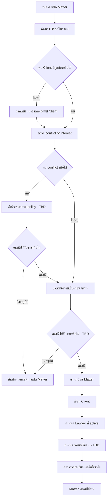

# Matter Intake & Opening

| Document Control        | Value        |
| ----------------------- | ------------ |
| SOP ID                  | SOP-MAT-001  |
| Status                  | Draft        |
| Version                 | 0.1          |
| Process Owner           | TBD          |
| Approver                | TBD          |
| Effective Date          | TBD          |
| Last Requirement Review | 13 July 2026 |

> **Draft notice:** Requirement ระบุ capability ของระบบและเงื่อนไขหลัก
> แต่ยังไม่ระบุผู้อนุมัติรับงาน, SLA, เกณฑ์ conflict/risk และชุดสถานะ Matter
> อย่างเป็นทางการ ประเด็นเหล่านี้จึงแสดงเป็น TBD และ SOP นี้ยังไม่ควรใช้เป็น
> policy ฉบับอนุมัติ

## Purpose

กำหนดขั้นตอนรับเรื่องและเปิด Matter (แฟ้มงานกฎหมาย) ให้ข้อมูลลูกความ
ผู้รับผิดชอบ และสถานะเริ่มต้นเชื่อมโยงกันอย่างถูกต้อง มีการควบคุมสิทธิ์
และสามารถตรวจสอบย้อนหลังได้

## Scope

เริ่มเมื่อ Lawyer, ผู้จัดการแฟ้มงาน หรือ Admin ได้รับคำขอเปิดงานกฎหมายใหม่
และสิ้นสุดเมื่อ Matter พร้อมใช้งาน มี Client (ลูกความ/ผู้รับบริการ) และ Lawyer
ผู้รับผิดชอบเชื่อมโยงแล้ว

SOP นี้ยังไม่ครอบคลุมการจัดทำ Quotation, การสร้าง Document, การสร้าง Task
หรือการวางบิลหลังเปิด Matter

## Roles

| Role             | Responsibility in This SOP                                           |
| ---------------- | -------------------------------------------------------------------- |
| Lawyer           | ให้ข้อมูลเรื่อง ตรวจสอบข้อมูล และรับผิดชอบ Matter เมื่อได้รับมอบหมาย |
| ผู้จัดการแฟ้มงาน | ประสานข้อมูล ลงทะเบียน และกำหนดผู้รับผิดชอบตามสิทธิ์                 |
| Admin            | ลงทะเบียนหรือแก้ข้อมูลตามสิทธิ์ และดูแล master data/RBAC             |
| ผู้อนุมัติรับงาน | ตัดสินใจจากผล conflict และ risk assessment (TBD)                     |

Requirement ใช้คำว่า “ผู้จัดการคดี” ส่วน SOP นี้ใช้ “ผู้จัดการแฟ้มงาน”
เพื่อให้สอดคล้องกับการใช้ Matter เป็นแฟ้มงานหลักของระบบ

## Required Information

ข้อมูลขั้นต่ำที่ requirement ระบุสำหรับการลงทะเบียน Matter:

- ประเภท Matter จาก master data
- ชื่อ Matter
- Client ที่มีอยู่ในระบบ
- Lawyer ผู้รับผิดชอบที่มีสถานะ active
- สถานะ Matter ที่ถูกต้องตาม master data

ข้อมูลสำหรับ conflict check และ risk assessment ยังไม่ได้กำหนด field บังคับ
ไว้ใน requirement จึงต้องยืนยันก่อนอนุมัติ SOP

## Related Control Document

[Matter Lifecycle & Approval Rules](/docs/sops/matter-lifecycle) รวบรวมชุดสถานะ,
transition, approval matrix และข้อเสนอสำหรับประเด็น TBD ของ SOP นี้
ข้อเสนอเหล่านั้นยังไม่มีผลเป็น policy จนกว่า Process Owner จะอนุมัติ

## Workflow

## Procedure

### 1. Search for the Client

**Responsible:** Lawyer, ผู้จัดการแฟ้มงาน หรือ Admin

1. เปิดหน้า Client List ตาม permission ของตนเอง
2. ค้นหาด้วยข้อมูลที่องค์กรใช้ระบุตัวลูกความ เช่น ชื่อหรือคำค้น
3. เปิดข้อมูล Client ที่พบและตรวจว่าเป็นบุคคลหรือองค์กรเดียวกับผู้ขอรับบริการ
4. ห้ามสร้าง Client ซ้ำเมื่อมีข้อมูลที่ถูกต้องอยู่แล้ว

**Expected result:** ได้ Client record ที่จะเชื่อมกับ Matter หรือยืนยันว่า
ต้องลงทะเบียน Client ใหม่

### 2. Register the Client When Needed

**Responsible:** Lawyer, ผู้จัดการแฟ้มงาน หรือ Admin

1. กรอก field บังคับของ Client ให้ครบ
2. เลือกหมวดหมู่ Client จาก master data ที่ถูกต้อง
3. บันทึกและเปิดดูรายละเอียด Client เพื่อตรวจความถูกต้อง

**Expected result:** Client ใหม่ถูกสร้างและพร้อมเชื่อมกับ Matter

### 3. Complete Conflict and Risk Checks

**Responsible:** TBD

1. ตรวจความเป็นอิสระและความขัดแย้งทางผลประโยชน์ระหว่างงานใหม่ ลูกความ
   และข้อมูลที่เกี่ยวข้อง
2. บันทึกผล conflict check พร้อมผู้ตรวจและวันเวลา (TBD: รูปแบบหลักฐาน)
3. ประเมินความเสี่ยงของลูกความก่อนรับงาน
4. เมื่อพบ conflict หรือความเสี่ยงเกินเกณฑ์ ให้ส่งผู้มีอำนาจตัดสินใจตาม policy
5. ห้ามลงทะเบียน Matter เป็นงานพร้อมใช้งานจนกว่าจะมีผลการพิจารณาให้รับงาน

**Expected result:** มีผลตรวจและผลตัดสินใจที่อ้างอิงได้ หรือยุติคำขอเปิดงาน

### 4. Register the Matter

**Responsible:** Lawyer, ผู้จัดการแฟ้มงาน หรือ Admin

1. เปิดหน้า Matter List ซึ่งระบบกรองข้อมูลตาม permission
2. ค้นหาด้วยเลข Matter, Client หรือสถานะ เพื่อลดความเสี่ยงจากการเปิดซ้ำ
3. เลือก Register Matter
4. ระบุประเภท Matter, ชื่อ Matter และ Client
5. บันทึกรายการ

**System controls:** ประเภท Matter ต้องระบุ และ Client ต้องมีอยู่ในระบบ

**Expected result:** Matter ใหม่ถูกสร้างและเชื่อมโยงกับ Client

### 5. Assign the Responsible Lawyer

**Responsible:** Lawyer, ผู้จัดการแฟ้มงาน หรือ Admin

1. เลือก Lawyer ผู้รับผิดชอบ
2. ตรวจว่า User มีสถานะ active
3. บันทึกการมอบหมาย

**Expected result:** Matter มี Lawyer เจ้าของงานที่ใช้งานระบบได้

### 6. Set Status and Verify Access

**Responsible:** Lawyer, ผู้จัดการแฟ้มงาน หรือ Admin

1. เลือกสถานะเริ่มต้นจาก master data (TBD: ชื่อสถานะมาตรฐาน)
2. เปิด Matter detail และตรวจ Client, ประเภท Matter, ชื่อ Matter, Lawyer
   ผู้รับผิดชอบ และสถานะ
3. ตรวจว่าเฉพาะผู้ใช้ที่มี permission เท่านั้นที่เห็น Matter
4. แก้ไขข้อมูลที่ไม่ครบหรือไม่ถูกต้องก่อนเริ่มงานต่อ

**Expected result:** Matter พร้อมใช้งานและแสดงเฉพาะผู้มีสิทธิ์

## Control Points

| Control              | Requirement                                  | Evidence                                        |
| -------------------- | -------------------------------------------- | ----------------------------------------------- |
| Duplicate prevention | ค้นหา Client และ Matter ก่อนสร้าง            | Search result หรือ duplicate-check record (TBD) |
| Conflict and risk    | ตรวจ conflict และประเมินความเสี่ยงก่อนรับงาน | ผลตรวจ ผู้ตรวจ วันเวลา และผลตัดสินใจ (TBD)      |
| Valid Client         | Client ต้องมีอยู่ในระบบก่อนเชื่อม            | Client ID                                       |
| Valid owner          | Lawyer ผู้รับผิดชอบต้อง active               | User ID และสถานะ active                         |
| Valid type/status    | ใช้ค่าที่ถูกต้องจาก master data              | Matter type และ status                          |
| Access control       | รายการและรายละเอียดต้องกรองตาม permission    | RBAC configuration และ access/audit log         |

## Exceptions

- **พบ Client ซ้ำ:** ใช้ Client เดิมและแจ้งผู้ดูแลข้อมูลเมื่อข้อมูลต้องรวมกัน
- **พบ conflict:** หยุดการเปิด Matter และส่งพิจารณาตาม policy ที่องค์กรอนุมัติ
- **ความเสี่ยงเกินเกณฑ์:** หยุดการเปิด Matter จนกว่าจะมีผลตัดสินใจ
- **Lawyer ไม่ active:** เลือกผู้รับผิดชอบรายอื่นหรือให้ Admin แก้สถานะ User
- **ประเภทหรือสถานะไม่พร้อมใช้:** ให้ Admin ตรวจ master data
  ห้ามใช้ข้อความอิสระแทน
- **ไม่มี permission:** ขอสิทธิ์ผ่านกระบวนการจัดการ access ห้ามใช้บัญชีผู้อื่น

## Completion Checklist

- [ ] ไม่พบ Matter ซ้ำสำหรับคำขอนี้
- [ ] Client ถูกต้องและไม่ซ้ำ
- [ ] Conflict check เสร็จและมีหลักฐาน (TBD)
- [ ] Risk assessment เสร็จและมีผลตัดสินใจ (TBD)
- [ ] Matter type และชื่อ Matter ถูกต้อง
- [ ] Matter เชื่อมกับ Client
- [ ] กำหนด Lawyer ที่ active แล้ว
- [ ] กำหนดสถานะเริ่มต้นแล้ว (TBD)
- [ ] ตรวจรายละเอียดและ permission แล้ว

## Requirement Traceability

| SOP Area                                                               | Source                                                                                       |
| ---------------------------------------------------------------------- | -------------------------------------------------------------------------------------------- |
| Conflict check, risk assessment และสถานะงาน                            | Manao Software Project Proposal-Alt Pro-Legal ERP-Phase_1_V1_20260525.pdf, หน้า 16           |
| Matter list, search, register, assign Client/Lawyer, status และ access | ไฟล์เดียวกัน, หน้า 32-33                                                                     |
| Client list, search, register, categorize และ link Matter              | ไฟล์เดียวกัน, หน้า 35                                                                        |
| Case Registration & Management                                         | ALT Pro - P3 (MatterSolv).xlsx, sheet Sub-Module, แถว 73-76                                  |
| Client Registration & Management                                       | ไฟล์เดียวกัน, sheet Sub-Module, แถว 98-101                                                   |
| Matter-centric workflow และ Smart Intake prototype                     | สำเนาของ 1. PMUC-proposal-Practice Management Platform_03032026_Final_DTS.pdf, หน้า 5 และ 18 |

## Open Questions

1. ใครเป็นผู้ทำ conflict check และใครมีอำนาจอนุมัติเมื่อพบ conflict
2. Risk assessment ใช้เกณฑ์และระดับความเสี่ยงใด
3. ข้อมูลใดเป็น field บังคับสำหรับ Client บุคคลและ Client องค์กร
4. รูปแบบการตรวจ Client/Matter ซ้ำใช้ field ใดเป็นหลัก
5. ชุดสถานะ Matter และสถานะเริ่มต้นที่อนุมัติคืออะไร
6. ต้องมี Client acceptance, engagement letter หรือ Quotation ก่อนเปิด Matter
   หรือไม่
7. ต้องเก็บหลักฐาน conflict/risk/approval ที่ใดและเก็บนานเท่าใด
8. Process Owner, Approver และ SLA ของ SOP นี้คือใคร/เท่าใด
