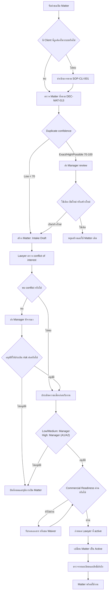

# Matter Intake & Opening

| Document Control        |    Value     |
| ----------------------- | :----------: |
| SOP ID                  | SOP-MAT-001  |
| Status                  |   Approved   |
| Version                 |     1.0      |
| Process Owner           |   Manager    |
| Approver                |   Manager    |
| Effective Date          | 14 July 2026 |
| Last Requirement Review | 14 July 2026 |

> **Approval notice:** Lifecycle, การแยก control decisions และ Manager ในฐานะ
> Process Owner, อำนาจอนุมัติ Low/Medium/High และขอบเขต Admin รวมถึง SLA กติกา
> Intake Draft/Commercial Readiness และ Immutable Audit Event รวมถึงเกณฑ์
> Conflict/Risk, Required Fields/Minimum Evidence และ Retention/Disposal
> ได้รับการยืนยันแล้ว รวมถึง Transition Authority ตาม DEC-MAT-012 และ Matter
> duplicate matching ตาม DEC-MAT-013 โดยมีผลใช้ตั้งแต่ 14 July 2026

## Purpose

กำหนดขั้นตอนรับเรื่องและเปิด Matter (แฟ้มงานกฎหมาย) ให้ข้อมูลลูกความ
ผู้รับผิดชอบ และสถานะเริ่มต้นเชื่อมโยงกันอย่างถูกต้อง มีการควบคุมสิทธิ์
และสามารถตรวจสอบย้อนหลังได้

## Scope

เริ่มเมื่อ Lawyer, Assistant หรือ Admin ได้รับคำขอเปิดงานกฎหมายใหม่
และสิ้นสุดเมื่อ Matter พร้อมใช้งาน มี Client (ลูกความ/ผู้รับบริการ) และ Lawyer
ผู้รับผิดชอบเชื่อมโยงแล้ว

SOP นี้ครอบคลุมการตรวจ Commercial Readiness แต่ไม่ครอบคลุมขั้นตอนจัดทำ
Quotation, Engagement Letter, Document, Task หรือการวางบิลหลังเปิด Matter

## Roles

| Role               | Responsibility in This SOP                                                                                                   |
| ------------------ | ---------------------------------------------------------------------------------------------------------------------------- |
| Lawyer             | เตรียมข้อมูล ตรวจ conflict/risk และรับผิดชอบ Matter เมื่อได้รับมอบหมาย                                                       |
| Assistant          | ประสานข้อมูล ลงทะเบียน และติดตามความครบถ้วนตามสิทธิ์                                                                         |
| Manager            | เป็น Process Owner, อนุมัติหรือปฏิเสธ Low/Medium และอนุมัติ High risk เป็น Manager A1/Manager A2 โดยแยกคนจากกันและผู้ประเมิน |
| Alternate Approver | อนุมัติแทนเมื่อ Manager ไม่อยู่                                                                                              |
| Admin              | เป็น System Owner ดูแล configuration, master data, RBAC, Audit Log และทำหน้าที่ Admin A2 ด้าน retention โดยแยกจาก executor   |

Requirement ใช้คำว่า “ผู้จัดการคดี” ส่วน SOP นี้ใช้ “ผู้จัดการแฟ้มงาน”
เพื่อให้สอดคล้องกับการใช้ Matter เป็นแฟ้มงานหลักของระบบ

Admin ไม่มีสิทธิ์อนุมัติหรือแก้ Conflict Assessment, Risk Assessment และ
Acceptance Decision หากบุคคลเดียวมี Business Role เพิ่ม ต้องเลือก Acting Role
และห้ามใช้ Admin Role ข้าม Separation of Duties

## Required Information

ข้อมูลขั้นต่ำที่ requirement ระบุสำหรับการลงทะเบียน Matter:

- ประเภท Matter จาก master data
- ชื่อ Matter
- Client ที่มีอยู่ในระบบ
- Lawyer ผู้รับผิดชอบที่มีสถานะ active
- สถานะ Matter ที่ถูกต้องตาม master data

เกณฑ์ Conflict/Risk อนุมัติตาม DEC-MAT-009, required fields/หลักฐานขั้นต่ำ
อนุมัติตาม DEC-MAT-010 และ Client fields/status gate อนุมัติตาม DEC-CLI-001

Client สถานะ Pending Verification เชื่อมกับ Intake Draft ได้ แต่ต้องเปลี่ยนเป็น
Active ตาม DEC-CLI-001 ก่อน Matter เปลี่ยนเป็น Active ส่วน Inactive ห้ามใช้เปิด
Matter ใหม่ และ Merged ต้อง redirect ไป surviving Client ตาม DEC-CLI-003

## Related Control Document

[Matter Lifecycle & Approval Rules](/docs/sops/matter-lifecycle) รวบรวมชุดสถานะ,
transition, approval matrix และ Decision Register ของ SOP นี้ โดยรายการ
DEC-MAT-001 ถึง DEC-MAT-013 ได้รับการอนุมัติแล้ว

[Retention and Disposal of Audit Evidence](/docs/sops/retention-disposal) กำหนด
Retention Schedule, Legal Hold, archive และการทำลายหลักฐานของ Matter

[Quotation & Engagement Approval](/docs/sops/quotation-engagement) กำหนด
commercial evidence และ
[User, Role & Access Management](/docs/sops/access-management) กำหนดสิทธิ์ของ
ผู้ดำเนินการ/ผู้อนุมัติ

## Workflow

## Procedure

ก่อนเริ่มขั้นตอนที่ 1 ต้องมี Client ที่ตรวจสอบแล้ว หากยังไม่มี ให้ดำเนินการตาม
[Client Registration & Maintenance](/docs/sops/client-registration)

### 1. Register the Matter as Intake Draft

**Responsible:** Assistant หรือ Lawyer

1. Resolve Merged Client ไป surviving Client และค้นหา Matter ทุกสถานะภายใน
   Tenant ด้วย field ที่ normalize ตาม DEC-MAT-013
2. บันทึก matching rule/version, Candidate Matter IDs, status, score และ matched
   fields ตาม permission
3. Exact Match ให้ block และใช้ Matter เดิมหรือส่ง Manager ตัดสิน
4. High/Possible Match ให้หยุดการสร้างจนกว่า Manager จะตัดสิน Use Existing,
   Reopen หรือ Create New พร้อมเหตุผล
5. Low Confidence สร้างต่อได้โดยต้องอ้างอิง duplicate-check result
6. ตรวจว่า Client ไม่เป็น Inactive และ Merged Client ถูก resolve แล้ว
7. ระบุ Matter type, Matter name, Client ID, requested legal service, intake
   summary และ requester
8. ระบุ conflict subjects เช่น คู่กรณี ผู้เกี่ยวข้อง และบริษัทในเครือ
9. บันทึก prepared by และ prepared at
10. สร้าง Matter ด้วยสถานะ Intake Draft
11. กำหนด Commercial Readiness เริ่มต้นเป็น Pending
12. ตรวจว่า Client เชื่อมโยงกับ Matter ถูกต้อง

**System controls:** ประเภท Matter ต้องระบุ, Client ต้องมีอยู่ในระบบ และระหว่าง
Intake Draft ห้ามทำงานสาระสำคัญให้บุคคลภายนอก ส่งเอกสารภายนอก บันทึกเวลา
ที่เรียกเก็บได้ หรือออก Invoice

**Expected result:** Matter Intake Draft ถูกสร้างและพร้อมส่งตรวจ conflict

### 2. Complete Conflict and Risk Checks

**Responsible:** Lawyer (R), Manager (A)

1. Lawyer ตรวจ conflict ระหว่างงานใหม่ ลูกความ คู่กรณี และผู้เกี่ยวข้อง
2. บันทึก Assessment version, conflict subjects, search scope, แหล่งข้อมูล,
   findings, rationale, reviewer, reviewed at และ Evidence Document ID
3. หากข้อมูล conflict ไม่ครบ ให้คงสถานะ In Review และห้ามให้ผล Cleared
4. เมื่อ conflict เป็น Escalated ให้ Manager พิจารณาเป็น Cleared พร้อมเงื่อนไข
   หรือ Prohibited ก่อนออกจาก Conflict Review
5. เมื่อ Cleared ให้ประเมิน Client, Matter complexity, Regulatory/AML/sanctions,
   Financial, Reputation/ethical และ Operational/data/resource risk
6. บันทึก Assessment version, ผลปัจจัยทั้ง 6 ด้าน, Risk Rating, rationale,
   assessor, assessed at และ Evidence Document ID
7. สำหรับ Medium/High ให้ระบุ mitigation, owner และ due date
8. หากข้อมูล risk ไม่ครบ ห้ามให้ผล Low และ Prohibited ห้าม override
9. ผู้ประเมินกับผู้อนุมัติต้องเป็นคนละ User
10. เมื่อ Manager เป็นผู้ประเมินหรือไม่อยู่ ให้ส่ง Alternate Approver
11. High risk ต้องให้ Manager อนุมัติลำดับแรก (A1) และอนุมัติลำดับสุดท้าย (A2)
12. ผู้ประเมินต้องไม่เป็นผู้อนุมัติ A1/A2
13. บันทึก Acceptance Decision, assessment versions ที่อ้างอิง, approver, ลำดับ
    A1/A2, Separation of Duties result, reason และ decided at
14. ตรวจ Conflict/Risk ใหม่เมื่อคู่กรณี ขอบเขตงาน Client ownership
    หรือข้อมูลสำคัญเปลี่ยน

**Expected result:** มี Conflict Assessment, Risk Assessment และ Acceptance
Decision ที่ตรวจสอบย้อนหลังได้ หรือ Matter ถูกเปลี่ยนเป็น Rejected

### 3. Assign the Responsible Lawyer

**Responsible:** Manager (A), Assistant หรือ Lawyer (R)

1. เลือก Lawyer ผู้รับผิดชอบ
2. ตรวจว่า User มีสถานะ active
3. บันทึกการมอบหมาย

**Expected result:** Matter มี Lawyer เจ้าของงานที่ใช้งานระบบได้

### 4. Activate and Verify Access

**Responsible:** Manager (A), Assistant หรือ Lawyer (R)

1. ตรวจว่า Acceptance Decision เป็น Approved
2. ตรวจว่า Client status เป็น Active
3. ตรวจ Commercial Readiness ว่าเป็น Accepted/Signed, Not Required หรือ Waived
   พร้อม requirement type, confirmed by และ confirmed at
4. กรณี Accepted/Signed ให้เชื่อมหลักฐาน Quotation ที่ได้รับการยอมรับหรือ
   Engagement Letter ที่ลงนามแล้ว
5. กรณี Not Required ให้ระบุประเภท Pro Bono/งานภายในและเหตุผล
6. กรณี Waived ให้มีเหตุผลและผลอนุมัติจาก Manager
7. เปลี่ยน Matter จาก Pending Approval เป็น Active
8. เปิด Matter detail และตรวจ Client, ประเภท Matter, ชื่อ Matter, Lawyer
   ผู้รับผิดชอบ และสถานะ
9. ตรวจว่าเฉพาะผู้ใช้ที่มี permission เท่านั้นที่เห็น Matter
10. แก้ไขข้อมูลที่ไม่ครบหรือไม่ถูกต้องก่อนเริ่มงานต่อ

**Expected result:** Matter พร้อมใช้งานและแสดงเฉพาะผู้มีสิทธิ์

## Control Points

| Control              | Requirement                                                                  | Evidence                                                           |
| -------------------- | ---------------------------------------------------------------------------- | ------------------------------------------------------------------ |
| Duplicate prevention | Client ใช้ DEC-CLI-002; Matter ใช้ score/threshold ตาม DEC-MAT-013           | Rule version, score, candidates และ Manager decision               |
| Conflict and risk    | ใช้เกณฑ์อนุมัติ แยก assessment และทำ re-assessment เมื่อข้อมูลสำคัญเปลี่ยน   | Control records, factors, evidence และ separation-of-duties result |
| High-risk approval   | ต้องมี Manager A1 และ A2                                                     | A1/A2 approval records และหลักฐานประกอบ                            |
| Valid Client         | Pending ใช้ได้เฉพาะ Intake Draft; Inactive ห้ามใช้ใหม่; Merged ต้อง redirect | Client ID, status, redirect และ validation result                  |
| Valid owner          | Lawyer ผู้รับผิดชอบต้อง active                                               | User ID และสถานะ active                                            |
| Valid type/status    | ใช้ค่าที่ถูกต้องจาก master data                                              | Matter type และ status                                             |
| Commercial readiness | ห้าม Active หรือเริ่มงานภายนอกจนกว่าเงื่อนไขเชิงพาณิชย์ผ่าน                  | เอกสาร, Not Required record หรือ Manager-approved Waiver           |
| Access control       | กรองตาม permission และห้าม Admin ข้าม approval                               | RBAC, Acting Role, permission approval และ emergency access log    |
| SLA control          | เริ่มเมื่อข้อมูลครบ แจ้งเตือน 75% และ escalate เมื่อเกินกำหนด                | SLA timestamps, notification และ breach event                      |
| Immutable audit      | Decision และ transition ต้องแก้หรือลบย้อนหลังไม่ได้                          | Event ID, previous Event linkage และ integrity verification        |
| Required data gate   | ห้ามส่งตรวจ อนุมัติ หรือ transition เมื่อข้อมูลบังคับไม่ครบ                  | Validation result และ referenced record versions                   |
| Minimum evidence     | ใช้ Document ID หรือไฟล์ในระบบเป็นหลักฐานที่ควบคุมสิทธิ์และตรวจย้อนหลังได้   | Document ID, Matter/Tenant permission และ evidence metadata        |
| Retention control    | เก็บ archive หรือทำลายตาม Retention Schedule และ Legal Hold                  | Policy version, hold record และ disposal eligibility               |
| Controlled disposal  | Manager A1 + Admin A2 อนุมัติร่วมก่อน Admin executor ดำเนินการ               | Dual approvals และ immutable Destruction Certificate               |
| Transition authority | ใช้ requester/approver/executor ตาม DEC-MAT-012 และไม่สร้าง approval ซ้ำ     | Transition request, approval reference และ immutable event         |

## SLA

| Activity                    |     Target      |       Breach Escalation        |
| --------------------------- | :-------------: | :----------------------------: |
| Intake completeness         | 1 business day  |            Manager             |
| Conflict review: Standard   | 1 business day  |            Manager             |
| Conflict review: Complex    | 2 business days |            Manager             |
| Risk assessment: Low/Medium | 1 business day  |            Manager             |
| Risk assessment: High       | 2 business days |            Manager             |
| Acceptance: Low/Medium      | 1 business day  | Manager และ Alternate Approver |
| Acceptance: High            | 2 business days | Manager และ Alternate Manager  |

- เริ่มนับเมื่อข้อมูลบังคับครบตาม business day และ timezone ของ Tenant
- หยุดนับได้เมื่อรอข้อมูลจาก Client โดยต้องบันทึกเหตุผลและเวลา
- แจ้งเตือนเมื่อใช้เวลา 75% และสร้าง breach event เมื่อเกิน SLA
- ห้ามอนุมัติอัตโนมัติเมื่อเกิน SLA
- Urgent Processing ต้องมีเหตุผล ผู้อนุมัติ และ audit event

## Exceptions

- **พบ Client ซ้ำ:** ใช้ Client เดิมและแจ้งผู้ดูแลข้อมูลเมื่อข้อมูลต้องรวมกัน
- **พบ Inactive Client:** ดำเนินการ reactivate ตาม DEC-CLI-003 ก่อนเปิด Matter
  ใหม่
- **พบ Merged Client:** เปลี่ยน linkage ไป surviving Client และห้ามใช้ source ID
- **พบ Exact Matter:** ใช้ Matter เดิม หรือให้ Manager ตัดสิน Reopen/Create New
- **พบ High/Possible Matter:** ระงับการสร้างและส่ง Manager review
- **พบ Closed Matter:** ให้ Manager ตัดสิน Reopen ไป Conflict Review
  หรือสร้างใหม่
- **พบ Rejected/Cancelled Matter:** สร้าง Intake Draft ใหม่พร้อม Prior Matter ID
  ห้าม reopen โดยตรง
- **สร้าง Matter ซ้ำผิดพลาด:** เชื่อม Duplicate Of และใช้ approved transition
  ห้าม merge อัตโนมัติหรือย้าย dependency โดยไม่มี reconciliation
- **พบ conflict:** หยุดการเปิด Matter และส่งพิจารณาตาม policy ที่องค์กรอนุมัติ
- **ความเสี่ยงเกินเกณฑ์:** หยุดการเปิด Matter จนกว่าจะมีผลตัดสินใจ
- **Lawyer ไม่ active:** เลือกผู้รับผิดชอบรายอื่นหรือให้ Admin แก้สถานะ User
- **ประเภทหรือสถานะไม่พร้อมใช้:** ให้ Admin ตรวจ master data
  ห้ามใช้ข้อความอิสระแทน
- **ไม่มี permission:** ขอสิทธิ์ผ่านกระบวนการจัดการ access ห้ามใช้บัญชีผู้อื่น
- **ต้องใช้ Emergency Access:** ระบุเหตุผล ขอบเขต ผู้อนุมัติ และเวลาสิ้นสุด
  ใช้เพื่อแก้ปัญหาระบบเท่านั้น ห้ามใช้อนุมัติรายการเชิงธุรกิจ
- **งาน Pro Bono หรืองานภายใน:** ระบุ Commercial Readiness เป็น Not Required
  พร้อมประเภทและเหตุผล
- **เอกสารเชิงพาณิชย์ยังไม่พร้อม:** คง Matter ไว้ก่อน Active หรือขอ Waiver จาก
  Manager พร้อมเหตุผล
- **Urgent Processing:** ลดระยะเวลาได้แต่ห้ามข้าม conflict check หรือรับงานที่
  มี Conflict Status เป็น Prohibited
- **ต้อง Immediate Hold:** Responsible Lawyer หรือ Admin สั่ง On Hold
  ได้ทันทีและให้ Manager review ภายใน 1 business day ห้าม resume อัตโนมัติ
- **บันทึก Audit Event ผิด:** สร้าง Correction Event ที่อ้างอิง Event เดิม
  พร้อมค่าแก้ไข เหตุผล ผู้ดำเนินการ Acting Role และวันที่เวลา ห้ามแก้หรือลบ
  Event เดิม
- **ข้อมูลหรือหลักฐานไม่ครบ:** คงขั้นตอนไว้สถานะเดิมและแจ้งรายการที่ขาด
  ห้ามส่งตรวจ อนุมัติ หรือเปลี่ยนสถานะ
- **มีเฉพาะลิงก์ภายนอก:** แนบไฟล์หรือบันทึกหลักฐานในระบบและอ้างอิง Document ID
  ก่อนดำเนินการต่อ
- **มี Legal Hold:** ระงับ disposal จนกว่าจะมี released at แล้วคำนวณ eligibility
  ใหม่
- **ครบ Retention Period:** ตรวจ Legal Hold/dependency และใช้ Manager A1 + Admin
  A2 อนุมัติร่วมก่อนให้ Admin executor ทำลาย

## Completion Checklist

- [ ] Matter duplicate check เก็บ rule/version, score, candidates และ matched
      fields
- [ ] Exact/High/Possible Match มี Manager decision และเหตุผลครบ
- [ ] Prior Matter ID หรือ Duplicate Of ถูกบันทึกเมื่อเกี่ยวข้อง
- [ ] Client ถูกต้องและไม่ซ้ำ
- [ ] Client ไม่เป็น Inactive และ Merged Client ถูก resolve ไป surviving Client
- [ ] Client status เป็น Active ก่อน Matter เปลี่ยนเป็น Active
- [ ] Matter Intake มี required fields และ conflict subjects ครบ
- [ ] Conflict Assessment และ Risk Assessment ถูกบันทึกแยกจาก Matter Status
- [ ] Conflict/Risk มีปัจจัย หลักฐาน เหตุผล และ mitigation เมื่อเกี่ยวข้อง
- [ ] รายการ Escalated มีผล Manager เป็น Cleared พร้อมเงื่อนไขหรือ Prohibited
- [ ] ตรวจ re-assessment trigger แล้ว
- [ ] ผู้ประเมินกับผู้อนุมัติเป็นคนละ User
- [ ] Acceptance Decision มีผู้อนุมัติ เหตุผล และวันที่เวลา
- [ ] Acceptance Decision อ้างอิง Conflict/Risk Assessment versions ที่ใช้จริง
- [ ] High risk มีผลอนุมัติ A1/A2 ครบ หรือมีผลปฏิเสธที่ระบุเหตุผล
- [ ] Matter type และชื่อ Matter ถูกต้อง
- [ ] Matter เชื่อมกับ Client
- [ ] กำหนด Lawyer ที่ active แล้ว
- [ ] Commercial Readiness มีสถานะและหลักฐานครบ
- [ ] ไม่มีงานภายนอก การส่งเอกสารภายนอก เวลาที่เรียกเก็บได้ หรือ Invoice
      เกิดขึ้นก่อน Matter เป็น Active
- [ ] Matter เปลี่ยนเป็น Active หลัง Client Active, Acceptance Decision Approved
      และ Commercial Readiness ผ่าน
- [ ] ตรวจรายละเอียดและ permission แล้ว
- [ ] บันทึก SLA pause, breach หรือ Urgent Processing เมื่อเกี่ยวข้อง
- [ ] Decision และ Status Transition มี immutable audit event ครบ
- [ ] Transition ใช้ requester/approver/executor ตาม DEC-MAT-012
- [ ] Correction Event อ้างอิง Event เดิมและมีเหตุผล เมื่อเกี่ยวข้อง
- [ ] Validation result และ Evidence Document ID ถูกบันทึกครบ
- [ ] Retention Policy version ถูกผูกกับ Matter และหลักฐาน
- [ ] Legal Hold ถูกบันทึกและระงับ disposal เมื่อเกี่ยวข้อง

## Requirement Traceability

| SOP Area                                                               | Source                                                                                       |
| ---------------------------------------------------------------------- | -------------------------------------------------------------------------------------------- |
| Conflict check, risk assessment และสถานะงาน                            | Manao Software Project Proposal-Alt Pro-Legal ERP-Phase_1_V1_20260525.pdf, หน้า 16           |
| Matter list, search, register, assign Client/Lawyer, status และ access | ไฟล์เดียวกัน, หน้า 32-33                                                                     |
| Client list, search, register, categorize และ link Matter              | ไฟล์เดียวกัน, หน้า 35                                                                        |
| Case Registration & Management                                         | ALT Pro - P3 (MatterSolv).xlsx, sheet Sub-Module, แถว 73-76                                  |
| Client Registration & Management                                       | ไฟล์เดียวกัน, sheet Sub-Module, แถว 98-101                                                   |
| Matter-centric workflow และ Smart Intake prototype                     | สำเนาของ 1. PMUC-proposal-Practice Management Platform_03032026_Final_DTS.pdf, หน้า 5 และ 18 |

## Approval Record

- Manager อนุมัติ
- DEC-MAT-001 ถึง DEC-MAT-013 ได้รับการอนุมัติครบ
- Effective Date: 14 July 2026
