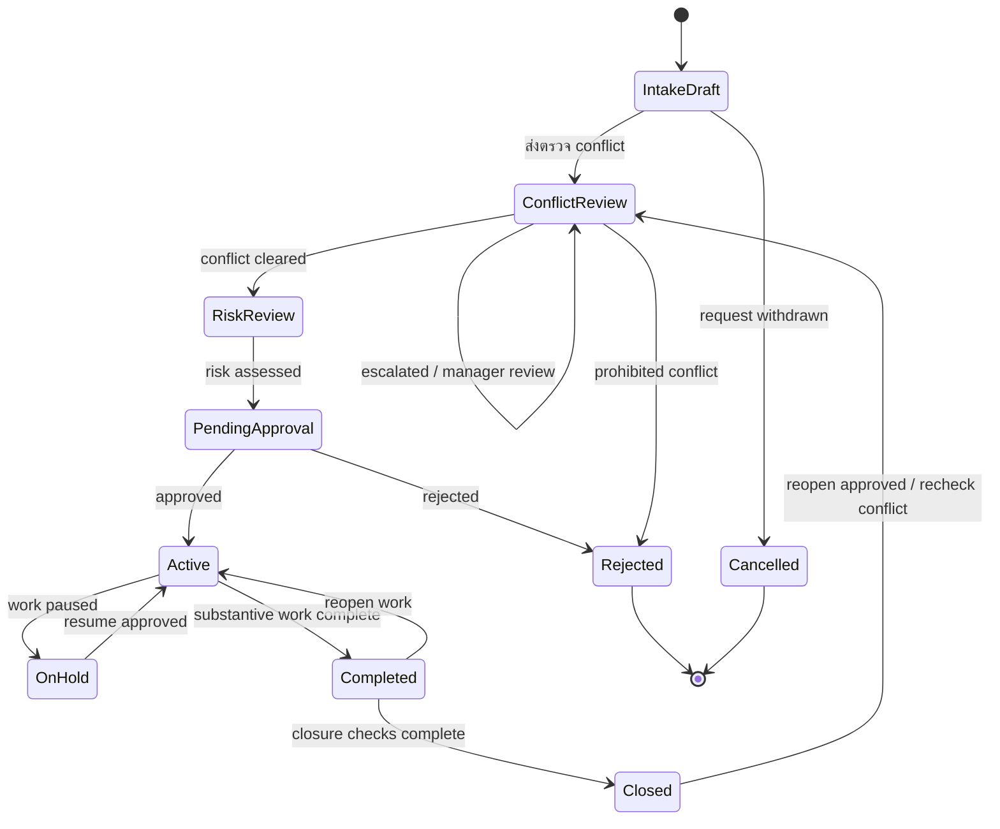

# Matter Lifecycle & Approval Rules

| Document Control        | Value        |
| ----------------------- | ------------ |
| Document ID             | CTRL-MAT-001 |
| Status                  | Approved     |
| Version                 | 1.0          |
| Process Owner           | Manager      |
| System Owner            | Admin        |
| Approver                | Manager      |
| Effective Date          | 14 July 2026 |
| Last Requirement Review | 14 July 2026 |

> **Approval notice:** Lifecycle, การแยก control decisions และ Manager ในฐานะ
> Process Owner, อำนาจอนุมัติ Low/Medium/High และขอบเขต Admin รวมถึง SLA กติกา
> Intake Draft, Commercial Readiness และ Immutable Audit Event รวมถึงเกณฑ์
> Conflict/Risk, Required Fields/Minimum Evidence และ Retention/Disposal
> ได้รับการยืนยันแล้ว รวมถึง Transition Authority ตาม DEC-MAT-012 และ Matter
> duplicate matching ตาม DEC-MAT-013 โดยมีผลใช้ตั้งแต่ 14 July 2026

## Design Principle

Matter status ใช้บอกว่าแฟ้มงานอยู่ช่วงใดของวงจรชีวิต ส่วนผล conflict check, risk
assessment และ acceptance decision เป็นข้อมูลควบคุมแยกกัน
เพื่อให้ตรวจสอบผู้ตัดสินใจ เหตุผล และเวลาได้โดยไม่สูญหายเมื่อเปลี่ยนสถานะ

Requirement กำหนดให้ระบบรองรับการตรวจ conflict, ประเมินความเสี่ยงก่อนรับงาน,
ติดตามสถานะ, กำหนด Client, กำหนด Lawyer ที่ active และบังคับใช้ permission
โดยชุดสถานะและ approval authority ได้รับการกำหนดอย่างเป็นทางการตาม Decision
Register ในเอกสารนี้

## Approved Lifecycle

## Status Definitions

| Status           | Meaning                                         | Entry Criteria                                                                   | Exit Control                                        |
| ---------------- | ----------------------------------------------- | -------------------------------------------------------------------------------- | --------------------------------------------------- |
| Intake Draft     | รับเรื่องและกำลังรวบรวมข้อมูล                   | มีคำขอเปิด Matter                                                                | ข้อมูลขั้นต่ำพร้อมส่งตรวจ conflict                  |
| Conflict Review  | อยู่ระหว่างตรวจความเป็นอิสระและผลประโยชน์ขัดกัน | ระบุ Client และ conflict subjects แล้ว                                           | มีผล Cleared หรือ Prohibited                        |
| Risk Review      | อยู่ระหว่างประเมินความเสี่ยงของลูกความและงาน    | Conflict status เป็น Cleared                                                     | มี risk rating และเหตุผล                            |
| Pending Approval | รอผู้มีอำนาจตัดสินใจรับงาน                      | ผล conflict/risk พร้อม หรือมีรายการ escalated                                    | Manager อนุมัติหรือปฏิเสธ                           |
| Active           | อนุมัติรับงานและเริ่มปฏิบัติงานได้              | Client และ Lawyer เป็น active, Acceptance Approved และ Commercial Readiness ผ่าน | พักงานหรือทำงานสาระสำคัญเสร็จ                       |
| On Hold          | หยุดดำเนินงานชั่วคราว                           | มีเหตุผล ผู้สั่งพัก และวันที่ทบทวน                                               | ผู้มีอำนาจอนุมัติให้กลับ Active                     |
| Completed        | งานสาระสำคัญเสร็จ รอตรวจปิดแฟ้ม                 | Lawyer ยืนยันงานเสร็จ                                                            | ตรวจเอกสาร งานค้าง เวลา และการเงินครบ               |
| Closed           | ปิดแฟ้มและไม่รับรายการปกติใหม่                  | Closure checklist และการอนุมัติครบ                                               | Manager อนุมัติให้เปิดใหม่และตรวจ conflict อีกครั้ง |
| Rejected         | องค์กรตัดสินใจไม่รับงาน                         | Conflict/risk/acceptance ไม่ผ่าน                                                 | Terminal state                                      |
| Cancelled        | ผู้ขอถอนเรื่องหรือยกเลิกก่อนรับงาน              | มีเหตุผลยกเลิก                                                                   | Terminal state                                      |

ชุดสถานะและกติกาเปิด Closed Matter ใหม่ได้รับการยืนยันตาม DEC-MAT-001 โดย
requirement ระบุเพียงตัวอย่างสถานะงานและกำหนดว่าค่าที่เลือกต้องเป็นสถานะที่
ถูกต้องในระบบ

## Separate Control Decisions

การแยก Conflict Status, Risk Rating และ Acceptance Decision ออกจาก Matter Status
ได้รับการยืนยันตาม DEC-MAT-002 และเกณฑ์การตัดสินได้รับการยืนยันตาม DEC-MAT-009

### Conflict Status

| Value       | Approved Criteria                                                         |
| ----------- | ------------------------------------------------------------------------- |
| Not Started | ยังไม่มีผู้รับผิดชอบหรือยังไม่เริ่มตรวจ                                   |
| In Review   | กำลังตรวจ Client, คู่กรณี ผู้เกี่ยวข้อง และบริษัทในเครือ                  |
| Cleared     | ไม่พบ conflict หรือ Manager อนุมัติให้เดินหน้าพร้อมเงื่อนไขที่บันทึกไว้   |
| Escalated   | พบความสัมพันธ์ที่อาจเป็น conflict, ข้อมูลไม่ชัดเจน หรือต้องพิจารณา waiver |
| Prohibited  | กฎหมาย จริยธรรม หรือ policy ห้ามรับงาน และไม่สามารถ override ได้          |

- Escalated ต้องให้ Manager พิจารณาและบันทึกผลเป็น Cleared พร้อมเงื่อนไข หรือ
  Prohibited ก่อนออกจาก Conflict Review
- หากข้อมูลไม่ครบ ห้ามให้ผล Cleared
- ต้องตรวจ Conflict ใหม่เมื่อคู่กรณี ขอบเขตงาน Client ownership
  หรือข้อมูลสำคัญเปลี่ยน

### Risk Rating

Risk Assessment ต้องพิจารณา Client identity/history, ประเภทและความซับซ้อนของงาน,
Regulatory/AML/sanctions, Financial/payment, Reputation/ethical และ
Operational/data/resource risk

| Value      | Approved Criteria                                                                                   |
| ---------- | --------------------------------------------------------------------------------------------------- |
| Low        | งานปกติและไม่พบปัจจัยเสี่ยงสำคัญ ให้ Manager อนุมัติ                                                |
| Medium     | มีความเสี่ยงที่ควบคุมได้ ต้องบันทึก mitigation และให้ Manager อนุมัติ                               |
| High       | มีความเสี่ยงสำคัญ หลายปัจจัย หรืออาจกระทบองค์กร ต้องให้ Manager A1 และ A2 อนุมัติ                   |
| Prohibited | ผิดกฎหมาย, sanctions, ethical restriction, conflict ที่ห้ามรับ หรือเกิน risk appetite ห้าม override |

- ผู้ประเมินต้องบันทึกปัจจัย หลักฐาน เหตุผล และ mitigation เมื่อเกี่ยวข้อง
- หากข้อมูลไม่ครบ ห้ามให้ Risk Rating เป็น Low
- เกณฑ์ Prohibited มีผลเหนือ Rating อื่น
- ต้องประเมิน Risk ใหม่เมื่อคู่กรณี ขอบเขตงาน Client ownership
  หรือข้อมูลสำคัญเปลี่ยน
- รายละเอียดเกณฑ์เก็บเป็น Tenant Policy โดยทุก revision ต้องมี effective date
  และ immutable audit event

### Acceptance Decision

| Value    | Meaning                              |
| -------- | ------------------------------------ |
| Pending  | รอผล conflict/risk หรือรอผู้อนุมัติ  |
| Approved | อนุมัติให้เปลี่ยน Matter เป็น Active |
| Rejected | ไม่รับงานและต้องบันทึกเหตุผล         |

## Approval Matrix

R = Responsible, A = Accountable/Approver, C = Consulted, I = Informed

| Activity                              | Lawyer | Assistant | Manager          | Admin |
| ------------------------------------- | ------ | --------- | ---------------- | ----- |
| ค้นหา/ลงทะเบียน Client                | C      | R         | A                | C     |
| เตรียมข้อมูล Matter intake            | R      | R         | A                | C     |
| ตรวจ conflict                         | R      | C         | A                | I     |
| ประเมิน risk                          | R      | C         | A                | I     |
| อนุมัติรับงาน Low/Medium              | C      | I         | A/R              | I     |
| อนุมัติรับงาน High                    | C      | I         | A1 + A2 (คนละคน) | I     |
| ลงทะเบียนและเชื่อม Client             | C      | R         | A                | C     |
| กำหนด Lawyer ผู้รับผิดชอบ             | C      | I         | A/R              | C     |
| เปลี่ยนเป็น Active                    | R      | R         | A                | I     |
| พักหรือเปิดงานต่อ                     | R      | I         | A                | I     |
| ยืนยันงานสาระสำคัญเสร็จ               | R      | C         | A                | I     |
| ปิดหรือเปิด Matter ใหม่               | R      | C         | A                | I     |
| ตั้งค่า status/permission/master data | I      | I         | C                | A/R   |

Admin ดูแลการตั้งค่าระบบและข้อมูลอ้างอิง แต่ไม่ใช่ผู้อนุมัติรับงานเชิงธุรกิจ
เว้นแต่บุคคลเดียวกันได้รับ Role Manager เพิ่มอย่างชัดเจน

### Approved Administration Boundaries

- Admin เป็น System Owner ดูแล configuration, master data, User, Role,
  Permission และ Audit Log
- Admin ไม่มีสิทธิ์อนุมัติ Conflict Assessment, Risk Assessment หรือ Acceptance
  Decision เชิงธุรกิจ
- Admin ห้ามแก้ผล assessment, approval หรือ audit event ที่บันทึกแล้ว
- ผู้ใช้ที่มีทั้ง Admin และ Business Role ต้องเลือกและบันทึก Acting Role
  สำหรับแต่ละ action
- ห้ามใช้ Admin Role ข้าม Separation of Duties หรือ approval sequence
- การแก้ Permission สำคัญต้องมีผู้อนุมัติอีกคนและมีผลก่อนผู้ขอใช้สิทธิ์ใหม่
- Emergency Access ต้องมีเหตุผล ผู้ร้องขอ ผู้อนุมัติ ขอบเขต และเวลาสิ้นสุด
- Emergency Access ใช้เพื่อแก้ปัญหาระบบหรือการเข้าถึงเท่านั้น
  ไม่ใช้อนุมัติรายการเชิงธุรกิจ
- ห้ามลบหรือแก้ Audit Event เดิม การแก้ข้อมูลต้องสร้าง event ใหม่

### Approved Low/Medium Approval Rules

- Manager เป็น Process Owner และผู้อนุมัติรับงานระดับ Low/Medium
- Medium risk ต้องมี mitigation และเหตุผลก่อนอนุมัติ
- ผู้จัดทำ conflict หรือ risk assessment ต้องไม่อนุมัติ assessment ของตนเอง
- เมื่อ Manager เป็นผู้ประเมิน ต้องส่ง Alternate Approver ที่มี Role Manager
  หรืออำนาจสูงกว่าอนุมัติแทน
- องค์กรต้องกำหนด Alternate Approver สำหรับกรณีผู้อนุมัติหลักไม่อยู่
- Approval record ต้องเก็บ assessor, approver, เหตุผล และวันที่เวลา

### Approved High-Risk Approval Rules

- Manager เป็นผู้อนุมัติลำดับแรก (A1)
- Manager เป็นผู้อนุมัติสุดท้าย (A2) โดยองค์กรแต่งตั้งจาก Managing Partner,
  Authorized Director หรือผู้บริหารที่มีอำนาจเทียบเท่า
- ผู้ประเมิน risk ต้องไม่เป็น Manager A1 หรือ A2
- ต้องมี mitigation, เหตุผล และหลักฐานประกอบก่อนเริ่มการอนุมัติ
- หาก A1 หรือ A2 ปฏิเสธ ให้บันทึก Rejected หรือส่งกลับแก้ assessment
  โดยต้องระบุเหตุผล
- Risk ระดับ Prohibited ห้าม override เป็น Approved
- ต้องกำหนด Alternate Manager สำหรับกรณีผู้อนุมัติหลักไม่อยู่
- Approval record ต้องเก็บผลของ A1 และ A2 แยกกันพร้อมวันที่เวลา

### Approved Draft and Commercial Readiness Rules

- สร้าง Matter สถานะ Intake Draft ได้ก่อนจัดทำหรือรับรอง Quotation และ
  Engagement Letter เพื่อรวบรวมข้อมูล ตรวจ conflict/risk และเตรียมงานภายใน
- ระหว่าง Intake Draft สามารถสร้างหรือเชื่อม Quotation และ Engagement Letter กับ
  Matter ได้
- ห้ามทำงานสาระสำคัญให้บุคคลภายนอก ส่งเอกสารภายนอก บันทึกเวลาที่เรียกเก็บได้
  หรือออก Invoice จนกว่า Matter จะเป็น Active
- Matter เปลี่ยนเป็น Active ได้เมื่อ Client และ Lawyer เป็น active, Acceptance
  Decision เป็น Approved และ Commercial Readiness ผ่านเงื่อนไข
- บริการที่ต้องมี Quotation หรือ Engagement Letter ต้องมีสถานะ Accepted/Signed
  ก่อนเริ่มงานภายนอก
- งาน Pro Bono หรืองานภายในที่ไม่ต้องใช้เอกสารเชิงพาณิชย์ ให้ระบุ Not Required
  พร้อมประเภทและเหตุผล
- การยกเว้นเอกสารที่ปกติต้องมี ให้ใช้สถานะ Waived โดย Manager ต้องอนุมัติ
  และบันทึกเหตุผล
- Urgent Processing ลดระยะเวลาได้ แต่ห้ามข้าม conflict check หรือรับงานที่มี
  Conflict Status เป็น Prohibited

### Commercial Readiness

| Value           | Meaning                                                        |
| --------------- | -------------------------------------------------------------- |
| Pending         | ยังไม่ยืนยันเงื่อนไขเชิงพาณิชย์                                |
| Accepted/Signed | Quotation ได้รับการยอมรับหรือ Engagement Letter ลงนามแล้ว      |
| Not Required    | งาน Pro Bono หรืองานภายในที่ไม่ต้องใช้เอกสารเชิงพาณิชย์        |
| Waived          | Manager อนุมัติยกเว้นเอกสารที่ปกติต้องมีก่อนเริ่มงานภายนอกแล้ว |

## Transition Rules

เงื่อนไข transition ที่อ้างถึง conflict, risk หรือ acceptance ต้องอ่านจาก
control record ล่าสุดที่มีผล ไม่ใช่อนุมานจาก Matter Status

| From             | To               | Required Conditions                                                                                                                                                                       | Evidence                                                                                      |
| ---------------- | ---------------- | ----------------------------------------------------------------------------------------------------------------------------------------------------------------------------------------- | --------------------------------------------------------------------------------------------- |
| Intake Draft     | Conflict Review  | Client, Matter type, Matter name และ conflict subjects ครบ                                                                                                                                | Intake record                                                                                 |
| Conflict Review  | Risk Review      | Conflict status เป็น Cleared; กรณีเคย Escalated ต้องมีผล Manager และเงื่อนไขครบ                                                                                                           | Conflict result, Manager decision, conditions, reviewer และ timestamp                         |
| Conflict Review  | Rejected         | Conflict status เป็น Prohibited                                                                                                                                                           | Policy reference และเหตุผล                                                                    |
| Risk Review      | Pending Approval | มี risk rating และ mitigation เมื่อจำเป็น                                                                                                                                                 | Risk assessment                                                                               |
| Pending Approval | Active           | Low/Medium: Manager หรือ Alternate Approver อนุมัติ, ผู้ประเมินกับผู้อนุมัติเป็นคนละคน, Client/Lawyer เป็น active และ Commercial Readiness เป็น Accepted/Signed, Not Required หรือ Waived | Approval record, client/owner validation, separation-of-duties result และ commercial evidence |
| Pending Approval | Active           | High: Manager A1 และ A2 อนุมัติครบ, ผู้ประเมินไม่ใช่ A1/A2, Client/Lawyer เป็น active และ Commercial Readiness เป็น Accepted/Signed, Not Required หรือ Waived                             | A1/A2 approval records, client/owner validation และ commercial evidence                       |
| Pending Approval | Rejected         | Acceptance เป็น Rejected หรือผู้อนุมัติ High risk คนใดคนหนึ่งปฏิเสธโดยไม่ส่งกลับแก้ไข                                                                                                     | Approver, reason, timestamp                                                                   |
| Active           | On Hold          | ระบุเหตุผล ผู้สั่งพัก และ review date                                                                                                                                                     | Hold record                                                                                   |
| On Hold          | Active           | Manager อนุมัติให้ทำงานต่อ                                                                                                                                                                | Resume approval                                                                               |
| Active           | Completed        | ไม่มีงานสาระสำคัญที่ยังเปิดอยู่                                                                                                                                                           | Lawyer completion confirmation                                                                |
| Completed        | Closed           | ตรวจ document, task, time entry และ finance item ครบ                                                                                                                                      | Closure checklist และ approval                                                                |
| Completed        | Active           | มีเหตุผลเปิดงานต่อและ Manager อนุมัติ                                                                                                                                                     | Reopen approval                                                                               |
| Closed           | Conflict Review  | Manager อนุมัติให้เปิดใหม่ ระบุเหตุผล และปรับ conflict subjects ให้เป็นปัจจุบัน                                                                                                           | Reopen approval, reason และ timestamp                                                         |

## Approved Transition Authority

### Approved Authority Matrix

| From             | To               | Requester/Actor     | Approval                                                | Executor               |
| ---------------- | ---------------- | ------------------- | ------------------------------------------------------- | ---------------------- |
| Intake Draft     | Conflict Review  | Lawyer/Assistant    | ไม่ต้องอนุมัติเมื่อ validation ผ่าน                     | Authorized User/System |
| Intake Draft     | Cancelled        | Lawyer/Assistant    | Manager                                                 | Authorized User/System |
| Conflict Review  | Risk Review      | Responsible Lawyer  | ไม่ต้องอนุมัติเมื่อ Cleared; Manager เมื่อเคย Escalated | Authorized User/System |
| Conflict Review  | Rejected         | Responsible Lawyer  | ไม่ต้องอนุมัติเพิ่มเมื่อ Prohibited และห้าม override    | System                 |
| Risk Review      | Pending Approval | Risk Assessor       | ไม่ต้องอนุมัติเมื่อ assessment/mitigation ครบ           | Authorized User/System |
| Pending Approval | Active           | Lawyer/Assistant    | Low/Medium: Manager; High: Manager A1 + Manager A2      | System                 |
| Pending Approval | Rejected         | Acceptance Approver | ใช้ผล Rejected เดิม ห้ามสร้าง approval ซ้ำ              | System                 |
| Active           | On Hold          | Responsible Lawyer  | Manager                                                 | Authorized User/System |
| On Hold          | Active           | Responsible Lawyer  | Manager                                                 | Authorized User/System |
| Active           | Completed        | Responsible Lawyer  | Manager                                                 | Authorized User/System |
| Completed        | Closed           | Lawyer/Assistant    | Manager                                                 | Authorized User/System |
| Completed        | Active           | Responsible Lawyer  | Manager                                                 | Authorized User/System |
| Closed           | Conflict Review  | Responsible Lawyer  | Manager                                                 | Authorized User/System |

### Approved Authority Rules

- Requester/Actor ห้ามอนุมัติ transition ของตนเอง เมื่อ Manager เป็น requester
  ต้องใช้ Alternate Approver
- Executor ตรวจ prerequisite และบันทึก transition ตามผลอนุมัติ ห้ามเปลี่ยน
  decision หรือสร้าง approval แทนผู้มีอำนาจ
- Admin ใช้ Admin Role ดำเนินการได้เฉพาะ support/configuration ห้ามเป็น business
  approver; หากมี Business Role ต้องเลือก Acting Role ตาม DEC-MAT-005
- Transition ที่ใช้ Conflict, Risk หรือ Acceptance Decision ต้องอ้างอิง record
  version ที่มีผล ห้ามคัดลอกผลมาเป็น approval ใหม่
- Transition ที่ไม่ต้อง approval ยังต้องผ่าน required-field validation และสร้าง
  immutable transition event
- Rejected และ Cancelled เป็น terminal state ห้ามเปลี่ยนกลับโดยตรง หากต้องรับ
  เรื่องอีกครั้งให้สร้าง Intake Draft ใหม่และเชื่อม Prior Matter ID

### Approved Urgent Hold Rule

Responsible Lawyer หรือ Admin สั่ง Immediate Hold ได้เมื่อมี
ความเสี่ยงทางกฎหมาย, sanctions, ethical, data security หรือ preservation concern
โดย On Hold มีผลทันทีเพื่อหยุดงาน และ Manager ต้อง review ภายใน 1 business day
หากไม่ยืนยันให้คง Hold จนกว่าจะมี decision ห้าม resume อัตโนมัติ

### Approved Transition Evidence

ทุก transition ต้องเก็บ Matter ID, previous/new status, requester/actor, Acting
Role, prerequisite record IDs/versions, validation result, approver และ approval
sequence เมื่อเกี่ยวข้อง, reason, effective at, transitioned at และ Prior Matter
ID สำหรับเรื่องที่สร้างใหม่จาก Rejected/Cancelled

## Approved Matter Duplicate Matching Rules

ตรวจ Matter ทุกสถานะภายใน Tenant เดียวกันก่อนสร้าง Intake Draft และเมื่อ Client,
Matter type, reference number, Matter name, conflict subjects หรือ scope
เปลี่ยนอย่างมีนัยสำคัญ ห้ามค้นหรือเปิดเผย Candidate ข้าม Tenant

### Data Normalization

- Resolve Merged Client ไป surviving Client ID ก่อนเปรียบเทียบ
- จัด external/court/reference number และ jurisdiction ให้อยู่ในรูปแบบมาตรฐาน
- เปรียบเทียบ Matter name แบบไม่สนตัวพิมพ์เล็ก/ใหญ่ ช่องว่างซ้ำ และอักขระตกแต่ง
  โดยเก็บค่าต้นฉบับไว้
- Normalize Matter type, requested legal service, conflict subjects, related
  entities และ aliases ตาม active master data
- Matching rule ต้องมี version และ effective date การเปลี่ยน rule
  ไม่มีผลย้อนหลัง โดยอัตโนมัติ

### Confidence Rules

| Match                                                                | Confidence |
| -------------------------------------------------------------------- | ---------- |
| External/court/reference number และ jurisdiction ตรงกัน              | 100        |
| Client, Matter type, normalized Matter name และ conflict subject ตรง | 95         |
| Client, requested service, conflict subjects และ scope ตรง           | 90         |
| Client และ Matter name similarity อย่างน้อย 85%                      | 85         |
| Client และ Matter type ตรง และสร้างภายใน 30 วัน                      | 75         |
| Matter name เพียงอย่างเดียว                                          | 50         |

เมื่อเข้าได้หลาย rule ให้ใช้ confidence สูงสุด และเก็บ matched rule/fields
ทุกข้อประกอบการ review

### Decision Thresholds

| Result          | Score      | Required Action                                        |
| --------------- | ---------- | ------------------------------------------------------ |
| Exact Match     | 100        | Block การสร้างและใช้ Matter เดิมหรือส่ง Manager ตัดสิน |
| High Confidence | 90-99      | Block และส่ง Manager review                            |
| Possible Match  | 70-89      | ระงับการสร้างจนกว่า Manager จะตัดสิน                   |
| Low Confidence  | ต่ำกว่า 70 | สร้างต่อได้และต้องเก็บ duplicate-check result          |

### Status and Decision Rules

- Intake Draft, Conflict Review, Risk Review, Pending Approval, Active, On Hold
  และ Completed ที่เป็น Exact/High ต้องใช้รายการเดิม เว้นแต่ Manager อนุมัติ
  Create New พร้อมเหตุผลที่ scope เป็นคนละงาน
- Closed Matter ให้ Manager ตัดสิน Reopen ไป Conflict Review หรือ Create New
  โดยทั้งสองทางต้องตรวจ conflict/risk ใหม่ตาม trigger
- Rejected/Cancelled ห้าม reopen โดยตรง หากเป็นคำขอใหม่ให้สร้าง Intake Draft
  พร้อม Prior Matter ID และเหตุผล
- Matter ที่สร้างซ้ำโดยผิดพลาดห้าม merge อัตโนมัติ ให้หยุดรายการใหม่ เชื่อม
  Duplicate Of Matter ID และใช้ transition ที่อนุมัติเพื่อ Cancel/Close
- ห้ามย้าย Document, Task, Time Entry, Invoice หรือ Payment ระหว่าง Matter โดย
  ไม่มี owner validation, reconciliation และ immutable event
- Requester ห้ามอนุมัติ duplicate exception ของตนเอง และ Admin ห้ามเป็น business
  reviewer

### Required Duplicate Evidence

ทุก check/review ต้องเก็บ Matter ID, Tenant ID, matching rule/version, score,
Candidate Matter IDs, status, matched field names และ values ตาม permission, ผล
Use Existing/Reopen/Create New, Prior/Duplicate Of Matter ID เมื่อเกี่ยวข้อง,
reason, requester, Manager reviewer และ timestamp เป็น immutable event

## Required Data

### Requirement Baseline

- Matter type
- Matter name
- Client ที่มีอยู่ในระบบ
- Lawyer ผู้รับผิดชอบที่มีสถานะ active
- Status ที่ถูกต้องตาม master data

### Approved Control Records

| Record               | Purpose                                             | Minimum Audit Linkage                        |
| -------------------- | --------------------------------------------------- | -------------------------------------------- |
| Conflict Assessment  | เก็บสถานะและผลการตรวจ conflict แยกจาก Matter Status | Matter ID, version, reviewer และ reviewed at |
| Risk Assessment      | เก็บ rating, เหตุผล และ mitigation                  | Matter ID, version, assessor และ assessed at |
| Acceptance Decision  | เก็บผลอนุมัติหรือปฏิเสธการรับงาน                    | Matter ID, approver, reason และ decided at   |
| Commercial Readiness | เก็บผลความพร้อมของ Quotation/Engagement Letter      | Matter ID, value, evidence และ confirmed at  |

Control record ใหม่ต้องไม่เขียนทับ record เดิม และ Matter ต้องอ้างอิง record
ล่าสุดที่มีผลสำหรับการตรวจ transition

### Approved Required Fields

#### Matter Intake

- Matter type, Matter name และ Client ID
- Requested legal service และ Intake summary
- Requester
- Conflict subjects เช่น คู่กรณี ผู้เกี่ยวข้อง และบริษัทในเครือ
- Prepared by และ prepared at
- Lawyer ผู้รับผิดชอบที่ active ต้องกำหนดก่อนเปลี่ยนเป็น Active

#### Conflict Assessment

- Assessment version
- Conflict subjects, search scope และแหล่งข้อมูลที่ตรวจ
- Conflict Status, findings และ rationale
- Reviewer และ reviewed at
- Evidence Document ID
- Manager decision และ conditions เมื่อเคย Escalated

#### Risk Assessment

- Assessment version และผลประเมินปัจจัยเสี่ยงทั้ง 6 ด้าน
- Risk Rating และ rationale
- Mitigation, owner และ due date สำหรับ Medium/High
- Assessor และ assessed at
- Evidence Document ID

#### Acceptance Decision

- Approved หรือ Rejected
- Conflict Assessment version และ Risk Assessment version ที่ใช้อ้างอิง
- Approver และลำดับ A1/A2 เมื่อเกี่ยวข้อง
- Separation of Duties result
- Reason และ decided at

#### Commercial Readiness

- Requirement type, readiness status, confirmed by และ confirmed at
- Quotation หรือ Engagement Document ID สำหรับ Accepted/Signed
- Type และ reason สำหรับ Not Required
- Manager, reason และ approved at สำหรับ Waived

#### Status Transition

- Previous status และ new status
- Actor และ Acting Role
- Reason และ prerequisite validation result
- Approval reference เมื่อ transition ต้องอนุมัติ
- Transitioned at

#### Conditional Operational Fields

- Status reason สำหรับ On Hold, Rejected, Cancelled, Completed และ Closed
- Review date สำหรับ Matter ที่ On Hold
- SLA started at, due at, paused at, resumed at และ pause reason
- SLA warning sent at, breached at และ escalation recipient
- Urgent processing reason และ approver

### Approved Validation and Evidence Rules

- ห้ามส่งตรวจ อนุมัติ หรือเปลี่ยนสถานะเมื่อ required fields ของขั้นตอนนั้นไม่ครบ
- หลักฐานต้องอ้างอิง Document ID หรือไฟล์ในระบบที่ควบคุม permission ตาม Matter
  และ Tenant และสามารถตรวจสอบย้อนหลังได้
- ลิงก์ภายนอกใช้เป็นข้อมูลประกอบได้ แต่ห้ามเป็นหลักฐานเพียงอย่างเดียว
- การแก้ข้อมูลหลังส่งตรวจต้องสร้าง revision และ immutable audit event
- Validation result ต้องถูกบันทึกกับ submission, decision หรือ transition
- ข้อมูลและหลักฐานต้องใช้ Retention Schedule ตาม DEC-MAT-011

## Approved SLA

| Activity                    | Target                                             | Breach Escalation              |
| --------------------------- | -------------------------------------------------- | ------------------------------ |
| Intake completeness         | 1 business day                                     | Manager                        |
| Conflict review: Standard   | 1 business day หลังข้อมูลครบ                       | Manager                        |
| Conflict review: Complex    | 2 business days หลังข้อมูลครบ                      | Manager                        |
| Risk assessment: Low/Medium | 1 business day หลัง conflict cleared               | Manager                        |
| Risk assessment: High       | 2 business days หลัง conflict cleared              | Manager                        |
| Acceptance: Low/Medium      | 1 business day หลัง assessment ครบ                 | Manager และ Alternate Approver |
| Acceptance: High            | 2 business days หลัง assessment และ mitigation ครบ | Manager และ Alternate Manager  |

### SLA Clock Rules

- เริ่มนับเมื่อข้อมูลบังคับของกิจกรรมนั้นครบ
- ใช้ business day, business hours และ timezone ของ Tenant
- หยุดนับได้เมื่อรอข้อมูลจาก Client โดยต้องบันทึก pause reason และ paused at
- เริ่มนับต่อเมื่อได้รับข้อมูล พร้อมบันทึก resumed at และคำนวณ due at ใหม่
- แจ้งเตือนผู้รับผิดชอบและผู้อนุมัติเมื่อใช้เวลา 75% ของ SLA
- เมื่อเกิน SLA ให้บันทึก breached at และแจ้งผู้รับ escalation ตามตาราง
- การเกิน SLA ไม่ทำให้รายการ Approved โดยอัตโนมัติ
- Urgent Processing ต้องมีเหตุผล ผู้อนุมัติ และ audit event ก่อนลดลำดับเวลา

## Audit Requirements

ระบบต้องสร้าง immutable audit event สำหรับ Conflict Assessment, Risk Assessment,
Acceptance Decision, Commercial Readiness และทุก Matter Status Transition
โดยเก็บข้อมูลต่อไปนี้:

- Matter ID และ Tenant ID
- ค่าเดิมและค่าใหม่
- ผู้ดำเนินการและ Role ขณะดำเนินการ
- ผู้อนุมัติเมื่อ transition ต้องอนุมัติ
- ผลตรวจว่าผู้ประเมินและผู้อนุมัติเป็นคนละ User
- Alternate Approver และเหตุผลที่ใช้ผู้อนุมัติสำรอง เมื่อเกี่ยวข้อง
- ลำดับการอนุมัติ A1/A2 และผลของผู้อนุมัติแต่ละคนสำหรับ High risk
- Alternate Manager และเหตุผลที่ใช้ เมื่อเกี่ยวข้อง
- Acting Role สำหรับผู้ใช้ที่มีหลาย Role
- ผู้ขอและผู้อนุมัติ Permission change พร้อมค่าก่อนและหลัง
- เหตุผล ขอบเขต ผู้อนุมัติ เวลาเริ่ม และเวลาสิ้นสุดของ Emergency Access
- SLA start/due/pause/resume/breach timestamps และผู้รับ escalation
- เหตุผลและผู้อนุมัติ Urgent Processing เมื่อเกี่ยวข้อง
- การเปลี่ยน Commercial Readiness พร้อมหลักฐาน ผู้ยืนยัน และวันที่เวลา
- ประเภทและเหตุผลของ Not Required หรือเหตุผลและผู้อนุมัติ Waiver
- วันที่และเวลา
- เหตุผล หมายเหตุ และ policy reference เมื่อเกี่ยวข้อง
- เอกสารหรือหลักฐานประกอบ

### Approved Immutable Audit Event Rules

- Audit Event ที่บันทึกสำเร็จแล้วห้ามแก้ไขหรือลบ
- แต่ละ Event ต้องมี Event ID ที่ไม่ซ้ำและอ้างอิง Event ก่อนหน้าของ Matter
  เพื่อให้เรียงเป็น Timeline และตรวจพบช่องว่างได้
- การแก้ข้อมูลผิดต้องสร้าง Correction Event ใหม่ โดยอ้างอิง Event เดิม
  ระบุค่าที่แก้ เหตุผล ผู้ดำเนินการ Acting Role และวันที่เวลา
- ห้ามใช้ Correction Event เขียนทับหรือซ่อน Event เดิม
- Event ที่ต้องอนุมัติต้องเก็บผู้อนุมัติ ลำดับอนุมัติ และผลตรวจ Separation of
  Duties
- หลักฐานต้องอ้างอิงด้วย Document ID หรือที่จัดเก็บซึ่งตรวจสอบย้อนหลังได้
- Admin ดูและ export Audit Log ได้ตาม permission แต่ห้ามเปลี่ยนเนื้อหา Event
- ระบบต้องมี integrity verification เพื่อตรวจพบ Event ที่ขาดหายหรือถูกแก้ไข
  โดยไม่ได้รับอนุญาต
- การ export, archive หรือย้ายที่จัดเก็บต้องรักษาลำดับ Event, linkage, metadata
  และหลักฐานตลอด Retention Period

## Retention and Disposal of Audit Evidence

กติกาที่อนุมัติตาม DEC-MAT-011 แยกเป็น SOP เพื่อให้ค้นหาและทบทวนได้โดยตรง:
[Retention and Disposal of Audit Evidence](/docs/sops/retention-disposal)

SOP ดังกล่าวเป็นแหล่งอ้างอิงหลักสำหรับ Retention Schedule, Legal Hold, archive,
Dual-Control Disposal และ Destruction Certificate

ขั้นตอนปฏิบัติหลัง Matter เป็น Active จนถึง Closed/Reopen อยู่ใน
[Matter Operations & Status Maintenance](/docs/sops/matter-operations)

## Decision Register

| Decision ID | Decision                                                                                                                | Status   | Decision Date |
| ----------- | ----------------------------------------------------------------------------------------------------------------------- | -------- | ------------- |
| DEC-MAT-001 | ใช้ lifecycle 10 สถานะ และให้ Closed กลับไป Conflict Review เมื่อ Manager อนุมัติเปิดใหม่                               | Approved | 13 July 2026  |
| DEC-MAT-002 | แยก Conflict Status, Risk Rating และ Acceptance Decision ออกจาก Matter Status                                           | Approved | 13 July 2026  |
| DEC-MAT-003 | Manager เป็น Process Owner และผู้อนุมัติรับงานระดับ Low/Medium โดยแยกผู้ประเมินกับผู้อนุมัติ                            | Approved | 13 July 2026  |
| DEC-MAT-004 | High risk ต้องมี Manager A1 และ A2 อนุมัติร่วมกัน และ Prohibited ห้าม override                                          | Approved | 13 July 2026  |
| DEC-MAT-005 | Admin เป็น System Owner แต่ไม่อนุมัติหรือแก้ business decisions และต้อง audit Acting Role/Emergency Access              | Approved | 13 July 2026  |
| DEC-MAT-006 | ใช้ SLA แบ่งตามกิจกรรม/ความเสี่ยง พร้อม pause, 75% warning, breach escalation และ no auto-approval                      | Approved | 13 July 2026  |
| DEC-MAT-007 | สร้าง Matter Draft ก่อนเอกสารเชิงพาณิชย์ได้ แต่ห้ามเริ่มงานภายนอกก่อน Acceptance Approved และ Commercial Readiness ผ่าน | Approved | 13 July 2026  |
| DEC-MAT-008 | เก็บ decision และ transition เป็น immutable audit event พร้อม correction, timeline และ integrity verification           | Approved | 13 July 2026  |
| DEC-MAT-009 | ใช้เกณฑ์ Conflict Status และ Risk Rating พร้อม re-assessment trigger และ Prohibited no-override                         | Approved | 13 July 2026  |
| DEC-MAT-010 | กำหนด required fields, phase validation และหลักฐานขั้นต่ำสำหรับ intake, assessments, decision และ transition            | Approved | 13 July 2026  |
| DEC-MAT-011 | ใช้ retention baseline, Legal Hold, controlled archive และ Dual-Control Disposal พร้อม Destruction Certificate          | Approved | 13 July 2026  |
| DEC-MAT-012 | กำหนด requester, approval, executor และ exception สำหรับทุก Matter Status Transition                                    | Approved | 14 July 2026  |
| DEC-MAT-013 | ใช้ tenant-scoped matching, confidence threshold, blocking และ Manager review สำหรับ Matter duplicate                   | Approved | 14 July 2026  |

## Requirement Traceability

| Control Area                                                        | Source                                                                                 |
| ------------------------------------------------------------------- | -------------------------------------------------------------------------------------- |
| Conflict check, risk assessment และตัวอย่างสถานะงาน                 | Manao Software Project Proposal-Alt Pro-Legal ERP-Phase_1_V1_20260525.pdf, หน้า 16     |
| Register Matter, assign Client/Lawyer, update status และ permission | ไฟล์เดียวกัน, หน้า 32-33                                                               |
| Client registration และ Client-to-Matter linkage                    | ไฟล์เดียวกัน, หน้า 35                                                                  |
| Case Registration & Management                                      | ALT Pro - P3 (MatterSolv).xlsx, sheet Sub-Module, แถว 73-76                            |
| Matter lifecycle และ Smart Intake/Conflict Check prototype          | สำเนาของ 1. PMUC-proposal-Practice Management Platform_03032026_Final_DTS.pdf, หน้า 18 |

## Approval Checklist

- [x] อนุมัติหรือแก้ชื่อและจำนวนสถานะ (DEC-MAT-001)
- [x] อนุมัติการแยก control decisions ออกจาก Matter Status (DEC-MAT-002)
- [x] ระบุ Manager เป็น Process Owner และผู้อนุมัติ Low/Medium (DEC-MAT-003)
- [x] ระบุ Manager A1 และ A2 สำหรับ High risk (DEC-MAT-004)
- [x] อนุมัติขอบเขต Admin, Acting Role และ Emergency Access (DEC-MAT-005)
- [x] อนุมัติ Transition Authority Matrix และ Urgent Hold Rule (DEC-MAT-012)
- [x] อนุมัติ Matter duplicate matching, threshold และ exception review
      (DEC-MAT-013)
- [x] อนุมัติเกณฑ์ Conflict Status, Risk Rating และ re-assessment trigger
      (DEC-MAT-009)
- [x] อนุมัติ SLA, clock rules และ escalation path (DEC-MAT-006)
- [x] อนุมัติ required fields, phase validation และ minimum evidence
      (DEC-MAT-010)
- [x] อนุมัติกติกา Draft และ Commercial Readiness ก่อนเริ่มงานภายนอก
      (DEC-MAT-007)
- [x] อนุมัติ Immutable Audit Event, Correction Event และ integrity verification
      (DEC-MAT-008)
- [x] อนุมัติ Retention Schedule, Legal Hold, archive และ disposal controls
      (DEC-MAT-011)
