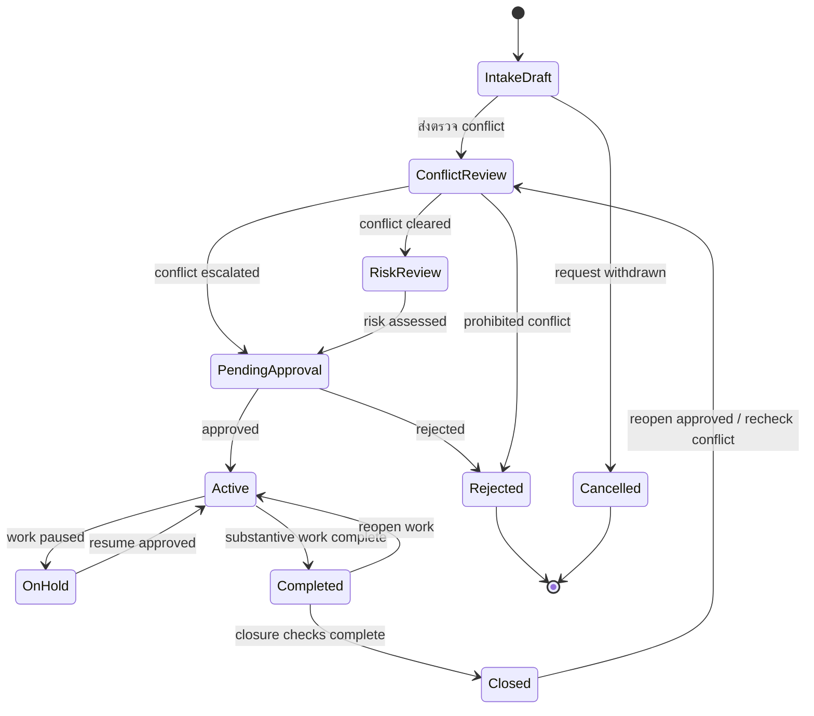

# Matter Lifecycle & Approval Rules

| Document Control        | Value              |
| ----------------------- | ------------------ |
| Document ID             | CTRL-MAT-001       |
| Status                  | Proposed           |
| Version                 | 0.1                |
| Process Owner           | Manager (Proposed) |
| System Owner            | Admin (Proposed)   |
| Approver                | TBD                |
| Effective Date          | TBD                |
| Last Requirement Review | 13 July 2026       |

> **Proposed control:** เอกสารนี้แปลง requirement ให้เป็นกติกาที่นำไป review ได้
> แต่ชื่อสถานะ ผู้รับผิดชอบ SLA และเงื่อนไขอนุมัติยังเป็นข้อเสนอ
> ต้องได้รับอนุมัติจาก Process Owner ก่อนนำไปตั้งค่าในระบบหรือใช้เป็น policy

## Design Principle

Matter status ใช้บอกว่าแฟ้มงานอยู่ช่วงใดของวงจรชีวิต ส่วนผล conflict check, risk
assessment และ acceptance decision เป็นข้อมูลควบคุมแยกกัน
เพื่อให้ตรวจสอบผู้ตัดสินใจ เหตุผล และเวลาได้โดยไม่สูญหายเมื่อเปลี่ยนสถานะ

Requirement กำหนดให้ระบบรองรับการตรวจ conflict, ประเมินความเสี่ยงก่อนรับงาน,
ติดตามสถานะ, กำหนด Client, กำหนด Lawyer ที่ active และบังคับใช้ permission
แต่ยังไม่ได้กำหนดชุดสถานะและ approval authority อย่างเป็นทางการ

## Proposed Lifecycle

## Status Definitions

| Status           | Meaning                                         | Entry Criteria                                            | Exit Control                                        |
| ---------------- | ----------------------------------------------- | --------------------------------------------------------- | --------------------------------------------------- |
| Intake Draft     | รับเรื่องและกำลังรวบรวมข้อมูล                   | มีคำขอเปิด Matter                                         | ข้อมูลขั้นต่ำพร้อมส่งตรวจ conflict                  |
| Conflict Review  | อยู่ระหว่างตรวจความเป็นอิสระและผลประโยชน์ขัดกัน | ระบุ Client และ conflict subjects แล้ว                    | มีผล Cleared, Escalated หรือ Prohibited             |
| Risk Review      | อยู่ระหว่างประเมินความเสี่ยงของลูกความและงาน    | Conflict status เป็น Cleared                              | มี risk rating และเหตุผล                            |
| Pending Approval | รอผู้มีอำนาจตัดสินใจรับงาน                      | ผล conflict/risk พร้อม หรือมีรายการ escalated             | Manager อนุมัติหรือปฏิเสธ                           |
| Active           | อนุมัติรับงานและเริ่มปฏิบัติงานได้              | Acceptance เป็น Approved, มี Client และ Lawyer ที่ active | พักงานหรือทำงานสาระสำคัญเสร็จ                       |
| On Hold          | หยุดดำเนินงานชั่วคราว                           | มีเหตุผล ผู้สั่งพัก และวันที่ทบทวน                        | ผู้มีอำนาจอนุมัติให้กลับ Active                     |
| Completed        | งานสาระสำคัญเสร็จ รอตรวจปิดแฟ้ม                 | Lawyer ยืนยันงานเสร็จ                                     | ตรวจเอกสาร งานค้าง เวลา และการเงินครบ               |
| Closed           | ปิดแฟ้มและไม่รับรายการปกติใหม่                  | Closure checklist และการอนุมัติครบ                        | Manager อนุมัติให้เปิดใหม่และตรวจ conflict อีกครั้ง |
| Rejected         | องค์กรตัดสินใจไม่รับงาน                         | Conflict/risk/acceptance ไม่ผ่าน                          | Terminal state                                      |
| Cancelled        | ผู้ขอถอนเรื่องหรือยกเลิกก่อนรับงาน              | มีเหตุผลยกเลิก                                            | Terminal state                                      |

ชุดสถานะและกติกาเปิด Closed Matter ใหม่ได้รับการยืนยันตาม DEC-MAT-001 แล้ว ส่วน
control อื่นในเอกสารยังเป็น Proposed โดย requirement ระบุเพียงตัวอย่าง
สถานะงานและกำหนดว่าค่าที่เลือกต้องเป็นสถานะที่ถูกต้องในระบบ

## Separate Control Decisions

### Conflict Status

| Value       | Meaning                               |
| ----------- | ------------------------------------- |
| Not Started | ยังไม่ได้เริ่มตรวจ                    |
| In Review   | กำลังตรวจ                             |
| Cleared     | ไม่พบ conflict ที่ห้ามรับงาน          |
| Escalated   | พบประเด็นที่ต้องให้ผู้มีอำนาจตัดสินใจ |
| Prohibited  | ห้ามรับงานตาม policy                  |

### Risk Rating

| Value      | Proposed Decision Rule                                   |
| ---------- | -------------------------------------------------------- |
| Low        | Manager อนุมัติตามกระบวนการปกติ                          |
| Medium     | Manager ต้องบันทึก mitigation ก่อนอนุมัติ                |
| High       | Manager และผู้มีอำนาจระดับองค์กรต้องอนุมัติร่วมกัน (TBD) |
| Prohibited | ปฏิเสธการรับงาน                                          |

### Acceptance Decision

| Value    | Meaning                              |
| -------- | ------------------------------------ |
| Pending  | รอผล conflict/risk หรือรอผู้อนุมัติ  |
| Approved | อนุมัติให้เปลี่ยน Matter เป็น Active |
| Rejected | ไม่รับงานและต้องบันทึกเหตุผล         |

## Approval Matrix

R = Responsible, A = Accountable/Approver, C = Consulted, I = Informed

| Activity                              | Lawyer | Assistant | Manager                 | Admin |
| ------------------------------------- | ------ | --------- | ----------------------- | ----- |
| ค้นหา/ลงทะเบียน Client                | C      | R         | A                       | C     |
| เตรียมข้อมูล Matter intake            | R      | R         | A                       | C     |
| ตรวจ conflict                         | R      | C         | A                       | I     |
| ประเมิน risk                          | R      | C         | A                       | I     |
| อนุมัติรับงาน Low/Medium              | C      | I         | A/R                     | I     |
| อนุมัติรับงาน High                    | C      | I         | A ร่วมกับผู้มีอำนาจ TBD | I     |
| ลงทะเบียนและเชื่อม Client             | C      | R         | A                       | C     |
| กำหนด Lawyer ผู้รับผิดชอบ             | C      | I         | A/R                     | C     |
| เปลี่ยนเป็น Active                    | R      | R         | A                       | I     |
| พักหรือเปิดงานต่อ                     | R      | I         | A                       | I     |
| ยืนยันงานสาระสำคัญเสร็จ               | R      | C         | A                       | I     |
| ปิดหรือเปิด Matter ใหม่               | R      | C         | A                       | I     |
| ตั้งค่า status/permission/master data | I      | I         | C                       | A/R   |

Admin ดูแลการตั้งค่าระบบและข้อมูลอ้างอิง แต่ไม่ใช่ผู้อนุมัติรับงานเชิงธุรกิจ
เว้นแต่บุคคลเดียวกันได้รับ Role Manager เพิ่มอย่างชัดเจน

## Transition Rules

| From             | To               | Required Conditions                                                             | Evidence                              |
| ---------------- | ---------------- | ------------------------------------------------------------------------------- | ------------------------------------- |
| Intake Draft     | Conflict Review  | Client, Matter type, Matter name และ conflict subjects ครบ                      | Intake record                         |
| Conflict Review  | Risk Review      | Conflict status เป็น Cleared                                                    | Conflict result, reviewer, timestamp  |
| Conflict Review  | Pending Approval | Conflict status เป็น Escalated                                                  | Issue, recommendation และ reviewer    |
| Conflict Review  | Rejected         | Conflict status เป็น Prohibited                                                 | Policy reference และเหตุผล            |
| Risk Review      | Pending Approval | มี risk rating และ mitigation เมื่อจำเป็น                                       | Risk assessment                       |
| Pending Approval | Active           | Acceptance เป็น Approved และกำหนด Lawyer ที่ active                             | Approval record                       |
| Pending Approval | Rejected         | Acceptance เป็น Rejected                                                        | Approver, reason, timestamp           |
| Active           | On Hold          | ระบุเหตุผล ผู้สั่งพัก และ review date                                           | Hold record                           |
| On Hold          | Active           | Manager อนุมัติให้ทำงานต่อ                                                      | Resume approval                       |
| Active           | Completed        | ไม่มีงานสาระสำคัญที่ยังเปิดอยู่                                                 | Lawyer completion confirmation        |
| Completed        | Closed           | ตรวจ document, task, time entry และ finance item ครบ                            | Closure checklist และ approval        |
| Completed        | Active           | มีเหตุผลเปิดงานต่อและ Manager อนุมัติ                                           | Reopen approval                       |
| Closed           | Conflict Review  | Manager อนุมัติให้เปิดใหม่ ระบุเหตุผล และปรับ conflict subjects ให้เป็นปัจจุบัน | Reopen approval, reason และ timestamp |

## Required Data

### Requirement Baseline

- Matter type
- Matter name
- Client ที่มีอยู่ในระบบ
- Lawyer ผู้รับผิดชอบที่มีสถานะ active
- Status ที่ถูกต้องตาม master data

### Proposed Additional Fields

- Intake summary และ requested legal service
- Conflict subjects เช่น คู่กรณี บุคคลที่เกี่ยวข้อง และบริษัทในเครือ
- Conflict status, result, reviewer และ reviewed at
- Risk rating, rationale และ mitigation
- Acceptance decision, approver, reason และ decided at
- Status reason สำหรับ On Hold, Rejected, Cancelled, Completed และ Closed
- Review date สำหรับ Matter ที่ On Hold

## Proposed SLA

| Activity            | Target                                     | Escalation                           |
| ------------------- | ------------------------------------------ | ------------------------------------ |
| ตรวจข้อมูล intake   | ภายใน 1 business day                       | แจ้ง Manager เมื่อข้อมูลไม่ครบ       |
| Conflict review     | ภายใน 1 business day หลังข้อมูลครบ         | แจ้ง Manager เมื่อเกินกำหนด          |
| Risk review         | ภายใน 1 business day หลัง conflict cleared | แจ้ง Manager เมื่อเกินกำหนด          |
| Acceptance decision | ภายใน 1 business day หลังผลตรวจครบ         | แจ้งผู้มีอำนาจระดับถัดไป (TBD)       |
| On Hold review      | ตาม review date ที่บันทึก                  | แจ้ง Lawyer และ Manager ก่อนครบกำหนด |

SLA ทั้งหมดเป็น Proposed และต้องปรับตามขนาดองค์กร ประเภทบริการ
และระดับความเสี่ยง

## Audit Requirements

ระบบควรเก็บข้อมูลต่อไปนี้สำหรับทุก decision และ status transition:

- Matter ID และ Tenant ID
- ค่าเดิมและค่าใหม่
- ผู้ดำเนินการและ Role ขณะดำเนินการ
- ผู้อนุมัติเมื่อ transition ต้องอนุมัติ
- วันที่และเวลา
- เหตุผล หมายเหตุ และ policy reference เมื่อเกี่ยวข้อง
- เอกสารหรือหลักฐานประกอบ

ห้ามแก้ผล conflict, risk หรือ acceptance แบบทับข้อมูลเดิม การแก้ไขต้องสร้าง
revision หรือ audit event ใหม่

## Decision Register

| Decision ID | Decision                                                                                       | Status                  | Decision Date |
| ----------- | ---------------------------------------------------------------------------------------------- | ----------------------- | ------------- |
| DEC-MAT-001 | ใช้ lifecycle 10 สถานะ และให้ Closed กลับไป Conflict Review เมื่อ Manager อนุมัติเปิดใหม่      | Approved                | 13 July 2026  |
| DEC-MAT-002 | แยก Conflict Status, Risk Rating และ Acceptance Decision ออกจาก Matter Status                  | Pending Business Review | -             |
| DEC-MAT-003 | Manager เป็น Process Owner และผู้อนุมัติรับงานระดับ Low/Medium                                 | Pending Business Review | -             |
| DEC-MAT-004 | High risk ต้องมีผู้อนุมัติร่วมระดับองค์กร                                                      | Pending Business Review | -             |
| DEC-MAT-005 | Admin ดูแล configuration แต่ไม่อนุมัติรับงานเชิงธุรกิจ                                         | Pending Business Review | -             |
| DEC-MAT-006 | ใช้ SLA 1 business day สำหรับ intake, conflict, risk และ acceptance                            | Pending Business Review | -             |
| DEC-MAT-007 | สร้าง Matter Draft ได้ก่อน Quotation/engagement letter แต่ห้าม Active ก่อน acceptance approval | Pending Business Review | -             |
| DEC-MAT-008 | เก็บ decision และ transition เป็น immutable audit event                                        | Pending Business Review | -             |

## Requirement Traceability

| Control Area                                                        | Source                                                                                 |
| ------------------------------------------------------------------- | -------------------------------------------------------------------------------------- |
| Conflict check, risk assessment และตัวอย่างสถานะงาน                 | Manao Software Project Proposal-Alt Pro-Legal ERP-Phase_1_V1_20260525.pdf, หน้า 16     |
| Register Matter, assign Client/Lawyer, update status และ permission | ไฟล์เดียวกัน, หน้า 32-33                                                               |
| Client registration และ Client-to-Matter linkage                    | ไฟล์เดียวกัน, หน้า 35                                                                  |
| Case Registration & Management                                      | ALT Pro - P3 (MatterSolv).xlsx, sheet Sub-Module, แถว 73-76                            |
| Matter lifecycle และ Smart Intake/Conflict Check prototype          | สำเนาของ 1. PMUC-proposal-Practice Management Platform_03032026_Final_DTS.pdf, หน้า 18 |

## Business Review Checklist

- [x] อนุมัติหรือแก้ชื่อและจำนวนสถานะ (DEC-MAT-001)
- [ ] อนุมัติ transition และเงื่อนไขแต่ละเส้นทาง
- [ ] ระบุ Process Owner และผู้อนุมัติ High risk
- [ ] อนุมัติเกณฑ์ Conflict Status และ Risk Rating
- [ ] อนุมัติ SLA และ escalation path
- [ ] อนุมัติ required fields และหลักฐานที่ต้องเก็บ
- [ ] อนุมัติกติกา Draft ก่อน Quotation/engagement letter
- [ ] กำหนด retention period ของ audit evidence
