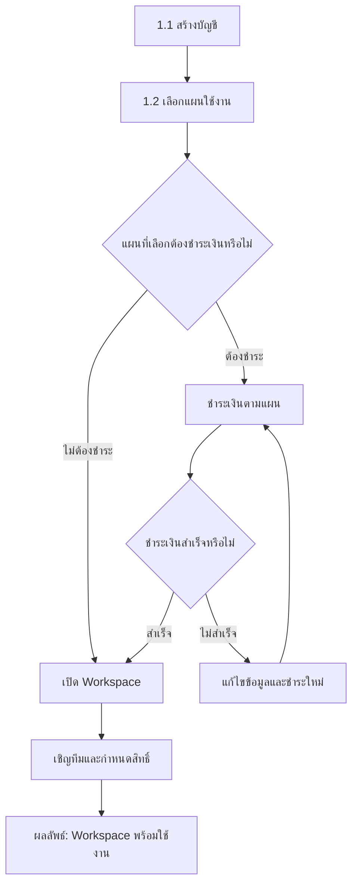
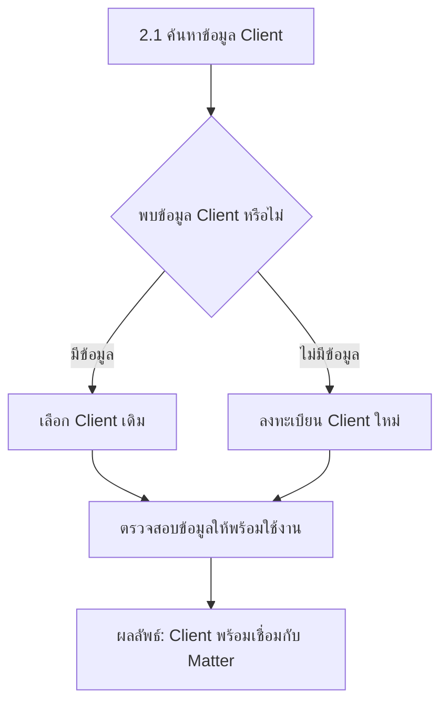
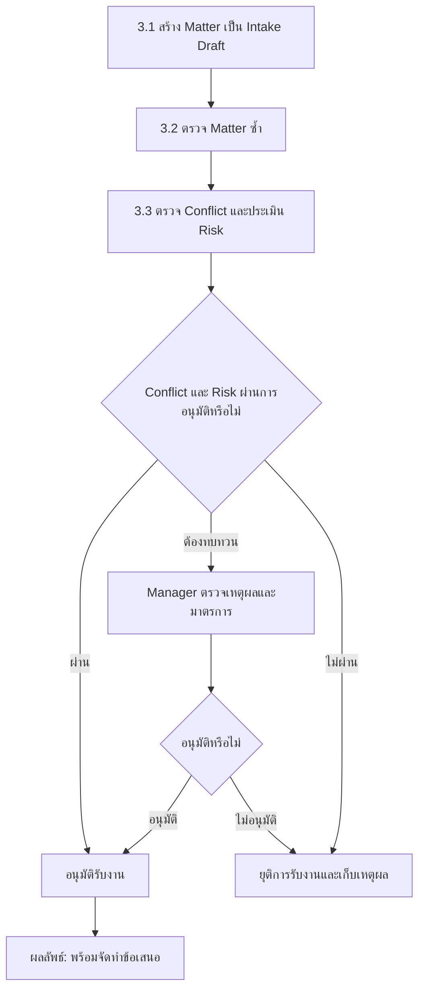
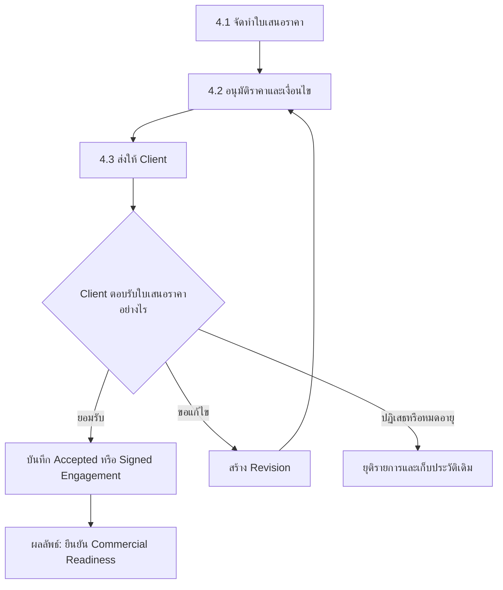
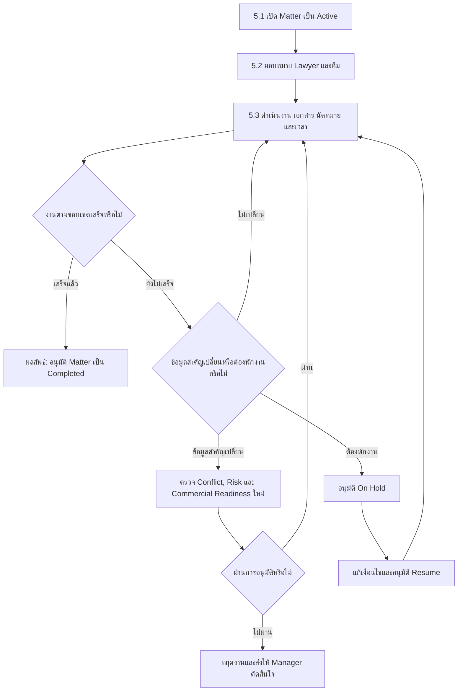
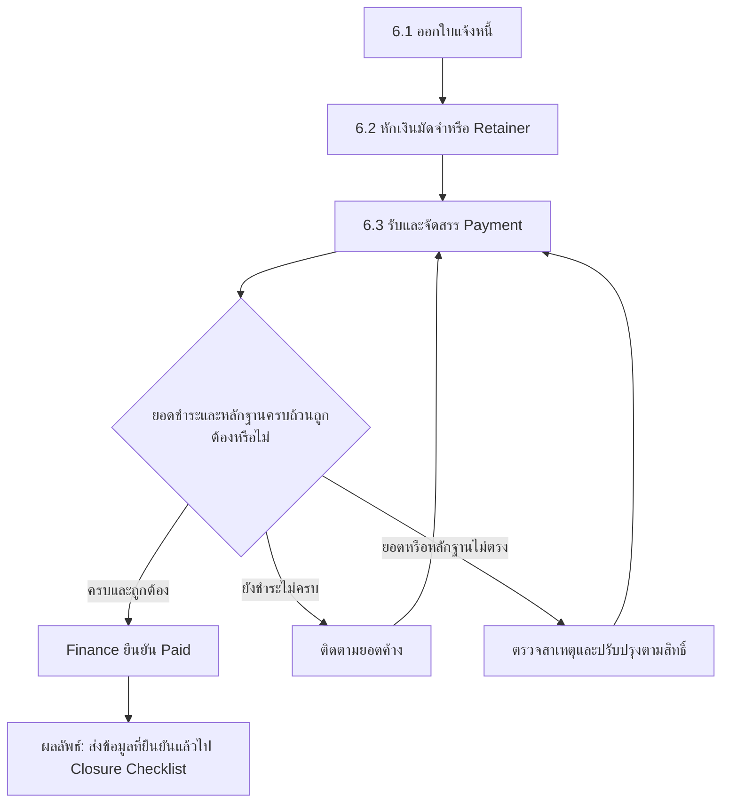
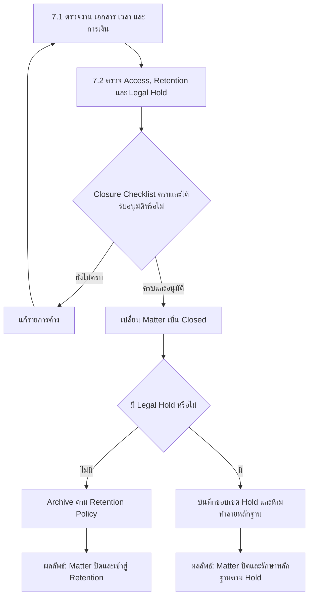

# End-to-End Legal Service Workflow

กระบวนการหลักของ Legal ERP ตั้งแต่สมัครใช้งาน สร้าง Workspace รับลูกความ
เปิด Matter ออกใบเสนอราคา ดำเนินงาน วางบิล รับชำระ และปิด Matter

## ภาพรวมกระบวนการ

<ol className="workflow-timeline" aria-label="ภาพรวมกระบวนการ 7 ขั้นตอน">
  <li><a href="#1-สมัครและเปิดใช้งาน"><strong>1</strong>สมัครใช้งาน</a></li>
  <li><a href="#2-จัดการ-client"><strong>2</strong>จัดการ Client</a></li>
  <li><a href="#3-ประเมินการรับงาน"><strong>3</strong>ประเมินรับงาน</a></li>
  <li><a href="#4-ตกลงราคาและขอบเขต"><strong>4</strong>เสนอราคา</a></li>
  <li><a href="#5-เปิดและดำเนินงาน"><strong>5</strong>ดำเนินงาน</a></li>
  <li><a href="#6-วางบิลและรับชำระ"><strong>6</strong>วางบิล</a></li>
  <li><a href="#7-ปิด-matter-และเก็บรักษาหลักฐาน"><strong>7</strong>ปิด Matter</a></li>
</ol>

<section className="workflow-mermaid-phase">

## 1. สมัครและเปิดใช้งาน

สร้าง Workspace ที่พร้อมให้ทีมเริ่มทำงาน

รายละเอียด: [Signup, Subscription & Access](/docs/plans/subscription-access)

</section>

<section className="workflow-mermaid-phase">

## 2. จัดการ Client

ยืนยันข้อมูลลูกความก่อนสร้างแฟ้มงานกฎหมาย

รายละเอียด: [Client Registration & Maintenance](/docs/sops/client-registration)

</section>

<section className="workflow-mermaid-phase">

## 3. ประเมินการรับงาน

ตรวจความซ้ำซ้อน ผลประโยชน์ขัดกัน และความเสี่ยง

รายละเอียด: [Matter Intake & Opening](/docs/sops/matter-intake)

</section>

<section className="workflow-mermaid-phase">

## 4. ตกลงราคาและขอบเขต

ทำให้ราคา ขอบเขต และการยอมรับของ Client ตรวจสอบย้อนหลังได้

รายละเอียด: [Quotation & Engagement Approval](/docs/sops/quotation-engagement)

</section>

<section className="workflow-mermaid-phase">

## 5. เปิดและดำเนินงาน

ใช้ Matter เป็นศูนย์กลางของทีม งาน นัดหมาย เอกสาร และเวลา

รายละเอียด: [Matter Operations & Closure](/docs/sops/matter-operations)

</section>

<section className="workflow-mermaid-phase">

## 6. วางบิลและรับชำระ

ออกใบแจ้งหนี้ รับเงิน และยืนยันยอดก่อนส่งปิด Matter

รายละเอียด: [Invoice, Payment & Adjustment](/docs/sops/invoice-payment)

</section>

<section className="workflow-mermaid-phase">

## 7. ปิด Matter และเก็บรักษาหลักฐาน

ตรวจความครบถ้วนก่อนจำกัดการทำรายการและเริ่ม Retention

รายละเอียด: [Matter Operations & Closure](/docs/sops/matter-operations)

</section>

## Work Execution

ระหว่าง Matter เป็น Active ให้ใช้รายการเดียวกันเป็นศูนย์กลางของข้อมูลทั้งหมด:

- [Document & Template Management](/docs/sops/document-management) สำหรับเอกสารและการอนุมัติ
- [Task & Calendar Management](/docs/sops/task-calendar) สำหรับงาน ผู้รับผิดชอบ และนัดหมาย
- [Time Tracking & Timesheet Approval](/docs/sops/time-tracking) สำหรับเวลาทำงานและข้อมูลที่ส่งต่อไป Billing

Matter อาจเปลี่ยนเป็น On Hold และกลับเป็น Active ได้ตามการอนุมัติ หาก Client,
คู่กรณี ขอบเขตงาน หรือผู้รับผิดชอบเปลี่ยน ต้องตรวจ Conflict, Risk และ Commercial
Readiness ใหม่ตามผลกระทบ

## Completion Gate

ก่อนอนุมัติปิด Matter ต้องตรวจอย่างน้อย:

- งานและเอกสารส่งมอบตามขอบเขตเสร็จแล้ว
- ไม่มี Task, นัดหมาย, ลายเซ็น หรือกำหนดเวลาสำคัญที่ยังค้างโดยไม่มีผู้รับผิดชอบ
- Time Entry, Invoice, Payment, Deposit, Retainer และยอดค้างได้รับการตรวจโดย Finance
- Document index, final correspondence, Client property และรายชื่อผู้เข้าถึงครบ
- ระบุ Retention Policy ที่ใช้ และตรวจ Legal Hold แล้ว
- Manager อนุมัติการปิด โดยผู้เตรียมรายการไม่อนุมัติคำขอของตนเอง

## Important Outcomes

| เหตุการณ์ | ผลลัพธ์ |
| --- | --- |
| Client หรือ Matter ซ้ำ | ใช้รายการเดิม หรือให้ Manager อนุมัติเหตุผลก่อนสร้างใหม่ |
| Conflict/Risk ไม่ผ่าน | ยุติการรับงานและเก็บเหตุผลกับหลักฐานการตัดสินใจ |
| ใบเสนอราคาต้องแก้ | สร้าง Revision และผ่านการอนุมัติใหม่ก่อนส่ง Client |
| Client ปฏิเสธหรือใบเสนอราคาหมดอายุ | ไม่เปิด Matter เป็น Active และเก็บประวัติเดิม |
| ขอบเขตงานเปลี่ยน | ตรวจ Conflict/Risk และ Commercial Readiness ตามผลกระทบ |
| ยอดชำระไม่ตรงหรือยังค้าง | Finance ติดตามหรือดำเนินการตามข้อยกเว้นก่อนส่งปิด Matter |
| มี Legal Hold | ปิด Matter ได้ตามผลอนุมัติ แต่ห้ามทำลายหลักฐานจนกว่าจะยกเลิก Hold |
