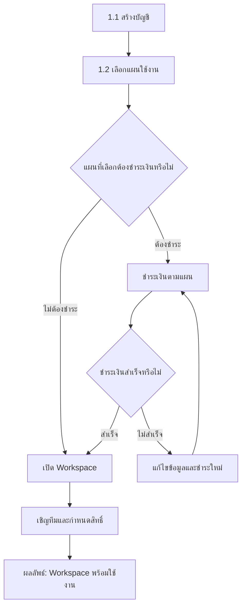
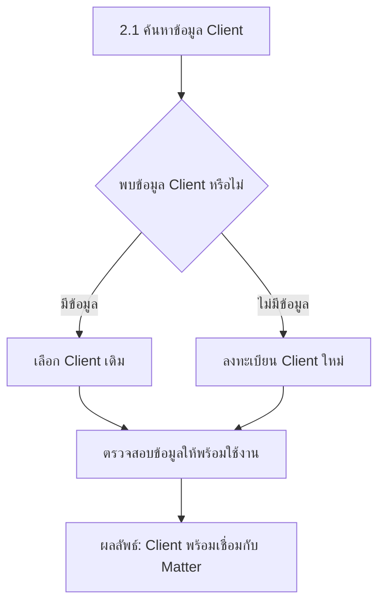
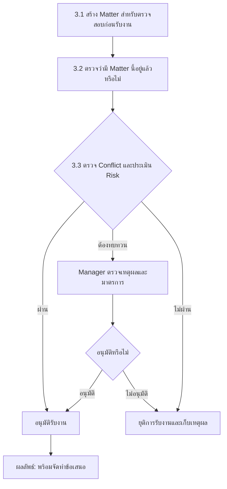
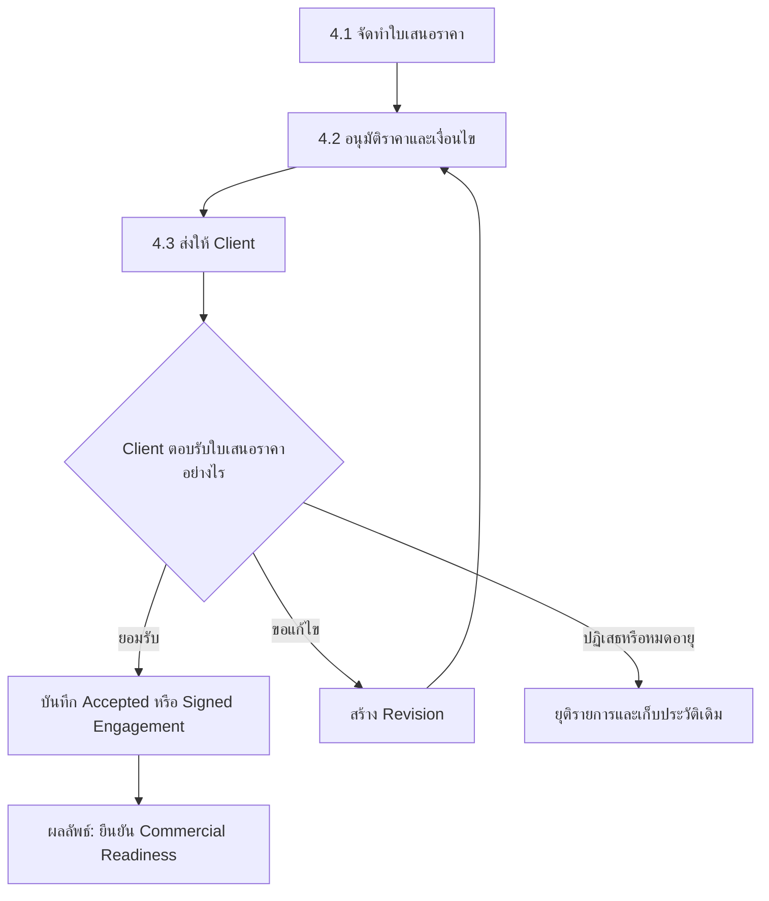
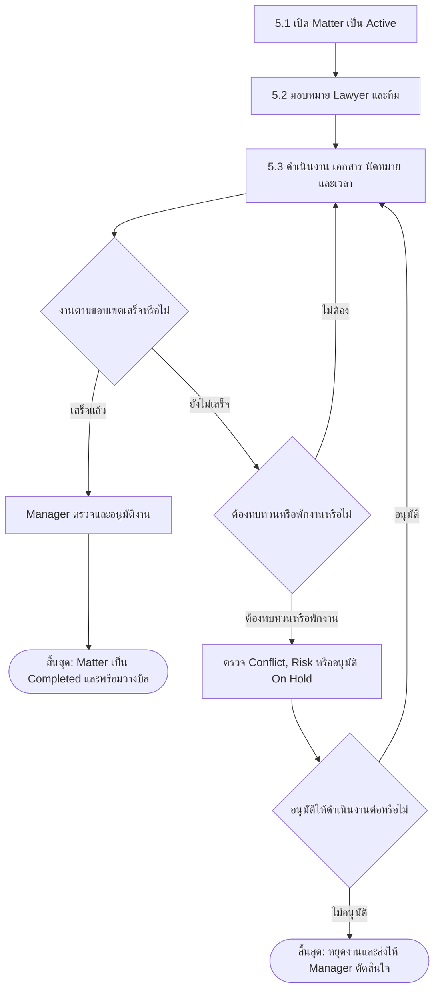
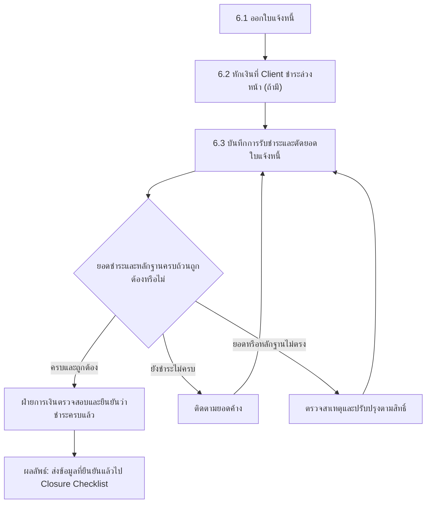
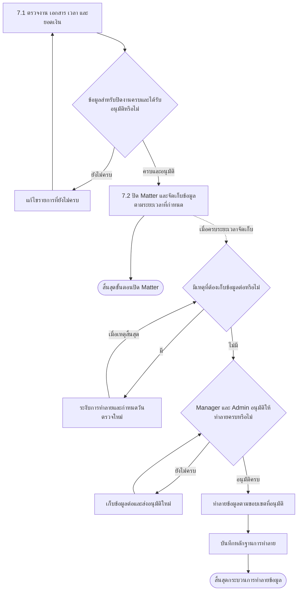

# End-to-End Legal Service Workflow

กระบวนการหลักของ Legal ERP ตั้งแต่สมัครใช้งาน สร้าง Workspace รับลูกความ
เปิด Matter ออกใบเสนอราคา ดำเนินงาน วางบิล รับชำระ และปิด Matter

## ภาพรวมกระบวนการ

<ol className="workflow-timeline" aria-label="ภาพรวมกระบวนการ 7 ขั้นตอน">
  <li><a href="#1-สมัครและเปิดใช้งาน"><strong>1</strong>สมัครใช้งาน</a></li>
  <li><a href="#2-จัดการ-client"><strong>2</strong>จัดการ Client</a></li>
  <li><a href="#3-ประเมินการรับงาน"><strong>3</strong>ประเมินรับงาน</a></li>
  <li><a href="#4-ตกลงราคาและขอบเขต"><strong>4</strong>เสนอราคา</a></li>
  <li><a href="#5-เปิดและดำเนินงาน"><strong>5</strong>ดำเนินงาน</a></li>
  <li><a href="#6-วางบิลและรับชำระ"><strong>6</strong>วางบิล</a></li>
  <li><a href="#7-ปิด-matter-และเก็บรักษาหลักฐาน"><strong>7</strong>ปิด Matter</a></li>
</ol>

<section className="workflow-mermaid-phase">

## 1. สมัครและเปิดใช้งาน

สร้าง Workspace ที่พร้อมให้ทีมเริ่มทำงาน

### คำอธิบายขั้นตอน

1. **สร้างบัญชี:** ผู้สมัครกรอกข้อมูลสำหรับเข้าสู่ระบบและยืนยันอีเมล
   ผู้สมัครจะเป็นเจ้าของ Workspace และเป็นสมาชิกคนแรก
2. **เลือกแผนใช้งาน:** เลือกแผนฟรีหรือแผนเสียเงินตาม Module
   ที่ต้องการใช้
3. **ตรวจว่าต้องชำระเงินหรือไม่:** แผนฟรีเปิดใช้งานได้โดยไม่ต้องกรอกข้อมูลบัตร
   ส่วนแผนเสียเงินต้องชำระเงินก่อน
4. **ชำระเงินตามแผน:** ระบบส่งผู้สมัครไปยังหน้าชำระเงินที่ปลอดภัย
   และไม่เก็บหมายเลขบัตรหรือรหัสความปลอดภัยของบัตร
5. **กรณีชำระเงินไม่สำเร็จ:** ระบบยังไม่เปิดแผนเสียเงิน ผู้สมัครต้องแก้ไข
   ข้อมูลการชำระเงินแล้วลองใหม่
6. **เปิดใช้งาน Workspace:** ผู้สมัครทุกคนจะได้รับ Workspace เหมือนกัน
   ผู้สมัครที่เลือกใช้งานฟรีเปิดใช้งานได้ทันที ส่วนผู้สมัครแบบชำระเงิน
   เปิดใช้งานหลังระบบยืนยันการชำระเงินสำเร็จ
7. **เชิญทีมและกำหนดสิทธิ์:** เจ้าของ Workspace เชิญพนักงานเข้าระบบ
   และกำหนดว่าแต่ละคนเข้า Module หรือทำรายการใดได้
8. **ผลลัพธ์:** Workspace พร้อมใช้งาน ผู้สมัครสามารถใช้งานคนเดียว
   หรือเพิ่มสมาชิกภายหลังได้

</section>

<section className="workflow-mermaid-phase">

## 2. จัดการ Client

ยืนยันข้อมูลลูกความก่อนสร้างแฟ้มงานกฎหมาย

</section>

<section className="workflow-mermaid-phase">

## 3. ประเมินการรับงาน

ตรวจความซ้ำซ้อน ผลประโยชน์ขัดกัน และความเสี่ยง

</section>

<section className="workflow-mermaid-phase">

## 4. ตกลงราคาและขอบเขต

ทำให้ราคา ขอบเขต และการยอมรับของ Client ตรวจสอบย้อนหลังได้

</section>

<section className="workflow-mermaid-phase">

## 5. เปิดและดำเนินงาน

ใช้ Matter เป็นศูนย์กลางของทีม งาน นัดหมาย เอกสาร และเวลา

</section>

<section className="workflow-mermaid-phase">

## 6. วางบิลและรับชำระ

ออกใบแจ้งหนี้ รับเงิน และยืนยันยอดก่อนส่งปิด Matter

</section>

<section className="workflow-mermaid-phase">

## 7. ปิด Matter และเก็บรักษาหลักฐาน

ตรวจความครบถ้วนก่อนจำกัดการทำรายการและเริ่มระยะเวลาจัดเก็บข้อมูล

> **หมายเหตุ:** การปิด Matter ไม่ทำลายข้อมูลทันที การทำลายจะเริ่มได้เมื่อครบ
> ระยะเวลาจัดเก็บ ไม่มีเหตุที่ต้องเก็บต่อ และได้รับอนุมัติครบตามที่กำหนด
> ผู้อนุมัติและผู้ดำเนินการทำลายต้องเป็นคนละบัญชี

</section>

