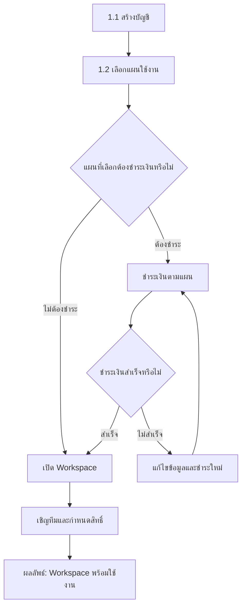
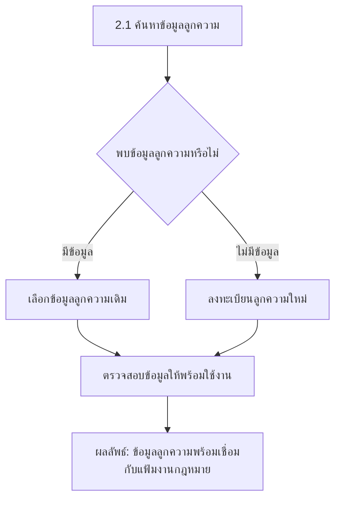
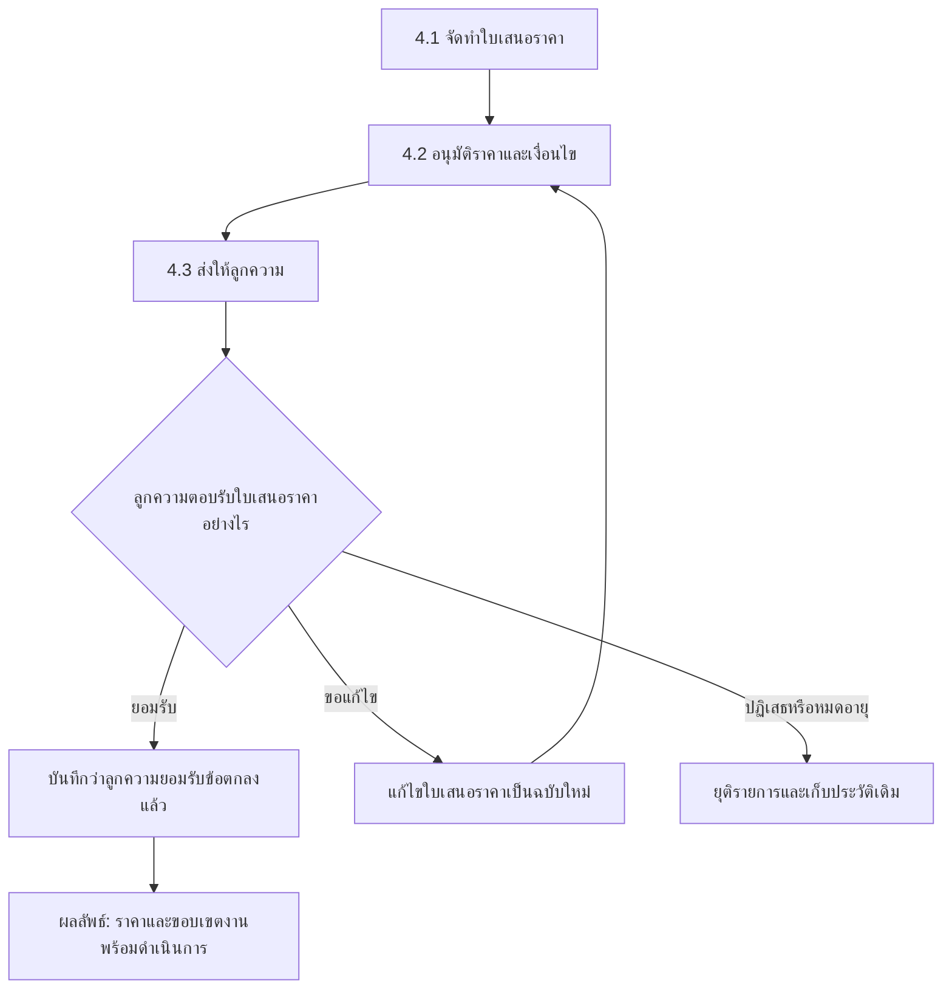
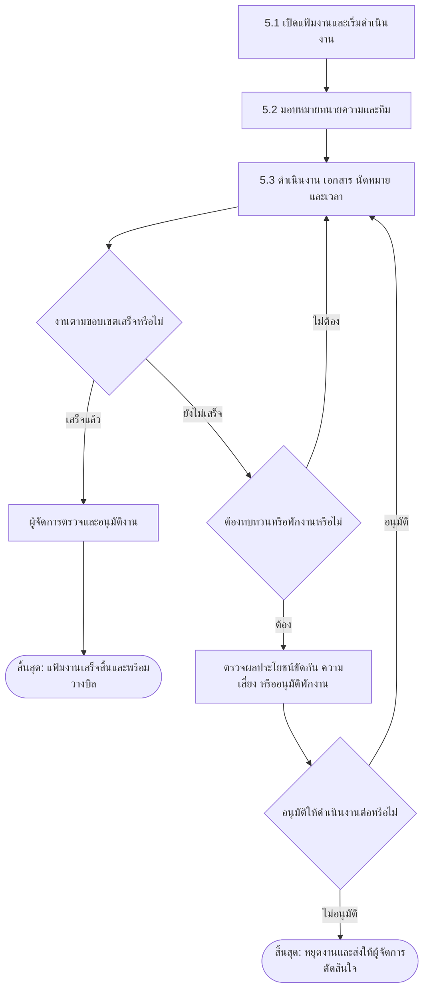
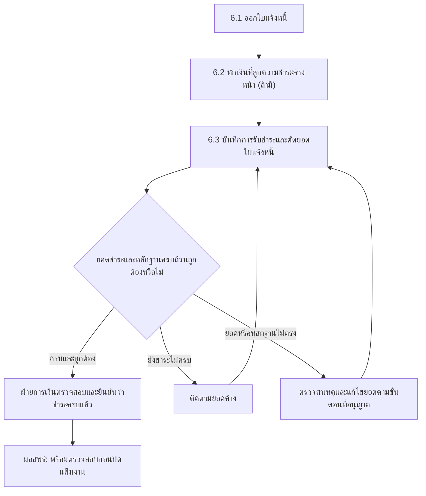

# End-to-End Legal Service Workflow

กระบวนการหลักของ Legal Practice ERP Platform ตั้งแต่สมัครใช้งาน สร้าง Workspace รับลูกความ
เปิดแฟ้มงานกฎหมาย ออกใบเสนอราคา ดำเนินงาน วางบิล รับชำระ และปิดแฟ้มงาน

## ภาพรวมกระบวนการ

<ol className="workflow-timeline" aria-label="ภาพรวมกระบวนการ 7 ขั้นตอน">
  <li><a href="#1-สมัครและเปิดใช้งาน"><strong>1</strong>สมัครใช้งาน</a></li>
  <li><a href="#2-จัดการลูกความ"><strong>2</strong>จัดการลูกความ</a></li>
  <li><a href="#3-ประเมินการรับงาน"><strong>3</strong>ประเมินรับงาน</a></li>
  <li><a href="#4-ตกลงราคาและขอบเขต"><strong>4</strong>เสนอราคา</a></li>
  <li><a href="#5-เปิดและดำเนินงาน"><strong>5</strong>ดำเนินงาน</a></li>
  <li><a href="#6-วางบิลและรับชำระ"><strong>6</strong>วางบิล</a></li>
  <li><a href="#7-ปิดแฟ้มงานกฎหมายและเก็บรักษาหลักฐาน"><strong>7</strong>ปิดแฟ้มงาน</a></li>
</ol>

<section className="workflow-mermaid-phase">

## 1. สมัครและเปิดใช้งาน

สร้าง Workspace ที่พร้อมให้ทีมเริ่มทำงาน

คำอธิบายขั้นตอน

1. **สร้างบัญชี:** ผู้สมัครกรอกข้อมูลสำหรับเข้าสู่ระบบและยืนยันอีเมล
   ผู้สมัครจะเป็นเจ้าของ Workspace และเป็นสมาชิกคนแรก
2. **เลือกแผนใช้งาน:** เลือกแผนฟรีหรือแผนเสียเงินตาม Module
   ที่ต้องการใช้
3. **ตรวจว่าต้องชำระเงินหรือไม่:** แผนฟรีเปิดใช้งานได้โดยไม่ต้องกรอกข้อมูลบัตร
   ส่วนแผนเสียเงินต้องชำระเงินก่อน
4. **ชำระเงินตามแผน:** ระบบส่งผู้สมัครไปยังหน้าชำระเงินที่ปลอดภัย
   และไม่เก็บหมายเลขบัตรหรือรหัสความปลอดภัยของบัตร
5. **กรณีชำระเงินไม่สำเร็จ:** ระบบยังไม่เปิดแผนเสียเงิน ผู้สมัครต้องแก้ไข
   ข้อมูลการชำระเงินแล้วลองใหม่
6. **เปิดใช้งาน Workspace:** ผู้สมัครทุกคนจะได้รับ Workspace เหมือนกัน
   ผู้สมัครที่เลือกใช้งานฟรีเปิดใช้งานได้ทันที ส่วนผู้สมัครแบบชำระเงิน
   เปิดใช้งานหลังระบบยืนยันการชำระเงินสำเร็จ
7. **เชิญทีมและกำหนดสิทธิ์:** เจ้าของ Workspace เชิญพนักงานเข้าระบบ
   และกำหนดว่าแต่ละคนเข้า Module หรือทำรายการใดได้
8. **ผลลัพธ์:** Workspace พร้อมใช้งาน ผู้สมัครสามารถใช้งานคนเดียว
   หรือเพิ่มสมาชิกภายหลังได้

</section>

<section className="workflow-mermaid-phase">

## 2. จัดการลูกความ

ยืนยันข้อมูลลูกความก่อนสร้างแฟ้มงานกฎหมาย

คำอธิบายขั้นตอน

1. **ค้นหาข้อมูลลูกความ:** ค้นหาจากข้อมูลที่มี เช่น ชื่อหรือเลขอ้างอิง
   ก่อนสร้างรายการใหม่
2. **กรณีมีข้อมูล:** เลือกข้อมูลลูกความเดิมและตรวจว่าข้อมูลยังถูกต้อง
   เพื่อไม่ให้เกิดรายการซ้ำ
3. **กรณีไม่มีข้อมูล:** ลงทะเบียนลูกความใหม่และกรอกข้อมูลที่จำเป็น
   สำหรับการรับงาน
4. **ตรวจสอบข้อมูล:** ตรวจว่าข้อมูลสำคัญครบถ้วนและพร้อมนำไปใช้
   กับแฟ้มงานกฎหมาย
5. **ผลลัพธ์:** ได้ข้อมูลลูกความที่ผ่านการตรวจสอบและพร้อมเชื่อมกับแฟ้มงานกฎหมาย

</section>

<section className="workflow-mermaid-phase">

## 3. ประเมินการรับงาน

ตรวจความซ้ำซ้อน ผลประโยชน์ขัดกัน และความเสี่ยง

คำอธิบายขั้นตอน

1. **สร้างแฟ้มงานสำหรับตรวจสอบ:** บันทึกข้อมูลเบื้องต้นของงาน
   ลูกความ คู่กรณี และขอบเขตงานที่ต้องการให้ดำเนินการ
2. **ตรวจแฟ้มงานเดิม:** ตรวจว่ามีแฟ้มงานเดียวกันอยู่แล้วหรือไม่
   เพื่อไม่ให้สร้างรายการซ้ำ
3. **ตรวจผลประโยชน์ขัดกัน:** ตรวจความเกี่ยวข้องของลูกความ คู่กรณี
   และผู้ที่เกี่ยวข้องก่อนรับงาน
4. **ประเมินความเสี่ยง:** พิจารณาความเสี่ยงของงานและแนวทางป้องกัน
   ก่อนตัดสินใจ
5. **กรณีผ่าน:** อนุมัติรับงานและดำเนินการจัดทำข้อเสนอ
6. **กรณีต้องทบทวน:** ผู้จัดการตรวจเหตุผลและแนวทางป้องกัน
   แล้วตัดสินใจว่าจะรับงานหรือไม่
7. **กรณีไม่ผ่านหรือไม่อนุมัติ:** ยุติการรับงานและบันทึกเหตุผลไว้
8. **ผลลัพธ์:** งานที่ได้รับอนุมัติพร้อมเข้าสู่ขั้นตอนจัดทำข้อเสนอ

</section>

<section className="workflow-mermaid-phase">

## 4. ตกลงราคาและขอบเขต

ทำให้ราคา ขอบเขต และการยอมรับของลูกความตรวจสอบย้อนหลังได้

คำอธิบายขั้นตอน

1. **จัดทำใบเสนอราคา:** ระบุขอบเขตงาน ค่าบริการ และเงื่อนไขที่ตกลงกัน
2. **อนุมัติราคาและเงื่อนไข:** ตรวจสอบความถูกต้องก่อนส่งให้ลูกความ
3. **ส่งให้ลูกความ:** ให้ลูกความพิจารณาราคา ขอบเขตงาน และเงื่อนไข
4. **กรณียอมรับ:** บันทึกการตอบรับและเก็บหลักฐานข้อตกลงไว้
5. **กรณีขอแก้ไข:** จัดทำใบเสนอราคาฉบับใหม่และส่งอนุมัติอีกครั้ง
6. **กรณีปฏิเสธหรือหมดอายุ:** ยุติใบเสนอราคาและเก็บประวัติเดิมไว้
7. **ผลลัพธ์:** ราคาและขอบเขตงานได้รับการยืนยัน พร้อมเริ่มดำเนินงาน

</section>

<section className="workflow-mermaid-phase">

## 5. เปิดและดำเนินงาน

ใช้แฟ้มงานกฎหมายเป็นศูนย์กลางของทีม งาน นัดหมาย เอกสาร และเวลา

คำอธิบายขั้นตอน

1. **เปิดแฟ้มงาน:** เริ่มงานตามราคาและขอบเขตที่ลูกความยอมรับแล้ว
2. **มอบหมายทีม:** กำหนดทนายความและผู้ร่วมงานที่รับผิดชอบ
3. **ดำเนินงาน:** บันทึกงาน เอกสาร นัดหมาย และเวลาทำงานไว้ในแฟ้มเดียวกัน
4. **ตรวจความคืบหน้า:** พิจารณาว่างานตามขอบเขตเสร็จแล้วหรือยัง
5. **กรณีงานเสร็จ:** ผู้จัดการตรวจและอนุมัติก่อนส่งไปวางบิล
6. **กรณียังไม่เสร็จ:** ดำเนินงานต่อ หรือส่งทบทวนเมื่อมีเหตุให้พักงาน
7. **กรณีต้องทบทวน:** ตรวจผลประโยชน์ขัดกันและความเสี่ยงอีกครั้ง
   ก่อนตัดสินใจว่าจะทำงานต่อหรือหยุดงาน
8. **ผลลัพธ์:** แฟ้มงานเสร็จพร้อมวางบิล หรือหยุดงานตามคำตัดสินของผู้จัดการ

</section>

<section className="workflow-mermaid-phase">

## 6. วางบิลและรับชำระ

ออกใบแจ้งหนี้ รับเงิน และยืนยันยอดก่อนส่งปิดแฟ้มงาน

คำอธิบายขั้นตอน

1. **ออกใบแจ้งหนี้:** เรียกเก็บค่าบริการและค่าใช้จ่ายตามข้อตกลง
2. **หักเงินที่ชำระล่วงหน้า:** นำเงินที่ลูกความจ่ายไว้ก่อนมาลดยอด
   ที่ต้องชำระ หากมี
3. **บันทึกการรับชำระ:** ระบุว่าเงินที่ได้รับนำไปชำระใบแจ้งหนี้ใด
4. **ตรวจยอดและหลักฐาน:** เปรียบเทียบจำนวนเงินกับหลักฐานการชำระ
5. **กรณีชำระครบ:** ฝ่ายการเงินตรวจสอบและยืนยันว่ารับเงินครบแล้ว
6. **กรณียังชำระไม่ครบ:** ติดตามยอดค้างและบันทึกการชำระเพิ่มเติม
7. **กรณีข้อมูลไม่ตรง:** ตรวจหาสาเหตุ แก้ไขตามขั้นตอน และตรวจใหม่
8. **ผลลัพธ์:** ยอดเงินได้รับการยืนยัน พร้อมเข้าสู่การตรวจสอบก่อนปิดแฟ้มงาน

</section>

<section className="workflow-mermaid-phase">

## 7. ปิดแฟ้มงานกฎหมายและเก็บรักษาหลักฐาน

ตรวจความครบถ้วนก่อนจำกัดการทำรายการและเริ่มระยะเวลาจัดเก็บข้อมูล

> **หมายเหตุ:** การปิดแฟ้มงานไม่ทำลายข้อมูลทันที การทำลายจะเริ่มได้เมื่อครบ
> ระยะเวลาจัดเก็บ ไม่มีเหตุที่ต้องเก็บต่อ และได้รับอนุมัติครบตามที่กำหนด
> ผู้อนุมัติและผู้ดำเนินการทำลายต้องเป็นคนละบัญชี

คำอธิบายขั้นตอน

1. **ตรวจความครบถ้วน:** ตรวจงาน เอกสาร เวลาทำงาน และยอดเงิน
   ก่อนปิดแฟ้มงาน
2. **กรณีข้อมูลยังไม่ครบ:** แก้ไขรายการที่ขาดและส่งตรวจใหม่
3. **กรณีข้อมูลครบ:** ปิดแฟ้มงานและเริ่มนับระยะเวลาจัดเก็บข้อมูล
4. **หลังปิดแฟ้มงาน:** ระบบเก็บข้อมูลไว้ตามระยะเวลาที่กำหนด
   โดยยังไม่ทำลายข้อมูลทันที
5. **เมื่อครบระยะเวลาจัดเก็บ:** ตรวจว่ามีคดี คำสั่ง หรือเหตุอื่น
   ที่ต้องเก็บข้อมูลต่อหรือไม่
6. **กรณีต้องเก็บต่อ:** ระงับการทำลายและกำหนดวันตรวจสอบใหม่
7. **กรณีไม่ต้องเก็บต่อ:** ขออนุมัติจากผู้จัดการและผู้ดูแลระบบ
8. **เมื่ออนุมัติครบ:** ผู้ดำเนินการที่ไม่ใช่ผู้อนุมัติ
   ทำลายเฉพาะข้อมูลที่ได้รับอนุมัติ
9. **บันทึกหลักฐาน:** เก็บข้อมูลว่าใครอนุมัติ ใครดำเนินการ
   ทำลายอะไร และทำเมื่อใด

</section>

